##  ⬇ 下载安装

> [!warning]
> 需要安装Allmusic这个点歌mod，你才能在游戏里听见歌曲声音

### 下载mod

> [!note]
> 如果你已经使用的是群文件里整合的客户端，那么它里面已经包含点歌Mod，你无需自己安装

**1. 加入QQ群286338133**

**2. 在群文件里下载点歌mod**

注意你客户端使用的是fabric还是forge。高版本一般都是fabric

下载路径: 群文件/★★★服务器★★★/【点歌mod】[fabirc-1.19.2]AllMusic_for_DripDrop-2.7.0.jar

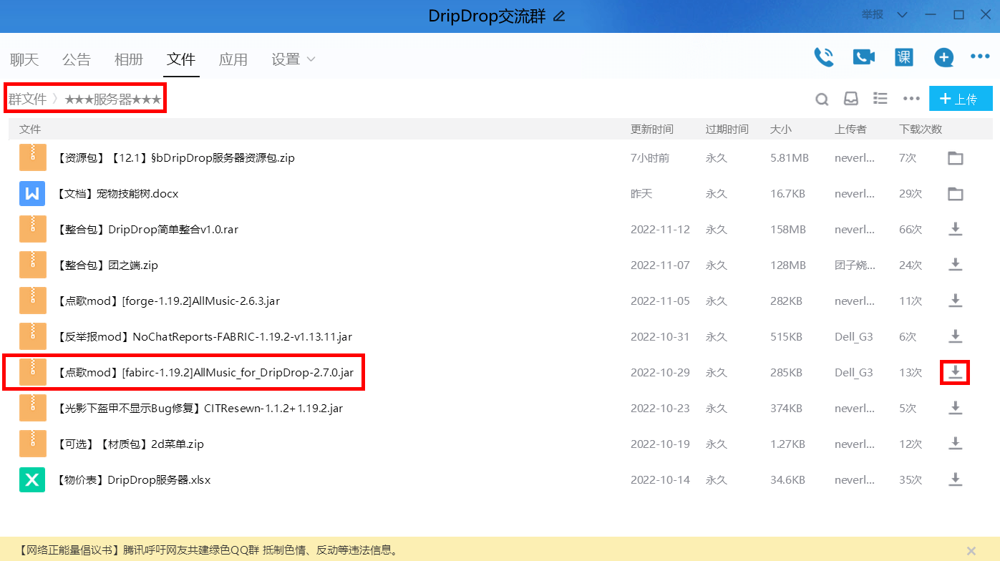

### 安装mod
1. **在安装mod之前请先确认是否安装了 `fabric` 或者 `forge`**

> [!note]
> 如果你的客户端已经安装了`fabric` 或者 `forge`且能正常使用，则可以直接跳过此步。

我们推荐使用fabric，可以在[Fabric官方发布网站](https://fabricmc.net/use/)下载Fabric安装器。

下载来的是`fabric-installer-xxx.jar`文件，双击打开，如果是正版启动器一般会自动选择安装路径。
    
如果用其他启动器的，请自行定位到 `.minecraft` 的文件里。

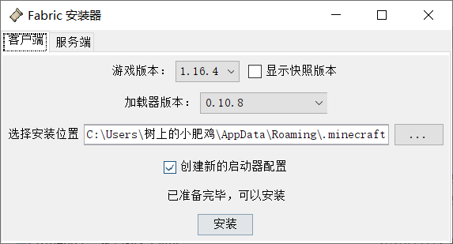

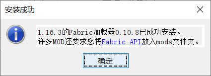

正如提示所说，你还需要fabric api，点击[Fabric API](https://www.curseforge.com/minecraft/mc-mods/fabric-api/)前往网站下载。

1. **将下载好的allmusic与fabric api放入mods文件夹中**

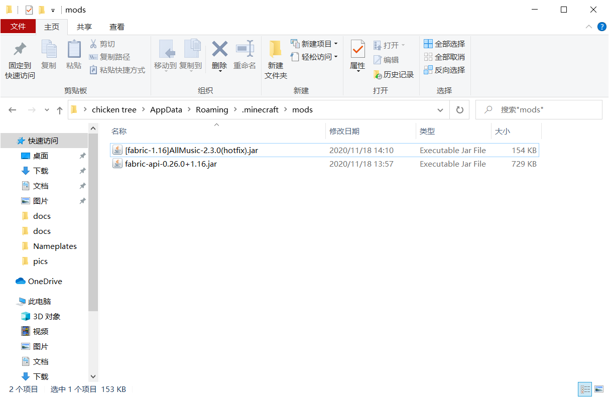

2. **启动游戏的时候注意选择带fabric的版本**

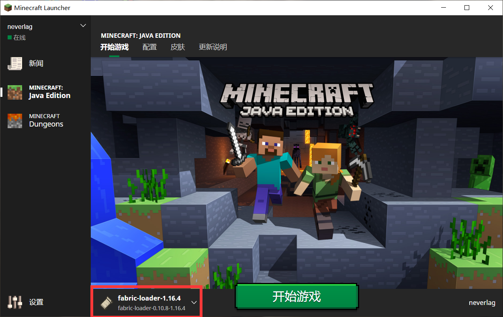

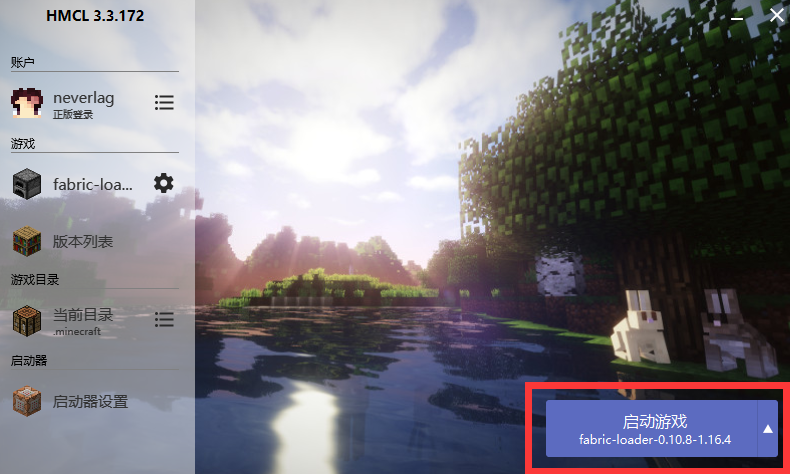

## 🔎 搜索点歌

### 游戏内搜索

输入指令 `/music search <歌名>` 例子: `/music search 小星星`

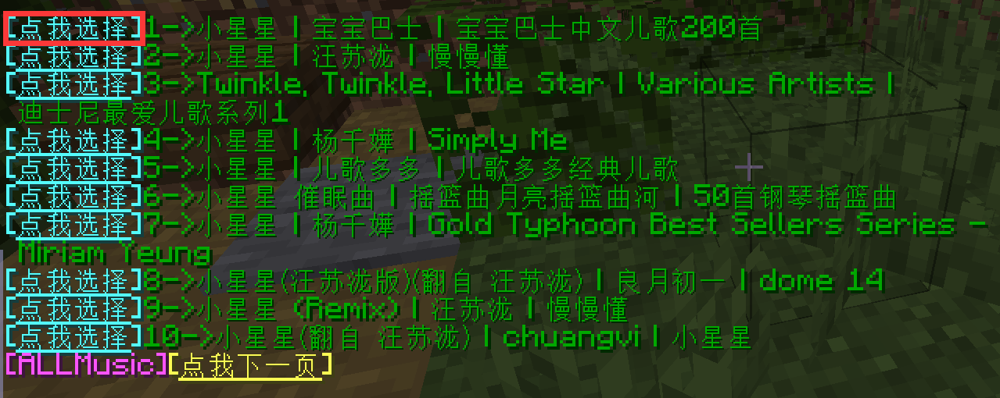

然后点击你要选择的歌曲成功点歌。

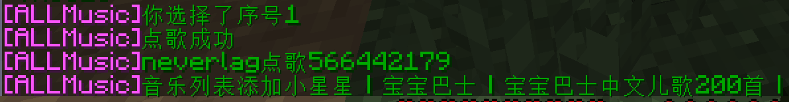

### 网易云APP内复制链接

选择你喜欢的歌 **右键**-**复制链接**

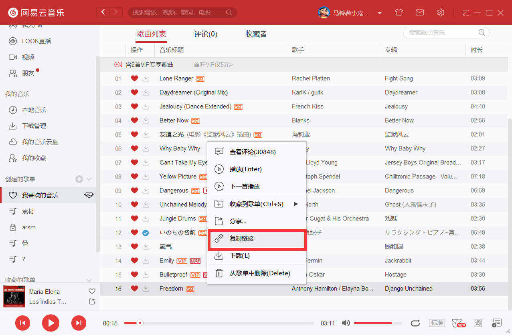

在游戏里输入 `/music` 后`空格`使用`Ctrl+V`粘贴链接发送后即可点歌

比如输入`/music https://music.163.com/song?id=26145413&userid=96846178`

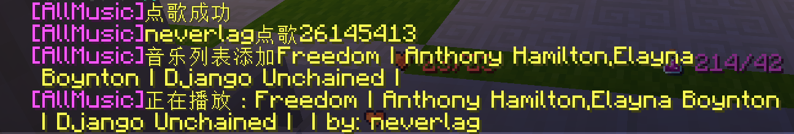

## ⚙️ 显示设置

### 默认显示

默认将显示在左上角，显示歌词，歌曲封面，歌曲列表

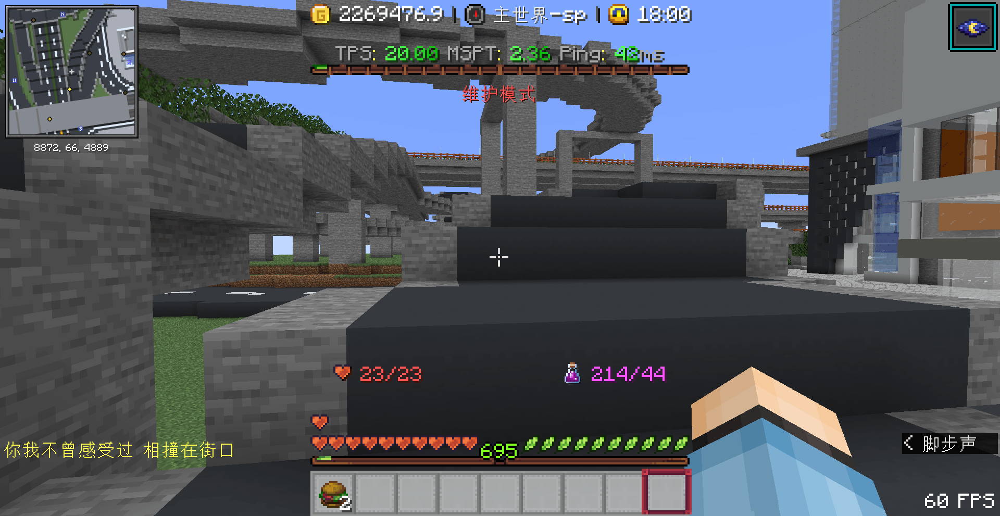

如果你调整过显示设置，你可以使用`/music hud reset`重置为默认显示

### 开关其他显示
> 指令: `/music hud enable [lyric|info|list|pic]`

+ `/music hud enable lyric` 可以控制歌词(lyric)的开关

+ `/music hud enable info` 可以控制歌曲信息(info)的开关
  + 歌名
  + 点歌的玩家

+ `/music hud enable list` 可以控制歌曲列表(list)的开关

+ `/music hud enable pic` 可以控制歌曲封面(pic)的开关

+ **`/music hud enable` 控制所有显示的开关**

### 调整显示位置

输入`/music hud [lyric|info|list|pic] <x> <y>` 设置歌词位置

整个屏幕左上角为`0,0` , 左下角的位置为`0,225`

+ 例子: `/music hud pic 0 0` 就是把封面移动到左上角的位置
+ 例子: `/music hud lyric 0 225` 就是把歌词移动到左下角的位置

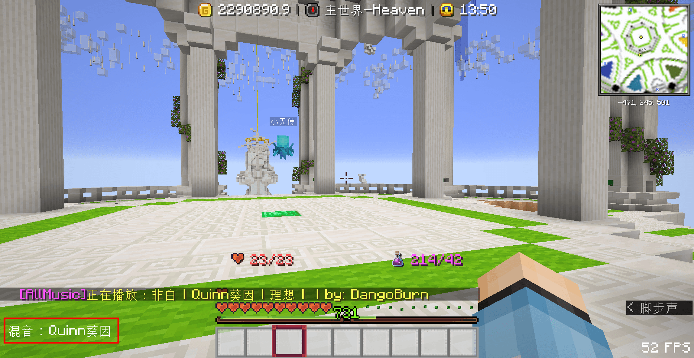

> [!tip]
> 默认位置: lyric(2,76) | info(默认关闭) | list(74,20) | pic(2,2)

## ❌ 关闭音乐

> 不想听这一首歌(比如你很讨厌别人放某个流行的鬼畜歌曲) 
+ 使用`/music stop`不听这首歌
+ 使用`/music vote`发起投票来跳过这首歌
+ 按ESC-设置-音乐和声音，将`唱片机/音符盒`的音量调为0关闭

> 完全不想在游戏里听歌
+ 使用 `/music nomusic` 来禁用点歌功能(可以点一首歌重新开启功能)
+ 直接在mods文件夹里删除allmusic这个mod

##  ❓ 常见问题

### 点歌没有声音

+ 你是否安装了点歌mod？需要安装Allmusic这个mod才能听到歌
+ 装了mod的是否搞错了Fabric和Forge版本？是否安装了fabric及fabricAPI？
+ 游戏里音符盒的声音是否被关闭了？

### VIP歌|点不了

+ 服务器的网易云账号已经开通了VIP，如果没法点歌说明这首歌是单独收费或者没有版权
+ 比如周杰伦的大部分歌网易云都没有版权，无法点播