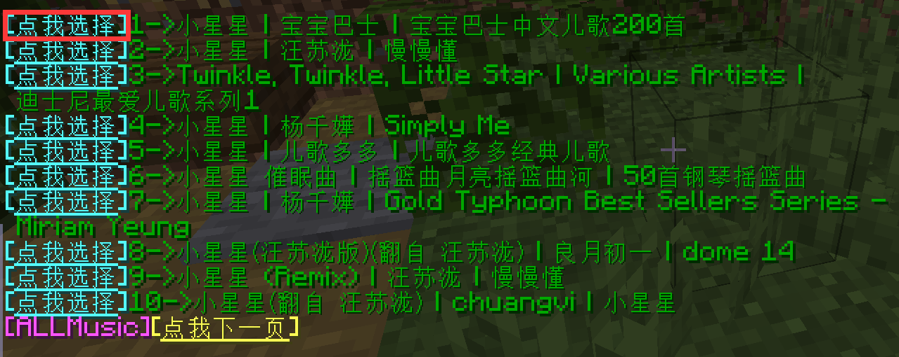
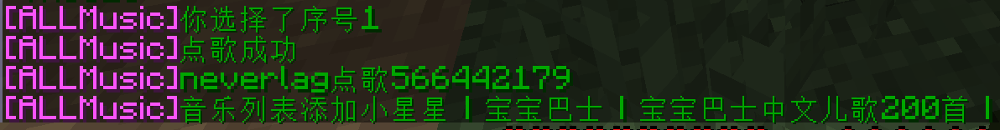
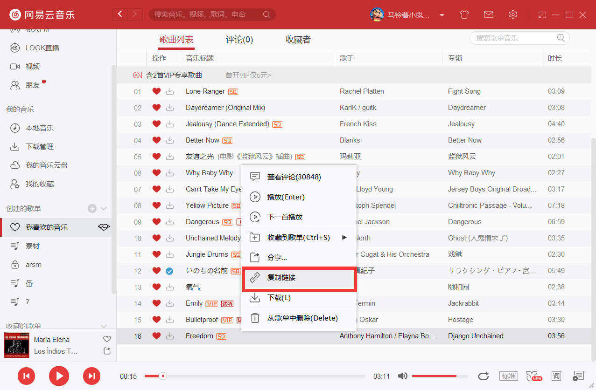
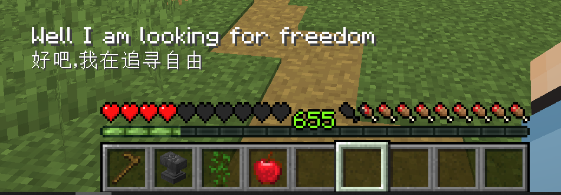

## 安装Allmusic mod
> 💡 需要安装allmusic的mod才能在游戏里听见点歌声音

1. **在安装mod之前请先确认是否安装了 `fabric` 或者 `forge`**
> 👍 如果你的客户端已经安装了mod且能正常使用，则可以直接跳过此步

    1.16.X版本一般都使用fabric，可以在[jenkins](https://jenkins.modmuss50.me/job/FabricMC/job/fabric-installer/job/master/)网站下载Fabric安装器

    下载来的是`fabric-installer-xxx.jar`文件,双击打开，如果是正版启动器一般会自动选择安装路径
    
    如果用其他启动器的，请自行定位到 `.minecraft` 的文件里

    

    

    正如提示所说，你还需要fabric api，点击[Fabric API](https://www.curseforge.com/minecraft/mc-mods/fabric-api/)前往网站下载
2. **下载allmusic mod**
> 插件作者说网盘不再更新，让玩家去他的QQ群 `571239090` 内下载，不过你也可以在我们QQ群 `286338133` 内下载
    
    群文件里的 `✿全服点歌✿` 里也有点歌mod的文件

3. **将下载好得allmusic与fabric api放入mods文件夹中**

    

4. **启动游戏的时候注意选择带fabric的版本**

    

    

## 在游戏里搜歌点歌

1. **输入指令 `/music search <歌名>` 例子: `/music search 小星星`**

    

    然后点击你要选择的歌曲

    

## 通过网易云音乐点特定的歌
> 有些歌曲为网易云的VIP歌曲，并不是说服务器里要开VIP才能听

> 有的傻逼自己点个VIP歌听不了，还骂我们服听歌都要VIP，我是真的快气笑了

1. **选择你喜欢的歌右键复制链接**

2. **在游戏里输入 `/music <链接>` 即可点歌**

3. **如果你知道一首歌的id，你也可以通过id点歌**

    如这首歌的id为`26145413`，输入`/music 26145413` 同样也能点歌

## 设置歌词

1. **输入`/music hud enable lyric` 打开歌词(再次输入关闭歌词)**

2. **设置歌词位置**
    输入`/music hud lyric <x> <y>` 设置歌词位置

    整个屏幕**左上角**为`0,0` , 血量条上方的位置为`150,180`

>    推荐坐标`/music hud lyric 150 180` 

## 不想听歌了

1. **只是这首歌不想听 `/music stop`**

2. **永远都不想不想听歌 `/music nomusic`**

3. **后悔了还是想听歌的话请点一首歌来重新开启功能**