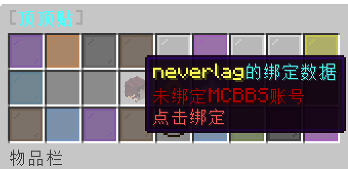
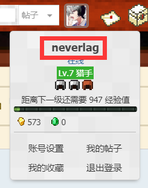
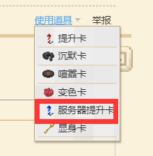
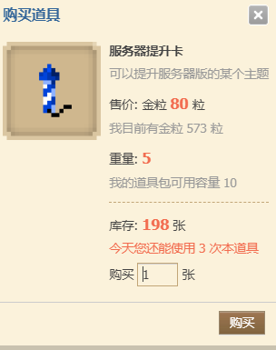
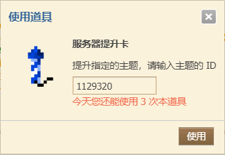
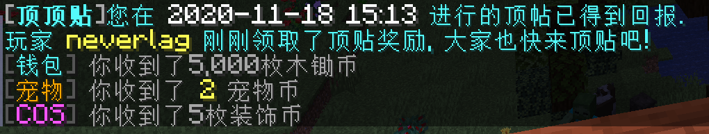

## 绑定MCBBS账号
    
1. **先打开顶帖菜单，输入指令 `/top`**

点击**头颅**按钮，然后在聊天框里输入你的**论坛ID**，为防止出错，需要输入两次。

> 💡 论坛ID即为你论坛里的昵称，比如腐竹的就是neverlag。

## 获取服务器宣传贴链接

1. **点击  `指南针` 获取服务器宣传贴链接**，然后在聊天框里点击链接，选择**是**，接着打开网页。

2. 目前我们服务器的宣传贴链接为[`https://www.mcbbs.net/thread-1129320-1-1.html`](https://www.mcbbs.net/thread-1129320-1-1.html)。

## 使用道具 - 服务器提升卡

> 💡 服务器提升卡需要花费80金粒购买,而且顶帖需要MCBBS等级大于等于4级。

**将宣传贴拉到最下面**，点击 **使用道具-服务器提升卡**。

 

 

## 自动获得奖励

> 💡 一天只能获得一次奖励，如果你一天顶了两次贴，第二天你上线时会自动发放奖励。

## 常见问题

1. **我为什么没有领取到奖励啊?**
   
    + 有可能你并没有绑定正确的论坛ID，注意是论坛的名字；

    + 你可能并没有顶帖，只是给我们服务器做了评分；

    + 一天只能领取一次顶帖奖励，请等第二天自动发放；

    + 你顶的帖子可能不是我们服的宣传贴，或者是已经过期了的宣传贴。

2. **我论坛ID绑定错误了怎么办?（我论坛改名了怎么办？）**
   
    + 你可以点击顶帖菜单里的 **头颅** 重新进行一次绑定。

3. **我为什么没法顶帖**

    + 论坛等级限制4级及以上。

    + 一天只能顶帖3次，你或许已经达到顶帖次数上限。