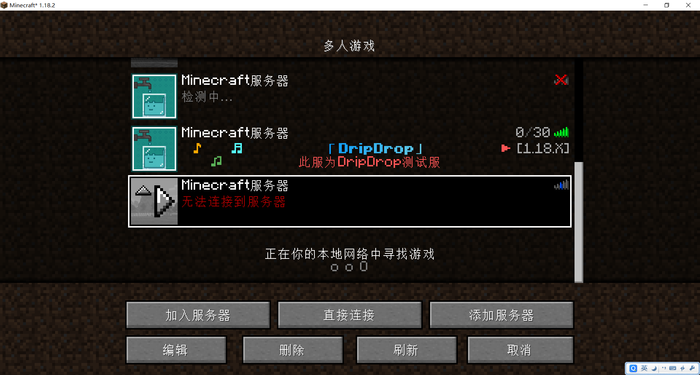
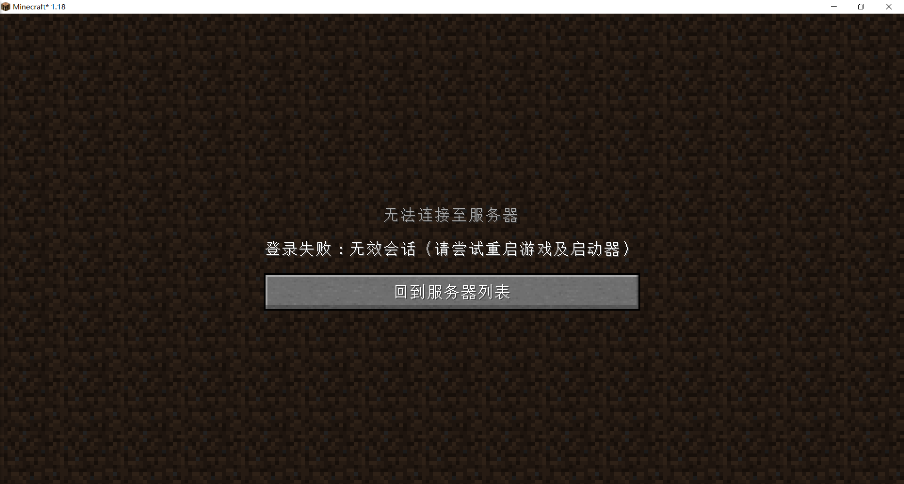
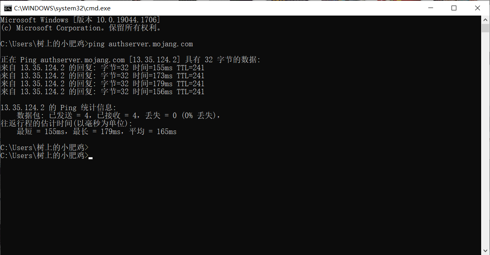

## 搜索指向关键词
> - 无法加入
> - 搜索不到
> - 进不来、进不去、进不了

## 各类情况及解决方法

### ① 未知的主机+无法刷新出motd
#### 问题截图
在多人游戏界面无法刷出正确的MOTD信息，且在加入服务器后显示未知的主机

#### 解决方案
**A 检查IP是否正确，尝试用以下两个IP连接**

域名IP为 `dripdrop.games`

无域名解析IP为 `129k-01.mcstory.cc:26850`

**B 尝试重启客户端**

俗话说重启能解决99%的问题，可以尝试重启客户端后再次连入

**C 尝试重启电脑**

俗话说重启能解决99%的问题，重启客户端不行的话，试试重启电脑

**D 检查电脑网络，是否能上网页，连接其他服务器**

如果网络正常，但依然无法连接，可能是由于DNS未刷新

可以在键盘上同时按`WINDOWS`+ `R`，打开“运行”对话窗，输入`cmd`命令，点击“确认”按钮

在打开的命令行窗口中，输入`ipconfig/flushdns`命令，键盘上按 `Enter`回车键即可刷新

### ② 登录失败 : 无效会话(请尝试重启游戏及启动器) 
#### 问题截图
能刷新出外面的motd，但加入服务器后显示“无效会话”

#### 解决方案
**A 确认自己是否正版登录**

服务器有正版验证，需要正版登录后才能加入

**B 尝试重启客户端**

俗话说重启能解决99%的问题，可以尝试重启客户端后再次连入

**C 尝试重启电脑**

俗话说重启能解决99%的问题，重启客户端不行的话，试试重启电脑

**D 检查自己电脑是否能连上mojang的验证服务器**

可以在键盘上同时按`WINDOWS`+ `R`，打开“运行”对话窗，输入`cmd`命令，点击“确认”按钮

在打开的命令行窗口中，输入`ping authserver.mojang.com`命令，键盘上按 `Enter`回车键

能够正常连接的话是“丢失 = 0 (0% 丢失)”，如图

如果是“丢失 = 4 (100% 丢失)”，则可以尝试[修改host](https://www.bilibili.com/read/cv15851058/)

**E 更新自己的网卡驱动**
> [!warning] 
> 请先尝试上述几个解决方案，此解决方案只出现过一次！某玩家无法正常连接到XBOX并正版验证，后通过更新网卡驱动解决
