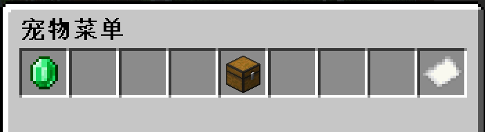
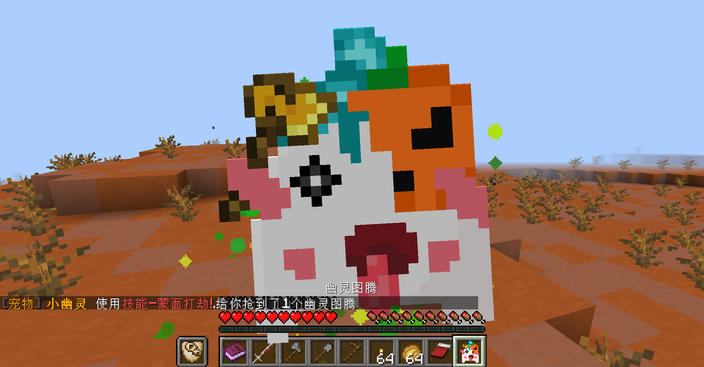

> 💔 Companions插件并不是一个高度自定义的插件，所以我们的宠物都很普通，请不要对宠物有过高的期待。

## 宠物图鉴

输入指令 `/pet` ，点击  `书本` 即可打开**宠物图鉴**。

## 宠物仓库

输入指令 `/pet` ，点击  `箱子` 即可打开**宠物仓库**。

你可以在宠物仓库里查看你已经拥有的宠物和你的宠物金币数量。

## 纪念限定宠物

> 服务器每个月都会推出一只**纪念限定宠物**，用来奖励购买了 `用爱发电机` 的玩家。

> 只要还在 `发电` 的时间内,你就可以通过指令 `/kit` 领取我们的**纪念限定宠物**，也就是说你甚至有机会只花**1个月的钱**领取到**3只宠物**。

比如2020年10月纪念宠物月兔（2020.10.1为中秋）

比如2020年11月纪念宠物小幽灵（2020.11.1为万圣节）

纪念限定宠物发动技能时也会有**额外的动画效果**。

## 宠物能力

> 宠物能力是给予你药水效果，或定时执行某一个指令，所以并不会很强大。

## 宠物金币

> 宠物金币是用来购买宠物的货币，独立于木锄币，玩家之间也无法交易。

1. **你可以通过氪金用RMB购买宠物金币，比例为1:1；**

2. **你可以通过顶帖每次获得2枚宠物金币。**

## 购买宠物

**在宠物图鉴中，选择你喜欢的宠物，左键点击即可购买。**

> **💡 由于插件作者没有设置二次确认，请不要乱点以免错误购买。**