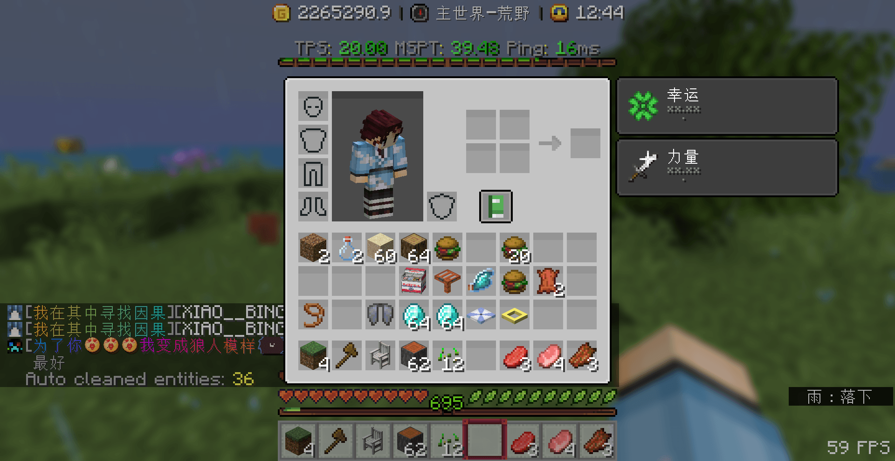

> [!warning]
> Companions插件无法高度自定义，今后可能会删除此插件(或者寻找更好的替代品)

## 💵 购买宠物

1. 输入`/pet`打开**宠物菜单**

2. 点击 **绿宝石** 进入 **宠物商店**

> [!warning]
> 已经购买了或无法购买的宠物不会显示在宠物商店

3. 点击想要购买的宠物购买

点击想要的宠物，即可购买

> [!warning]
> 此插件无任何确认购买的步骤，点击即购买，小心误触

4. 购买成功的提示

## 🔃 切换宠物

1. 输入`/pet`,点击 **箱子** 进入 **宠物仓库**

2. 点击想要切换的宠物即可

## ☪️ 宠物技能

> 由于插件无法高度自定义，宠物技能只能实现一些药水Buff或间隔一段时间执行命令

+ 每个宠物都有自己独特的技能，你可以通过宠物描述来查看

+ 宠物技能自动释放，你不需要执行任何命令，只要切换出来宠物即可

+ 药水效果类的技能可以升级，详细查看[技能升级](#技能升级)

### 以宠物汉堡包为例

当20分钟触发技能时，会给玩家一个能吃的汉堡包

## 🆙 技能升级

> [!warning]
> 目前只有药水buff类的技能能够升级,升级后药水效果等级将提升

### 以宠物巨钳蟹为例

1. 宠物巨钳蟹给予主人1级的力量BUFF

2. 在`/pet`的宠物菜单内，点击 **纸** 打开 **宠物调试**

3. 点击 **经验瓶** 进行 **升级宠物技能**

4. 升级成功的提示

5. 升级成功后宠物巨钳蟹给予主人2级的力量Buff

## ✏️ 宠物名字

1. 在`/pet`的宠物菜单内，点击 **纸** 打开 **宠物调试**

2. 点击 **命名牌** 进行 **宠物改名**

3. 在聊天栏里输入想要改的名字，比如`&6无敌大汉堡`

你可以使用普通的颜色代码

4. 你可以点击 **空地图** 进行 **是否显示宠物名字**

## 🤏 更换手持

### 以更换宠物手持物品为钻石为例

1. 按`F3+H`打开高级提示框，将鼠标移到钻石上查看钻石英文id

我们可以看到钻石的英文是`diamond`

2. 在`/pet`的宠物菜单内，点击 **纸** 打开 **宠物调试**

3. 点击 **钻石剑** 进行 **更换宠物手持物品**

4. 在聊天框里输入`diamond`

5. 宠物成功手持物品为钻石

