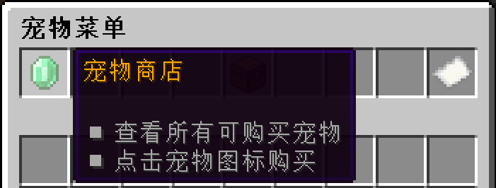
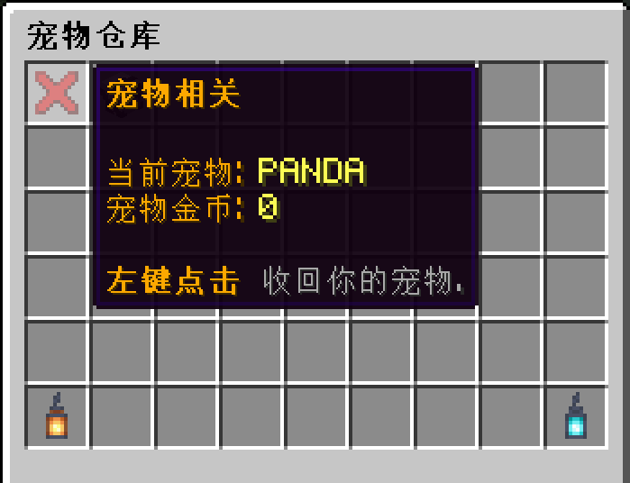

## 进入宠物菜单

> [!note]
> Companions插件并不是一个高度自定义的插件，所以我们的宠物都很普通，请不要对宠物抱有过高的甚至不切实际的期待。

在聊天栏中输入指令 `/pet` ，或是在系统菜单里找到相应入口，即可打开宠物菜单。

## 宠物商店

点击宠物菜单中的绿宝石图标，就可以进入宠物商店，挑选购买自己喜欢的宠物：

将鼠标移到宠物图标上即可查看宠物信息，点击**左键**就能买下宠物了：

>[!note]
>商店会自动为玩家屏蔽掉已经购买过的宠物，防止误操作重复购买。

## 宠物背包

已经购买好的宠物，可以进到宠物背包里面进行查看：

**右键**点击宠物即可将其召唤出来。如果要收回宠物，就点击菜单左上角的❌图标：

## 宠物调试

宠物调试可以为玩家的宠物提供升级和改名等功能，这些是要另外花钱的：

