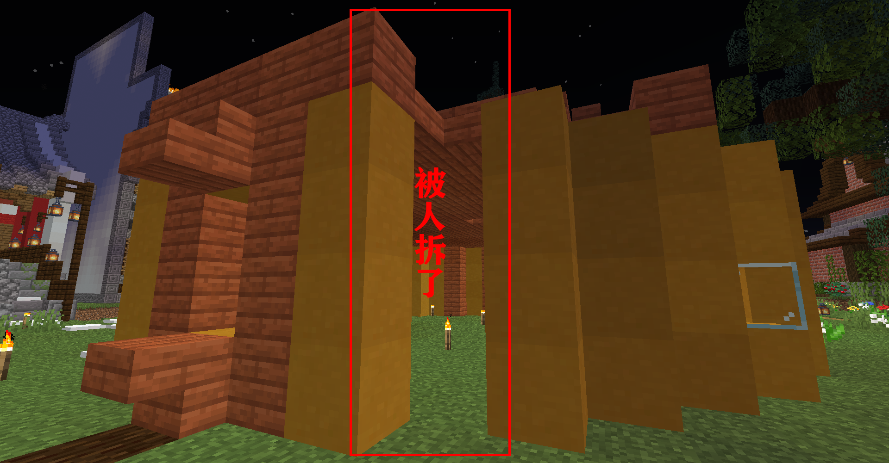
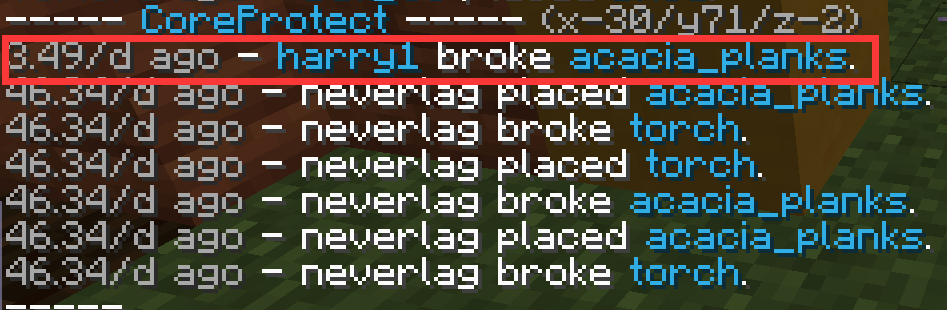
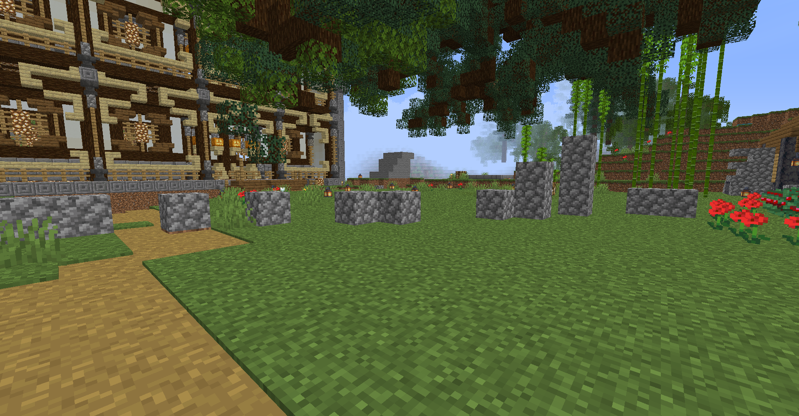
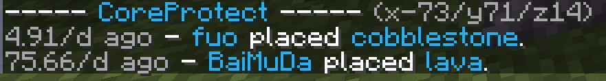
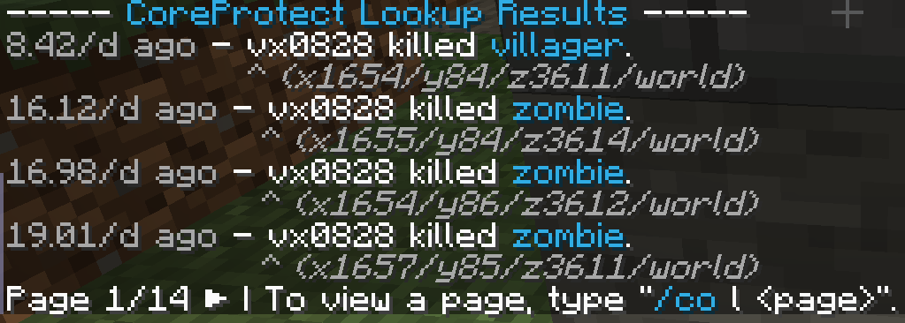

> [!note]
> 破坏查询是用Coreprotect插件，一般被称为COI插件，可以记录方块破坏、生物击杀等情况。

## 查询方块

1. **查询不见的方块**

    这个房屋的一角不知道被谁拆掉了，我想查询一下：

    

    输入指令 `/co inspect` **开启查询模式**：

    

    手里拿着随便拿一个方块右键放在被破坏的地方，聊天框会弹出信息：

    

    可以发现，是玩家 `harry` 在 `3.49天` 之前，破坏了 `金合欢木板`。

    查询结束后，再次输入指令 `/co inspect` **关闭** **查询模式**。

    

2. **查询多出来的方块**

    图中，有人在路上随便摆放 `圆石` ，影响美观，想看看是谁干的：

    

    输入指令 `/co inspect` **开启查询模式**：

    

    左键点击路上的 `圆石`，聊天框会弹出信息：

    

    可以发现，是玩家 `fuo` 在 `4.91天` 之前，放置了 `圆石`。

    查询结束后，再次输入指令 `/co inspect` **关闭查询模式**。

    

## 查询生物

1. **家里的 `村民` 莫名其妙的消失了**

    输入指令 `/co lookup action:kill radius:<查询半径> time:<查询时间>`，

    例如 `co lookup action:kill radius:3 time:10d`：

    

    发现是玩家 `vx0828` 在 `8.42天` 之前，杀了一只 `村民`。

## 查询特定方块

1. **查询有没有人用TNT炸我的家**

    输入指令 `/co lookup block:tnt radius:<查询半径> time:<查询时间>`。

2. **查询我家的潜影盒是不是被人拿走了**

    输入指令 `/co lookup action:-block block:shulker_box radius:<查询半径> time:<查询时间>`。

## 区域回档

> [!tip]
> 如果你的家被熊孩子破坏了，Coreprotect插件是可以对你家附近进行区域回档的，请不必过于担心。

需要 **区域回档** 请找服主或在线的管理员。