> [!warning]
> 因为服务器没有强制使用服务器资源包，所以目前每日商店只出售或回收**原版物品**

## 🚪 打开商店

### 通过主菜单打开每日商店

输入指令`/cd`打开主菜单,点击商店图标进入商店(可能因服务器更新,主菜单略有不同)

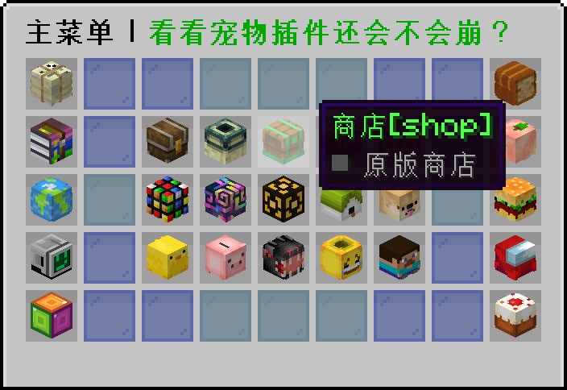

### 输入指令`/shop`打开每日商店

输入指令`/shop`直接打开商店

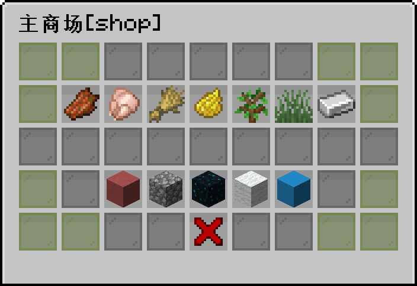

## 🔖 商店分类
> [!tip]
> 你可以在群文件里下载到物价表，或者在gitee上下载

+ 掉落物
+ 食物
+ 作物
+ 染料
+ 木头
+ 植物
+ 矿石
+ 陶瓦
+ 建材
+ 黑市
+ 羊毛
+ 混凝土

## 📦 购买物品

> [!warning]
> 每日商店的商品都会随机刷新，所以你不一定能购买到自己心仪的物品

玩家在服务器内赚钱的主要路径，就是通过挖矿、饲养家畜以及种植农产品等方式，获得可以用于交易的商品，然后在原版商店中出售兑换硬币。

以卖矿为例，选择进入矿物商店入口，如下图所示。

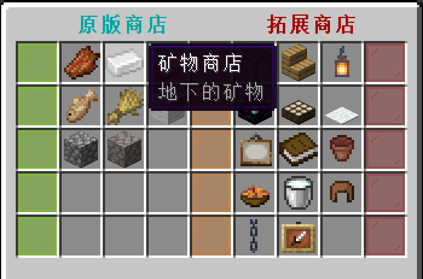

在矿物列表界面选择其中一种可交易的矿物（本例中为钻石），将鼠标移动至商品图标上查看当前交易价格，然后点击进入交易界面。

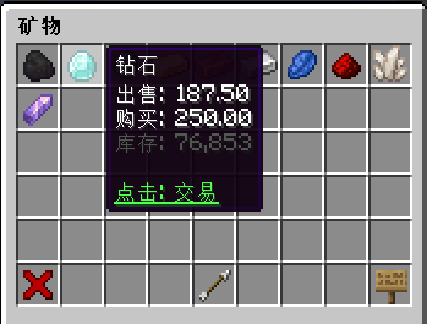

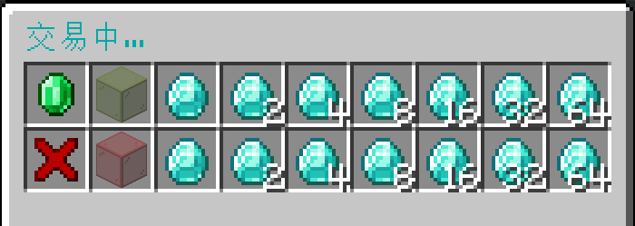

在上面的交易界面里，将鼠标移至绿宝石上可以显示当前玩家的硬币余额和商店总资金数量:
    
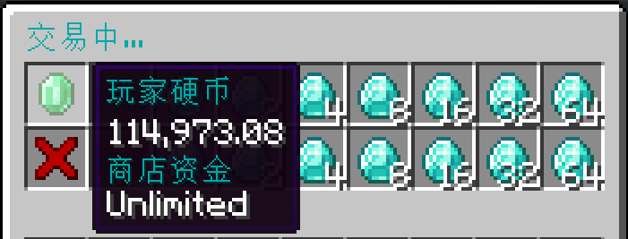
    
菜单第一排是出售模式，玩家可以选择某个给定的商品数量进行出售以换取硬币:
    
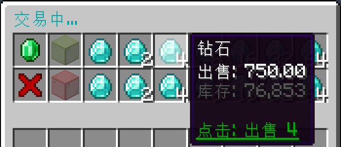

>[!note]
>如果玩家选择的商品售出数量大于实际持有的数量，那么就会直接卖掉手上所有商品，并按照实际商品数量×当前出售单价，向玩家发放对应数额的硬币。

菜单第二排是购买模式，玩家可以选择某个给定的商品数量进行购买:

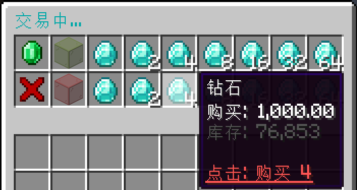

>[!warning]
>由于系统商店没有退款选项，因此在购买商品前，玩家务必检查清楚所要购买的数量。如果购买了错误种类或错误数量的商品，玩家只能通过出售回商店的方式减少损失——注意是“减少损失”，因为商品的出售价格通常低于购买价格，所以指望通过卖回系统商店来回本是不可能的。

## 💰 出售物品

拓展商店在交易方式上和原版商店是一样的，只不过交易的商品必须要安装使用本服特有的[资源包](/joinproblem?id=材质包资源包怎么安装)，才能够查看和使用。

下面展示的是部分拓展物品的交易界面。

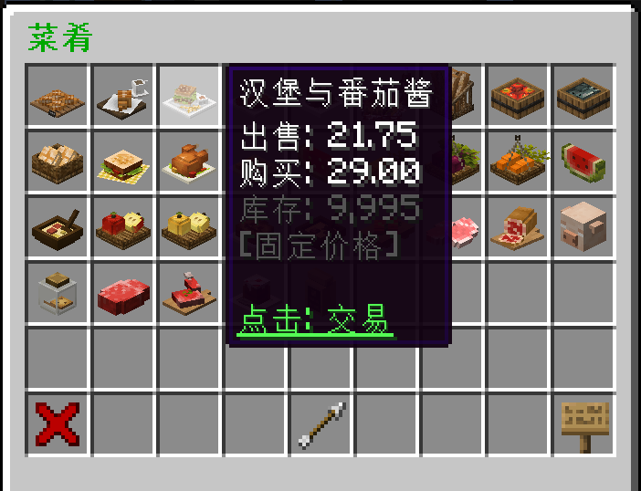
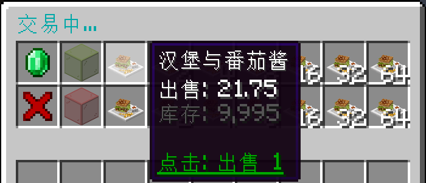
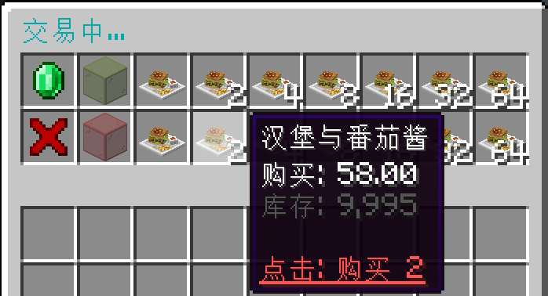