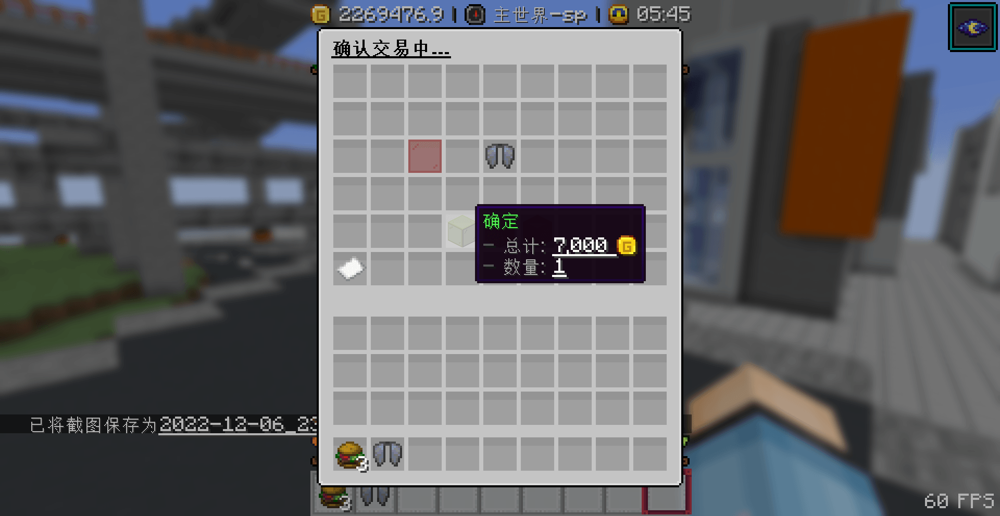

> [!warning]
> 因为服务器没有强制使用服务器资源包，所以目前每日商店只出售或回收**原版物品**

## 🚪 打开商店

### 通过主菜单打开每日商店

输入指令`/cd`打开主菜单,点击商店图标进入商店(可能因服务器更新,主菜单略有不同)

### 输入指令`/shop`打开每日商店

输入指令`/shop`直接打开商店

## 🔖 商店分类
> [!tip]
> 你可以在群文件里下载到物价表，或者在[gitee](https://gitee.com/neverlag/dripdrop_wiki/blob/master/file/%E6%9C%8D%E5%8A%A1%E5%99%A8%E7%89%A9%E4%BB%B7%E8%A1%A8.xlsx)上下载

+ **掉落物**
  + (比如腐肉、鸡蛋、海晶砂砾、火药、粘液球、皮革等等生物的掉落物)
+ **食物**
  + (比如生鸡肉、热带鱼、河豚、兔肉煲、烤马铃薯等能够食用的物品)
+ **作物**
  + (比如苹果、竹子、甜菜根、甜菜种子、西瓜、南瓜等农业方面的物品)
+ **染料**
  + (比如黑色染料、蓝色染料、棕色染料、粉色染料等不同颜色的染料)
+ **木头**
  + (比如金合欢原木、金合欢木板、金合欢树苗等不同树木的产物)
+ **植物**
  + (比如绒球葱、兰花、草、藤蔓、睡莲、绯红菌、凋零玫瑰等等植物花卉)
+ **矿石**
  + (比如紫水晶块、紫水晶碎片、铜块、铜锭、粗铜、粗铜块等矿物)
+ **陶瓦**
  + (比如黑色陶瓦、蓝色陶瓦、棕色陶瓦、青色陶瓦等不同颜色的陶瓦)
+ **建材**
  + (比如安山岩、玄武岩、泥土、沙子、闪长岩、黑石、圆石等基础的建筑材料)
+ **黑市**
  + (比如信标、苦力怕头颅、鞘翅、潜影盒、海洋之心等原版珍稀物品)
+ **羊毛**
  + (比如黑色羊毛、蓝色羊毛、棕色羊毛、青色羊毛等不同颜色的羊毛)
+ **混凝土**
  + (比如黑色混凝土、蓝色混凝土、棕色混凝土、青色混凝土等不同颜色的混凝土

## 📦 购买物品

> [!warning]
> + 每日商店的商品都会随机刷新，所以你不一定能购买到自己心仪的物品  
> + 黑市物品有库存限制，你只能购买库存数量的商品

### 以购买黑市物品-鞘翅为例

1. 点击每日商店里黑市的图标

2. 发现有鞘翅售卖，**左键**点击鞘翅

3. 选择购买数量，点**增加 1**

4. 点击**确定**来确认购买

5. 成功购买后聊天栏的系统提示

## 💰 出售物品

> [!warning]
> + 每日商店的商品都会随机刷新，所以你不一定能出售自己想出售的物品  
> + 每个商店(比如掉落物商店)都有出售上限，你最多只能出售上限数量的物品

### 以出售矿物物品-绿宝石为例

1. 点击每日商店里矿物的图标

2. 发现有绿宝石，**右键**点击绿宝石

3. 选择出售数量，点击**全部**来全部出售

4. 点击**确定**来确认出售

5. 成功出售后聊天栏的系统提示

##  ❓ 常见问题

### 为什么没法出售物品了

+ 每个商店(比如混凝土商店、掉落物商店)都有出售上限，达到上限后将无法出售
+ 具体的上限可以在商店的右下角查看

### 出售上限什么时候恢复

+ 每日早上6：10分会自动更新商店货物，恢复出售上限

### 为什么只能购买一个物品

+ 有些物品具有库存属性，最多只能购买库存数量的物品

### 拓展物品在哪里买？

+ 这个每日商店只有原版物品，拓展物品一般是在家具商店购买

## 💩 已知bug

+ 服务器在重启后会自动刷新收购上限，导致崩服重启后又能再出售一次
+ 出售和购买物品的系统消息无法正确汉化
+ 插件作者几乎已经确定要跑路了！这个插件可能要被更换！