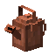
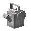
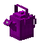
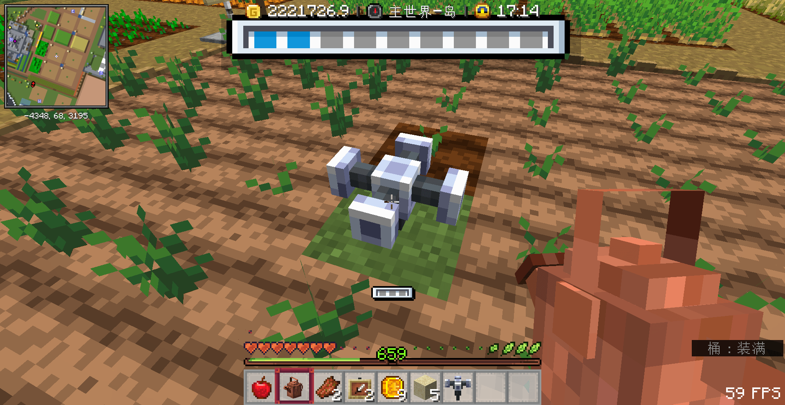
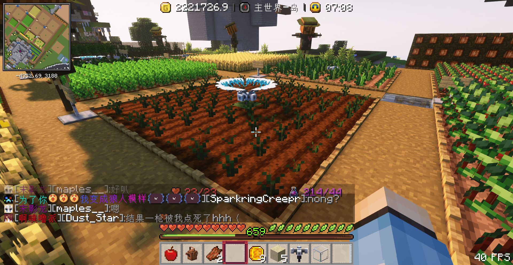

### 水壶

> [!tip]
> 水壶需要在水池里先右键接水才能浇水

<!-- tabs:start -->

#### **铜水壶**

+ 最多装3格水
+ 浇灌范围1×1

#### **银水壶**

+ 最多装4格水
+ 浇灌范围3×1

#### **金水壶**

+ 最多装5格水
+ 浇灌范围3×3

#### **铱金水壶**

+ 最多装6格水
+ 浇灌范围5×3

<!-- tabs:end -->

### 洒水器

>[!tip]
> 洒水器在游戏里每天7:00会自动浇灌一次  
> 洒水器也需要用水壶浇水进去

<!-- tabs:start -->

#### **洒水器**

+ 最多装5格水
+ 浇灌范围5×5

#### **优质洒水器**

+ 最多装7格水
+ 浇灌范围7×7

#### **高端洒水器**

+ 最多装9格水
+ 浇灌范围9×9

<!-- tabs:end -->

