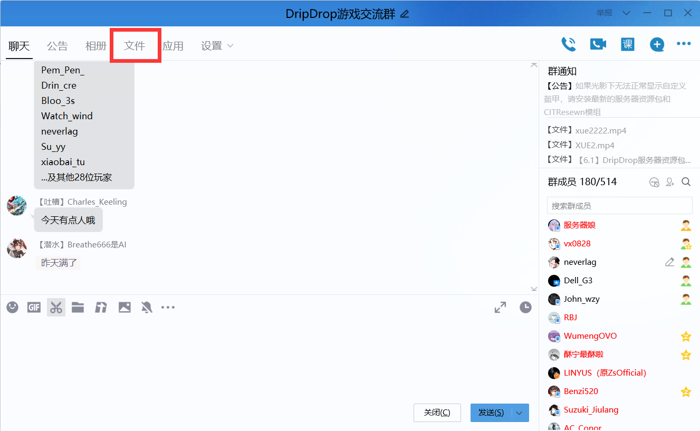
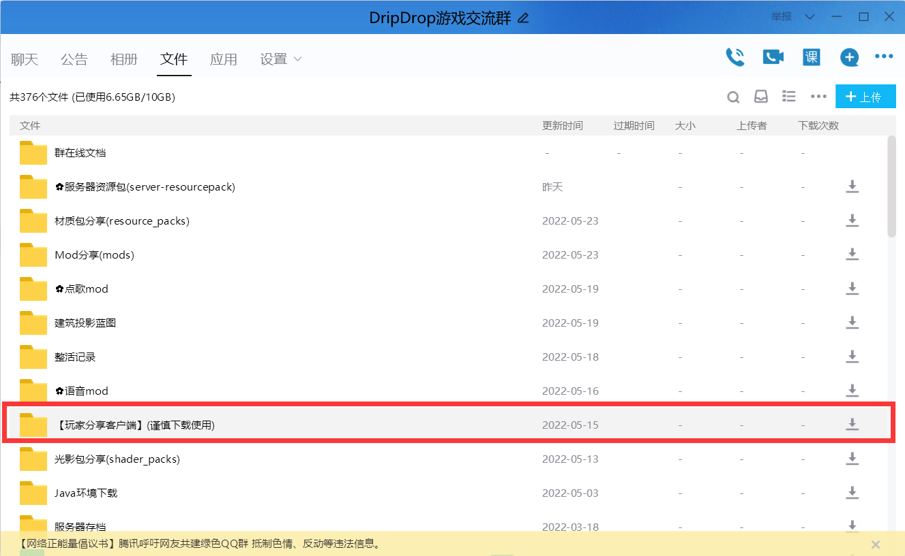
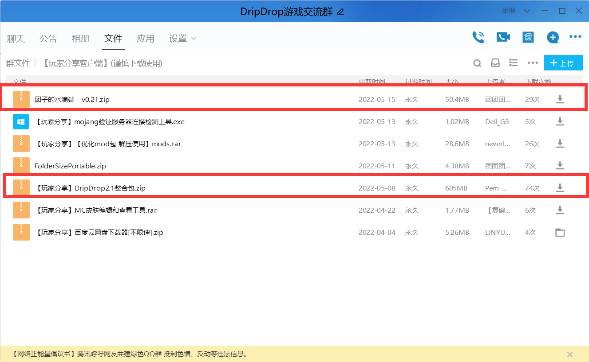

## 搜索指向关键词
> - 客户端

## 不需要专用客户端

进入服务器不需要任何专用客户端，只需要输入IP``dripdrop.games``即可连入。

## 推荐客户端

在Mojang不顾优化的情况下更新到1.18，已经俨然是一坨屎山代码。

很多低配机器在官方客户端下游玩会感觉卡顿，可以下载群内的整合客户端。

或者安装[Fabulously Optimized](https://www.curseforge.com/minecraft/modpacks/fabulously-optimized)（一堆优化mod的整合包）

## 下载推荐客户端

**① 打开QQ群聊，点击群文件**

**② 双击【玩家分享客户端】文件夹**

**③ 选择下载图中这两个客户端中的一个**

