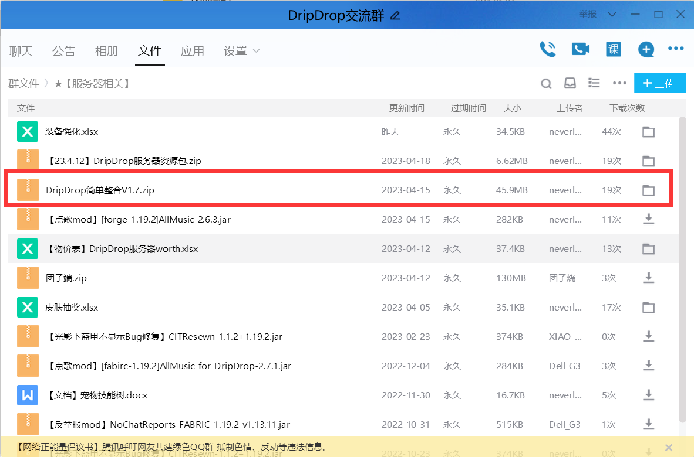

## ✅ 不需要专用客户端
> [!tip]
> + 你可以使用符合当前服务器版本的任意客户端加入服务器；
> + 只需要输入IP `dripdrop.games`即可连入。

## ⭐ 推荐客户端

> [!warning]
> 如果你没有客户端，或者客户端并没有什么优化mod，我 **非常建议** 你使用“DripDrop简单整合”客户端。

Minecraft高版本的优化并不够好，很多人在高版本只有40-50FPS，客户端需要优化！

我在百万下载量的优化整合包[Fabulously Optimized](https://www.curseforge.com/minecraft/modpacks/fabulously-optimized)基础上，增加了一些实用、美化mod，让你体验到丝滑而且漂亮的游戏界面

我的笔记本配置是GTX1060 with Max-Q，开光影也能有65FPS

## ⬇️ 下载并解压客户端

**1. 打开[QQ群聊](https://jq.qq.com/?_wv=1027&k=VoMxW5eI)(286338133)，点击“文件”**

**2. 打开`★【服务器相关】`文件夹**

**3. 下载我整合的客户端`DripDrop简单整合`**

**4. 解压到"DripDrop简单整合"**

> [!warning]
请勿直接在桌面上使用"解压到当前文件夹"

**5.进入文件夹内，双击HMCL启动器后会自动下载补全文件**

## 🕹️ 登录正版账号

**1.点击"没有游戏账户"**

**2.选择微软账户开始登录**

**3.在跳转的网页内，用Ctrl+V粘贴验证码**

**4.登录你的微软账号**

**5.返回启动器并启动游戏**

