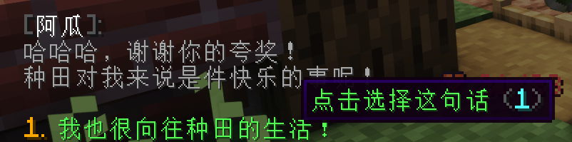
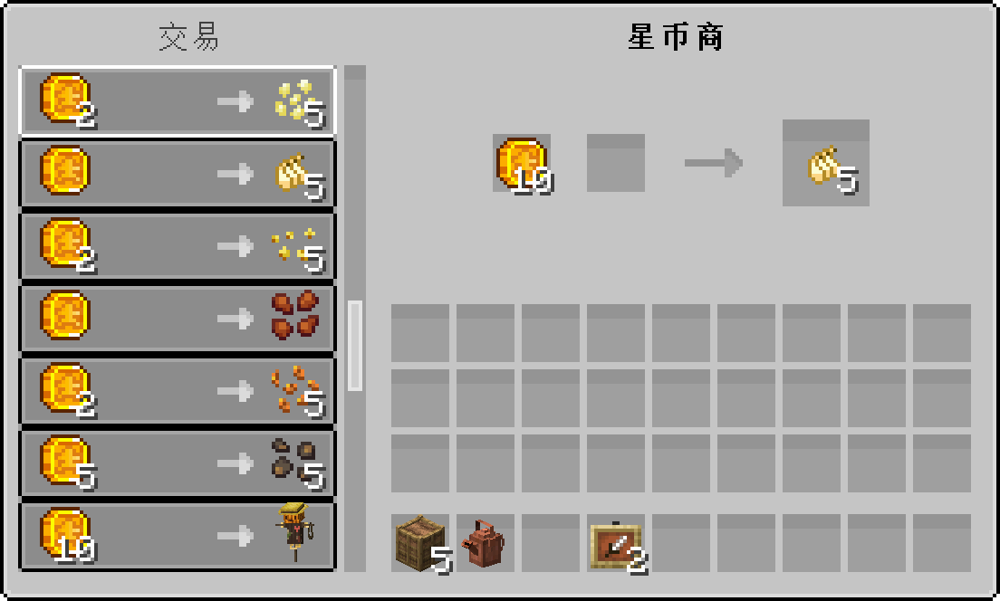

## 🪴 开启种田之旅

1. 输入`/warp 喵喵村` 前往喵喵村寻找到NPC **阿瓜**

2. 右键点击**阿瓜**触发对话

3. 每次都用**鼠标**点击第一个选项的对话

4. 领取到10×星星币

5. 前往附近的农商店，找到NPC **星币商**

6. 用星星币兑换你想要的种子

7. 用锄头将土地变成耕地

8. 将 **种子** **右键** 播种在 **耕地** 上

9. 静静等待农作物的生长即可

## 🍆 农作物

> [!warning]
> 改版后，农作物可以种在原版的耕地上，但一个区块最多种81个星露谷作物

### 作物分类

<!-- tabs:start -->

#### **番茄**

+ 番茄有5个生长阶段
+ 成熟收获1~3个番茄
+ 5%获得金星番茄，1%获得巨型番茄
+ 收获后会回到第1生长阶段

#### **白菜**

+ 白菜有4个生长阶段
+ 成熟收获1个白菜，80%获得0~2个白菜种子
+ 5%获得金星白菜，2%获得巨型白菜

#### **葡萄**

+ 葡萄有6个生长阶段
+ 成熟收获1~2个葡萄
+ 5%获得金星葡萄
+ 收获后会回到第4生长阶段

#### **玉米**

+ 玉米有4个生长阶段
+ 成熟收获1~2个玉米
+ 5%获得金星玉米

#### **辣椒**

+ 辣椒有5个生长阶段
+ 成熟收获1~3个辣椒
+ 5%获得金星辣椒

#### **大蒜**

+ 大蒜有4个生长阶段
+ 成熟收获1~3个大蒜
+ 5%获得金星大蒜

#### **苹果**

+ 苹果有8个生长阶段
+ 成熟收获1~3个苹果
+ 5%获得金苹果
+ 收获后会回到第5生长阶段
+ 在第7个生长阶段破坏获得青苹果

#### **香蕉**

+ 香蕉有7个生长阶段
+ 成熟收获1~3个香蕉
+ 5%获得金星香蕉
+ 收获后会回到第4生长阶段

#### **稻米**

+ 稻米有5个生长阶段
+ 成熟收获2\~4个稻米,80%获得1\~2稻米种子
+ 5%获得金星稻米

#### **茄子**

+ 茄子有4个生长阶段
+ 成熟收获1\~3个茄子
+ 5%获得金星茄子

#### **摇钱树**

+ 新年时的限定作物
+ 茄子有6个生长阶段
+ 成熟收获1\~8个红包
+ 红包打开后随即获得1~666硬币

<!-- tabs:end -->

### 作物种子

+ 用星星币与 **NPC星币商** 兑换

+ 将农作物用工作台变成种子(香蕉、白菜无法这样获得种子)

## 💧 浇水

> [!warning]
> + 改版后只需要保持耕地湿润即可
> + 旧版的水壶、洒水器可以在喵喵村兑换回星星币

## 🧪 肥料

>[!tip]
> 肥料需要在播种前就在耕地里使用  
> 可以手里拿着肥料探测器右键耕地来查看肥料剩余次数

### 加速肥料

+ 有概率一次生长2个阶段

<!-- tabs:start -->

#### **普通加速肥料**

+ 10%概率生效
+ 最多使用14次

#### **高级加速肥料**

+ 20%概率生效
+ 最多使用14次

#### **超级加速肥料**

+ 30%概率生效
+ 最多使用14次

<!-- tabs:end -->

### 保湿肥料

+ 有概率生长过后不消耗水分

<!-- tabs:start -->

#### **普通保湿肥料**

+ 10%概率生效
+ 最多使用28次

#### **高级保湿肥料**

+ 20%概率生效
+ 最多使用28次

#### **超级保湿肥料**

+ 30%概率生效
+ 最多使用28次

<!-- tabs:end -->

### 品质肥料

+ 增加收货金星作物的几率

<!-- tabs:start -->

#### **基础品质肥料**

+ 收货金星作物的几率提升至10%
+ 最多使用28次

#### **高级品质肥料**

+ 收货金星作物的几率提升至15%
+ 最多使用28次

#### **超级品质肥料**

+ 收货金星作物的几率提升至20%
+ 最多使用28次

<!-- tabs:end -->

### 增产肥料

+ 增加收获时获得的农作物数量

<!-- tabs:start -->

#### **普通增产肥料**

+ 50%几率额外收货1个作物
+ 最多使用14次

#### **高级增产肥料**

+ 50%几率额外收货2个作物
+ 最多使用14次

#### **超级增产肥料**

+ 80%几率额外收货2个作物
+ 最多使用14次

<!-- tabs:end -->

### 巨大化魔药

+ 更高概率获得巨大化农作物

<!-- tabs:start -->

#### **普通巨大化魔药**

+ 增加2%生成巨型作物的几率
+ 最多使用14次

#### **高级巨大化魔药**

+ 增加4%生成巨型作物的几率
+ 最多使用14次

#### **超级巨大化魔药**

+ 增加8%生成巨型作物的几率
+ 最多使用14次

<!-- tabs:end -->

### 肥料探测仪

+ 右键农作物或耕地，若有肥料则会悬浮显示肥料类型与剩余使用次数

## 🎃 乌鸦与稻草人

### 乌鸦
乌鸦(只是动画效果)有0.5%的几率生成，会吃掉农作物

### 稻草人

你可以放置稻草人来驱赶乌鸦，稻草人可以保护当前区块的农作物

可以按`F3+G`查看区块范围

## 💰 出售作物

你可以在 **农商店** 里右键NPC **农商** 出售作物

出售物品的步骤可以查看每日商店里的出售物品

