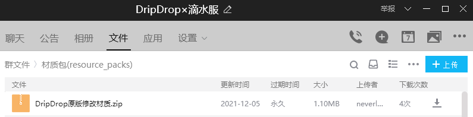

## 提前劝退

**不欢迎** 以下玩家：

+ 恶意攻击其他玩家，搞破坏，盗取他人财产的玩家（熊孩子）
+ 飞天、透视等恶劣作弊行为的外挂使用者
+ 脾气很差张口就骂的玩家
+ 什么都不懂，却认为别人理所应当需要帮助你的玩家

**不适合** 以下玩家：

+ 搞大型红石的玩家
+ 重度RPG玩家
+ 喜欢肝，喜欢刷的玩家

## 进入服务器

目前我们还没有正版验证和白名单的门槛，你可以直接用IP连入我们服务器。

我们服务器的IP地址为 `txyminecraft.club:25565`。

你可以用 **1.16** 任意版本加入我们的服务器 （推荐用 **1.16.5**）。

## 安装材质包

> 👍 你可以暂时跳过此步，因为这并不是必须的。

> 🍀 但是如果你想体验拓展物品，请 **务必安装** 材质包。

> ❓ 材质包的有关问题请查看 [入服常见问题](joinproblem.md)。

请知悉，服务器里面的拓展物品需要安装材质包，你可以通过以下两种方式下载：

+ 进入服务器后，选择 **是** 即可自动下载使用

+ 加入QQ群`286338133` 从群文件里的 `✿拓展物品资源包✿` **下载最新的** 材质包

## 注册与登录

首次加入服务器，请 `按T` 打开聊天框，输入指令`/register <密码> <重复一次密码>` ，回车完成用户注册。

例如 `/register china2020 china2020`。

登录服务器，只需要输入指令 `/login <密码>` 并回车，就能完成用户登录。

例如 `/login china2020`。

## 正版验证

> ❌ 如果你并非正版玩家，请 **不要** 进行正版验证。

输入指令 `/premium` 之后再次输入指令 `/premium`。

