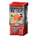

## 🔖 家具分类

+ 桌椅
+ 小摆饰
+ 菜肴
+ 盆栽
+ 灯饰
+ 电器
+ 壁饰
+ 室内
+ 室外
+ 厨房
+ 卧室
+ 浴室
+ 书房
+ 商店
+ 集市
+ 自然

## 🛒 购买家具

1. 输入指令`/jiaju`打开家具城

2. 点击各个商店，大致浏览商品

3. **左键**点击想要的商品

4. 选择购买的数量

+ 如果只想购买1个，那么可以直接点`确认`

> [!warning] 
> 由于每日商店和家具商店所使用的插件不同，此处购买一个物品时的操作略有不同  
> 每日商店需要点击+1后才能购买一个，家具商店可以直接点击确认

+ 如果想买2个，那么可以点击`[+] 1` 后点击 `确认`

5. 成功购买后的提示

成功购买后聊天栏会有提示信息

## 🪚 制作家具

> [!warning]
> 目前只有木制的桌椅能够通过`木匠台`制作

1. 在桌椅商店购买`木匠台`  

2. 将购买的木匠台摆放在地上后**右键**打开

3. 用鼠标滚轮在交易页面滚动，查看想要制作的家具并点击

4. 取出想要的物品(按住shift取出就是全部制作)

5. 按ESC键退出制作页面

## 🛁 家具摆放

+ 一般家具都是如同正常的方块右键摆放在地上

+ 类似悬挂盆栽、风铃、吊灯等悬挂式的家具需要放置在某个方块的底部

+ 类似挂画、墙壁上的照片，贴墙闹钟等壁饰需要放置在墙壁上

## 👆 家具交互

+ 椅子类家具右键点击可以坐在上面
  
+ 垃圾桶右键可以打开垃圾桶菜单  

+ 饮料机右键打开购买饮料菜单  

+ 扭蛋机右键打开扭蛋机菜单  

+ 冰淇淋柜右键打开购买冰淇淋菜单  

+ 木匠台右键可以打开制作页面  

## 🎨 家具染色

> [!warning]
> 只有物品名字中带有染色符号  的才能染色  
> 如果语言里面设置了强制使用unicode字符的话，染色符号显示为✎

1. 手持可以染色的物品(比如原版的皮革衣服，家具里的遮阳伞)

2. 输入指令`/ranse` 打开染色菜单

3. 点击想要的颜色，成功染色！

4. 可以直接输入`/dye <rgb颜色>`

比如你可以输入`/dye #aabbff` 来染色

## ❓ 常见问题

### 家具的材质贴图变了

+ 有时候会删去一些家具。被删去家具的材质就会被其他材质代替
+ 有时候家具的原材料(Material)会更换。比如灯饰从一开始的纸变成火把(为了支持动态光源)，导致家具材质变化
+ 有时候家具模型会重制

### 某个地方卡了个屏障

+ 有时候被删去的家具无法正确拆掉，会在原来的地方卡一个屏障
+ 请联系在线的管理员敲掉屏障

### 放了很多家具很卡

+ 家具基本都是用屏障+透明展示框+资源包实现的，放置过多家具会导致客户端掉帧（影响FPS）
