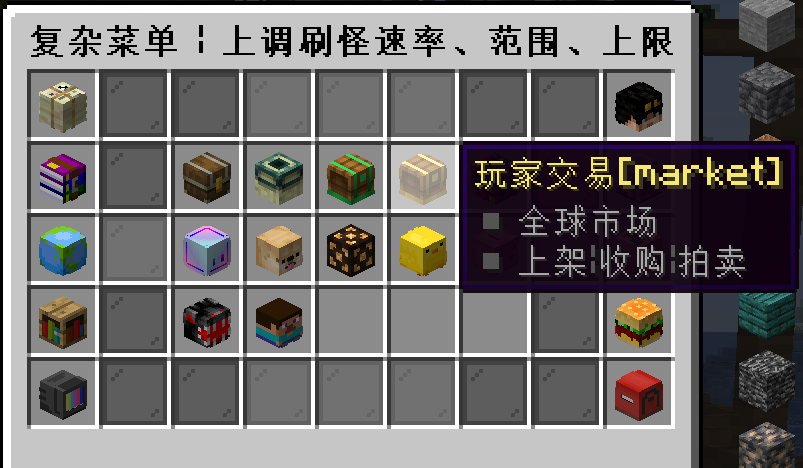
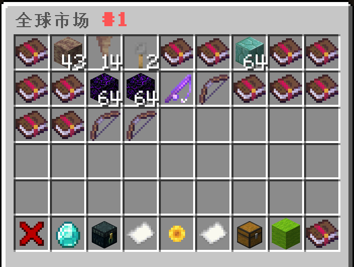
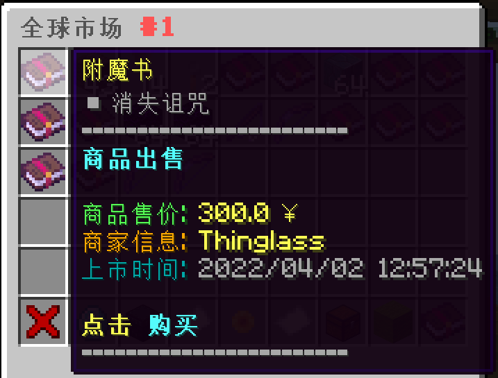
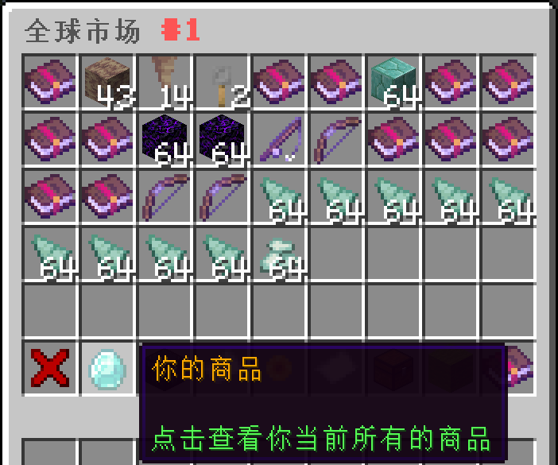
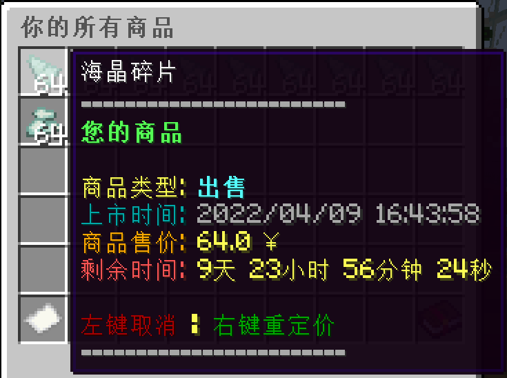
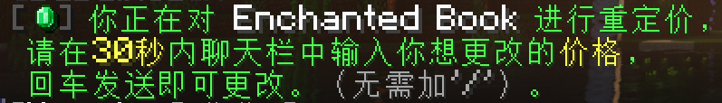
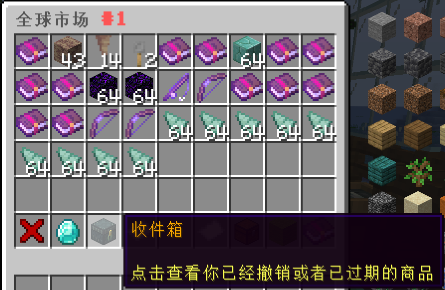
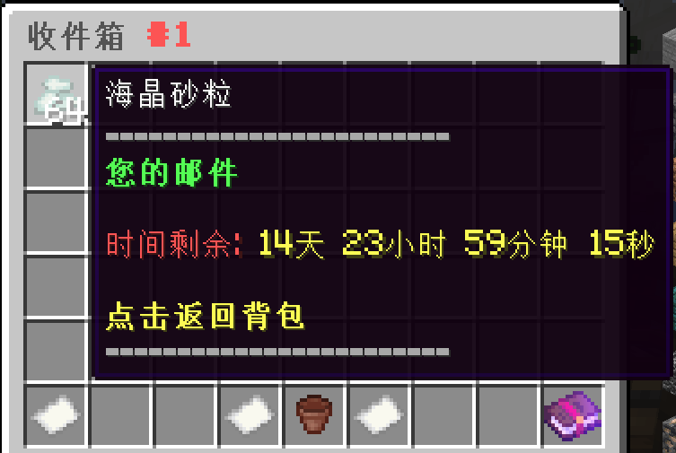

全球市场是一个**高度自由**的服内玩家交易平台。任何玩家都能在全球市场中进行交易。交易的商品可以是玩家在服务器内获得的任何物品；交易的价格最低为0.1硬币，并且不设上限。**每个玩家最多上架10件商品**，只有商品卖出或下架才能获得空闲的商品上架名额。

全球市场的入口和交易界面如下：

将鼠标移动到商品图标上，就能查看类似下图的商品信息：

如果玩家有物品需要售出，首先要**右手持有该物品**，接着输入指令`/ca sell <总售价> <售出数量>`并发送执行，即可将物品上架到自由市场中。

>[!note]
>注意，在`/ca sell <总售价> <售出数量>`指令中，售出数量**最大不能超过玩家右手持有的物品实际数量**，总售价也是代表这些数量的物品打包出售的价格，数值不能低于0.1。此外，如果一个（组）物品没有被拿在右手上，那么出售指令是不会对其生效的。

如果玩家想要对已上架的商品进行重新定价，那么可以按照下图进到相应的菜单界面，选择要重新定价的商品：

**右键**点击指定商品，系统就会在聊天栏里弹出类似下图的提示，按指示修改定价即可：

如果玩家想要下架自己的商品，同样是在上上张图中，点击**左键**即可。下架商品会在被暂时保留在收件箱中15天。如果在到期前没有将下架商品返回背包，那么系统就会自动清理保存到期的下架商品：

