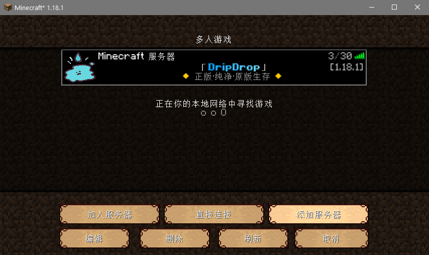

> ✔️ 玩家只需要使用 `1.16.X` 的客户端输入IP `txyminecraft.club:25565` 即可加入服务器

> 📘 以下教程是为 没有启动器 甚至 没有 *Java* 的 **超级萌新** 准备的

## 下载Java

一般而言，安装 *Java* 最安全的方式，是直接在<u>[官网](https://www.oracle.com/java/technologies/javase-jre8-downloads.html)</u>下载。

但是超级萌新一般不了解 *Java*，也不会有 *Oracle* 账号，而且国内下载速度很慢。

比较推荐在QQ群 `286338133` 的群文件 `Java环境下载` 里下载java。

> ❗ 对于不熟悉 Java 的新手玩家，<u>强烈不建议自行搜索、下载、安装和使用来源不明的安装包</u>，此举可能存在计算机安全风险

> ❗ 请玩家务必安装使用 **<u>64</u>** 位的安装包（名字中标有64或x64的），否则游戏将发生内存不足异常。

> ❗ 单纯玩MC只需要下载 JRE 即可，当然你下载 JDK(开发者工具，内含JRE) 也是OK的

## 安装Java

+ **Windows用户的安装过程**

下载完安装包后，解压得到的应该是 `jre-8u271-win-x64.exe` 的可执行文件，双击打开它，可能会提示安全警告，我们选择 **是**。

+ **MacOS用户的安装过程**

下载的应该是 `jre-8u271-macosx-x64.dmg` 的可执行文件。

## 下载启动器

+ **正版启动器**

如果你是正版用户，你可以使用正版启动器，它简洁美观，只是在更新的时候会网速很慢。

请前往[官网](https://www.minecraft.net/zh-hans/download)下载。

+ **第三方启动器**

考虑到你是一个 **超级萌新** ，请加入 `QQ群286338133` ，在群文件 `✿客户端整合包✿` 中下载整合包。

**请不要在网络上随便的下载第三方启动器！！！**

## 设置启动器

下载完后对 `1.16.3fabric简单整合.rar` 解压得到：

双击 `HMCL-3.3.172.exe` 启动HMCL启动器。

输入你喜欢的用户名(注意必须是英文字母或者数字,可以大小写与下划线，不能中文)，然后点击 **确定** 。

最后 **启动游戏** 。

## 加入服务器

