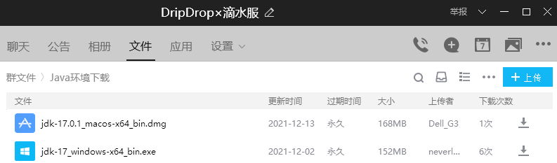
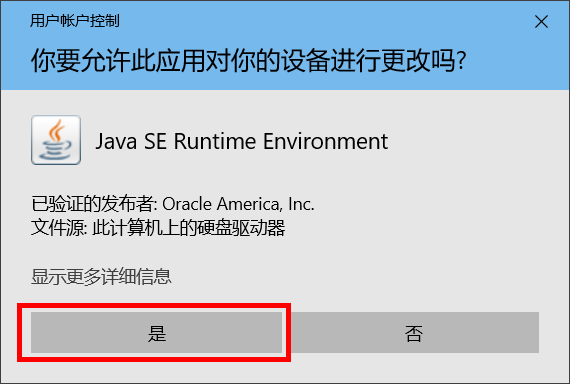
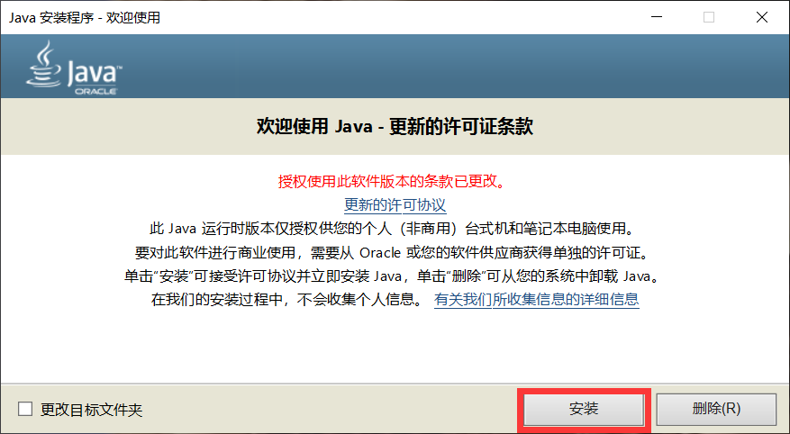
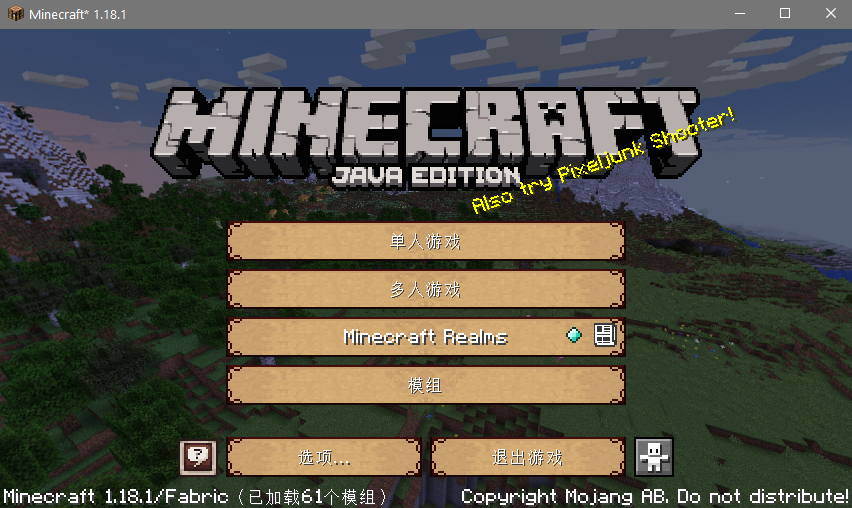

> [!note]
> 📘 以下教程是为 **<u>没有启动器</u>** 甚至 **<u>不知道 *Java* 是什么</u>** 的 **超级萌新** 准备的

## 下载Java

对于纯新手而言，直接在QQ群 `286338133` 的群文件 `Java环境下载` 里下载 *Java* 安装包是最为简便的方式。群内提供了Oracle JDK的安装包（仅供个人非商业使用），并且会不定时进行版本更新和替换，如下图所示：

> [!tip]
> 使用**官方启动器**的玩家不需要额外下载Java，因为自1.17版本开始，官方启动器就已经内置了Java环境。
> 另外，我们不生产JDK或JRE，我们只是[Oracle官网下载文件](https://www.oracle.com/java/technologies/javase-downloads.html)的搬运工。
> 如果有需要，也可以考虑使用无论是商业还是个人使用都完全免费的OpenJDK，这里推荐[Zulu JDK](https://www.azul.com/downloads/?package=jdk#download-openjdk)、[Microsoft OpenJDK](https://docs.microsoft.com/zh-cn/java/openjdk/download)以及[Red Hat OpenJDK](https://developers.redhat.com/products/openjdk/download)。

> [!warning] 
> 强烈不建议**通过百度**自行搜索、下载和使用来源不明的Java安装包，此举可能会为你的计算机带来安全风险。此外，非专业开发人员的玩家，应当使用当前游戏版本所支持的Java版本，既不要使用过于老旧的版本，也不需要使用太新的版本（可能官方都还没开始适配），否则可能会带来意想不到的问题。

## 安装Java

+ **Windows平台玩家**

从群文件下载得到 `.exe` 格式的文件之后，双击打开它（如果提示安全警告就选择 **是**）。

按照界面上的提示一步步操作，直到提示完成安装。

+ **Mac OS平台玩家**

Mac OS平台安装 `.dmg` 格式文件的步骤和Windows用户类似，这里不作赘述。

+ **~~Linux平台玩家~~**

~~Linux用户不会装JDK？wget指令也不会用？那你只是纯粹拿Linux装逼的吗？~~

> [!tip]
> 一般来说，系统在安装Java时会自动配置好 *Java* 环境。如果玩家在安装好Java并准备进行游戏时却提示找不到Java，请参考[这里](./reference/javaconfig.md)。

## 下载启动器

+ **正版启动器**

对于正版用户，最稳妥的选择是使用[正版启动器](https://www.minecraft.net/zh-hans/download)，它简洁美观，只是在下载时可能网速不是很令人满意。

> [!tip]
> 如果只想使用正版启动器，但同时又想体验丰富的社区Mod，请移步参考[这里](https://www.bilibili.com/read/cv6120888/)（仅限Fabric）。

使用正版启动器，可以享受到官方自带的皮肤系统，并且能获得正规、及时的官方消息通知（需要一定的英语阅读能力）和技术支持。

+ **第三方启动器**

> [!tip]
> Mac以及Linux用户请猛戳[此处](./reference/linuxmac.md)了解如何下载使用第三方启动器。

对于不习惯使用正版启动器的玩家，可以考虑使用第三方开发者提供的第三方启动器，或是在此基础上由玩家整合出来的懒人包。第三方启动器相对官方启动器的主要优势在于整合包能够做到开箱即用，而且可以比较方便地管理模组。

第三方启动器有很多途径可以获取到，最典型的有[HMCL](https://hmcl.huangyuhui.net/)和[PCL2](https://afdian.net/@LTCat)。有能力的玩家，建议直接访问它们的发布页面下载启动器，然后在此基础上DIY适合自己使用的整合包；如果想偷懒也没关系，在我们的群里，你可以向小伙伴们询问他们在用的整合包，并进行分享。

> [!attention]
> 请不要**通过百度**下载和使用来源不明的第三方启动器，这可能会危害你的账号和计算机安全！即使是群内玩家分享的整合包，也务必谨慎使用！

## 设置启动器

>[!tip]
>注意，部分玩家在使用基于HMCL进行整合的客户端时，可能会遇到类似**“需要安装JavaFX”**的提示，但是不要着急，启动器自己会下载安装JavaFX的，不需要玩家自己花大力气到处找JavaFX安装包（而且基本上都是下载了也装不上）。

下面是一个HMCL整合包的示例，玩家在下载整合包之后对其解压，可以得到下图所示的文件：

双击 `.exe` 文件启动HMCL启动器，然后点击下图所示的“账户”进行登录。

选择下图所示的`Mojang账号`或`微软账户`模式。注意，已按Mojang官方要求完成账号迁移的玩家，**请务必使用`微软账户`模式登录**。

最后 **启动游戏** 。

## 加入服务器

游戏启动后，选择“多人游戏”，进入服务器列表。

在服务器列表中，点击“加入服务器”，就可以开始和其他小伙伴们一起愉快地玩耍了。

