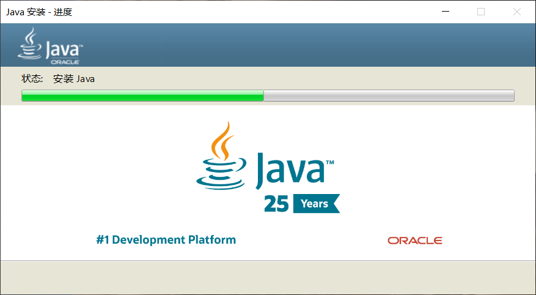
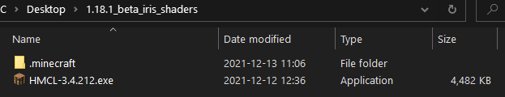
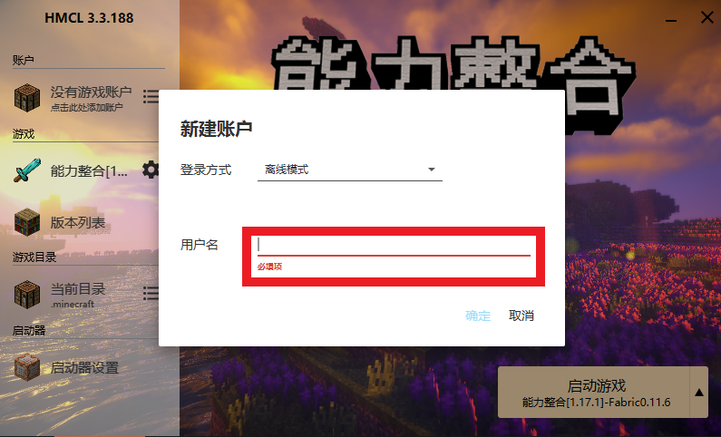
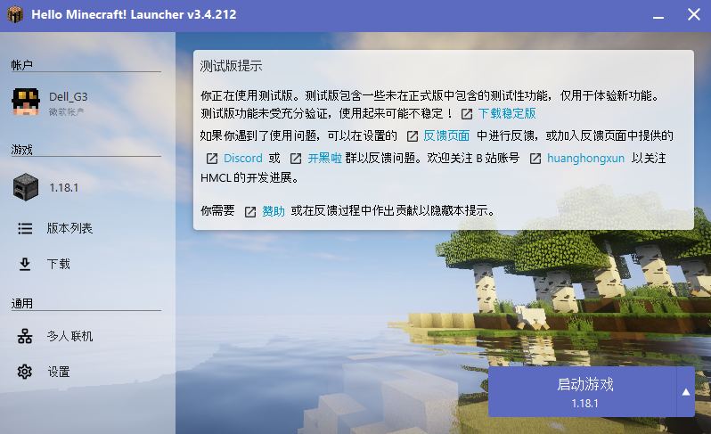

> 📘 以下教程是为 **<u>没有启动器</u>** 甚至 **<u>不知道 *Java* 是什么</u>** 的 **超级萌新** 准备的

## 下载Java

一般而言，安装 *Java* 最安全的方式，是直接在<u>[官网](https://www.oracle.com/java/technologies/javase-jre8-downloads.html)</u>下载。

但是鉴于纯新手一般都不太可能了解 *Java*，也不会特地注册有 *Oracle* 账号，加上国内网络环境导致官网的下载速度很慢，

因此我们强烈推荐在QQ群 `286338133` 的群文件 `Java环境下载` 里下载 *Java* 安装包，如下图所示。

> ❗ 对于不熟悉 Java 的新手玩家，<u>强烈不建议自行搜索、下载、安装和使用来源不明的安装包</u>，此举可能存在计算机安全风险。

> ❗ 如果玩家自己在网上搜寻下载安装包，请务必安装使用 **<u>64</u>** 位的安装包（名字中标有64或x64的），否则游戏将发生内存不足异常。

> ❗ 单纯玩游戏只需要安装JRE ，但是如果想要学习技术加入我们的开发行列，就请下载 [JDK](https://www.oracle.com/java/technologies/javase-jdk11-downloads.html)（目前服务器使用插件支持Java 11) 。

## 安装Java

+ **Windows平台玩家**

不论是从官网、群文件还是别的地方下载安装包，最终肯定会得到 `.exe` 格式的文件，双击打开它（如果提示安全警告就选择 **是**）。

按照界面上的提示一步步操作，直到提示完成安装。

+ **Mac OS平台玩家**

不论是从官网、群文件还是别的地方下载安装包，最终应该会得到 `.dmg` 格式的文件，安装步骤和Windows用户类似。

+ **Linux平台玩家**

~~我们认为Linux用户通常属于开发人员，因此不需要浪费时间查看这部分的教程。~~（Linux玩家 -1并愤怒地发起DDoS攻击）

> 一般来说，系统在安装JRE时会自动配置好 *Java* 环境。如果玩家在安装好JRE并准备进行游戏时却提示找不到 *Java*，请参考[这里](./reference/javaconfig.md)。

## 下载启动器

+ **正版启动器**

对于正版用户，最稳妥的选择是使用正版启动器（[点我进官网](https://www.minecraft.net/zh-hans/download)），它简洁美观，只是在下载时可能网速不是很令人满意。

> 如果只想使用正版启动器，但同时又想体验丰富的社区Mod，请移步参考[这里](https://www.bilibili.com/read/cv6120888/)。

+ **第三方启动器**

考虑到你是一个 **超级萌新** ，请加入 `QQ群286338133` ，在群文件 `✿客户端整合包✿` 中下载已经做好基本配置的整合包。

**请不要下载和使用来源不明的第三方启动器！！！**

> Mac以及Linux用户请猛戳[此处](./reference/linuxmac.md)了解如何下载使用第三方启动器。

## 设置启动器

下载完后对 `1.16.3fabric简单整合.rar` 解压得到：

双击 `HMCL-3.3.172.exe` 启动HMCL启动器。

输入你喜欢的用户名（注意必须是英文字母或者数字,可以大小写与下划线，不能中文），然后点击 **确定** 。

最后 **启动游戏** 。

## 加入服务器

