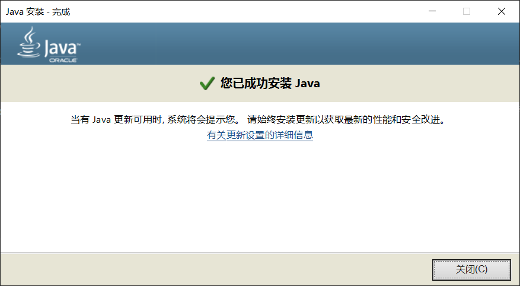
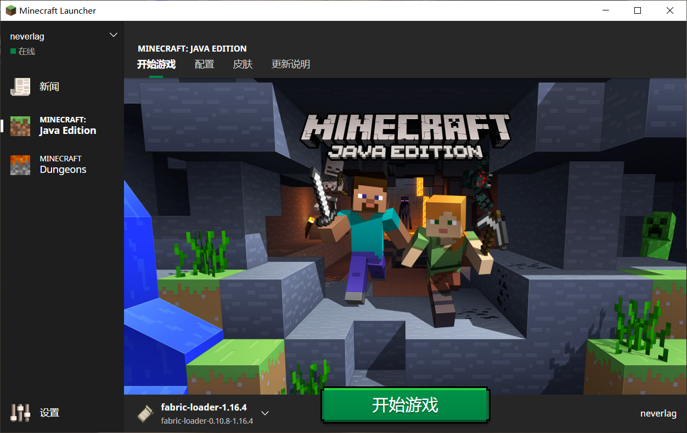

> 📘 以下教程是为 **<u>没有启动器</u>** 甚至 **<u>不知道 *Java* 是什么</u>** 的 **超级萌新** 准备的

## 下载Java

对于纯新手（或是懒得注册Oracle账号又怕随便下会碰到带毒安装包的玩家）而言，直接在QQ群 `286338133` 的群文件 `Java环境下载` 里下载 *Java* 安装包是最为简便的方式，如下图所示：

> ❗ 对于不熟悉 Java 的新手玩家，<u>强烈不建议自行搜索、下载、安装和使用来源不明的安装包</u>，此举可能存在计算机安全风险。

> ❗ 如果玩家自己在网上搜寻下载安装包，请务必安装使用 **<u>64</u>** 位的安装包（名字中标有64或x64的），否则游戏将发生内存不足异常。

## 安装Java

+ **Windows平台玩家**

不论是从官网、群文件还是别的地方下载安装包，最终肯定会得到 `.exe` 格式的文件，双击打开它（如果提示安全警告就选择 **是**）。

按照界面上的提示一步步操作，直到提示完成安装。

+ **Mac OS平台玩家**

Mac OS平台安装 `.dmg` 格式文件的步骤和Windows用户类似，这里不作赘述。

+ **Linux平台玩家**

~~我们认为Linux用户通常属于开发人员，因此不需要浪费时间查看这部分的教程（什么？不会装OpenJDK？wget指令也不会用？那你只是用Linux装逼的吗？）。~~（Linux玩家 -1并愤怒地发起DDoS攻击）

> 一般来说，系统在安装JRE时会自动配置好 *Java* 环境。如果玩家在安装好JRE并准备进行游戏时却提示找不到 *Java*，请参考[这里](./reference/javaconfig.md)。

## 下载启动器

+ **正版启动器**

对于正版用户，最稳妥的选择是使用正版启动器（[点我进官网](https://www.minecraft.net/zh-hans/download)），它简洁美观，只是在下载时可能网速不是很令人满意。

> 如果只想使用正版启动器，但同时又想体验丰富的社区Mod，请移步参考[这里](https://www.bilibili.com/read/cv6120888/)。

+ **第三方启动器**

第三方启动器有很多途径可以获取到，不过既然加入了QQ群，自然就选择在群文件 `客户端整合包` 中下载已经做好基本配置的整合包。

> ❗请不要下载和使用来源不明的第三方启动器！！！Mac以及Linux用户请猛戳[此处](./reference/linuxmac.md)了解如何下载使用第三方启动器。

## 设置启动器

以`1.16.5.zip`为例，玩家在下载该整合包之后对其解压，可以得到下图所示的文件：

双击 `.exe` 文件启动HMCL启动器。

输入你喜欢的用户名（注意必须是英文字母或者数字,可以大小写与下划线，不能使用中文），然后点击 **确定** 。

最后 **启动游戏** 。

## 加入服务器

游戏启动后，选择“多人游戏”，进入服务器列表。

在服务器列表中，点击“加入服务器”，就可以开始和其他人一起愉快地玩耍了。

