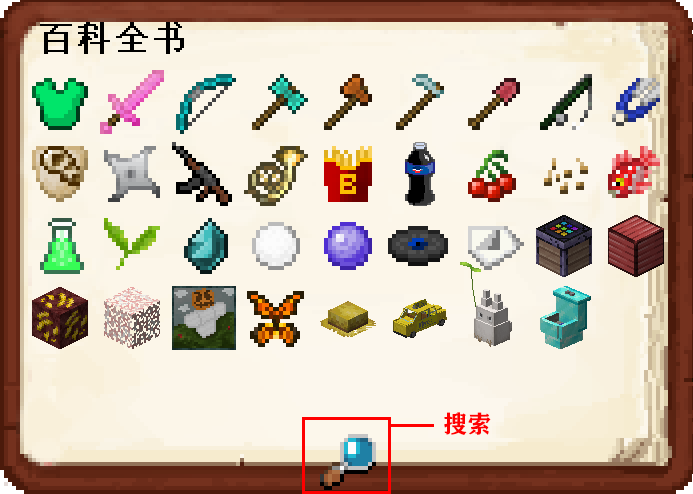
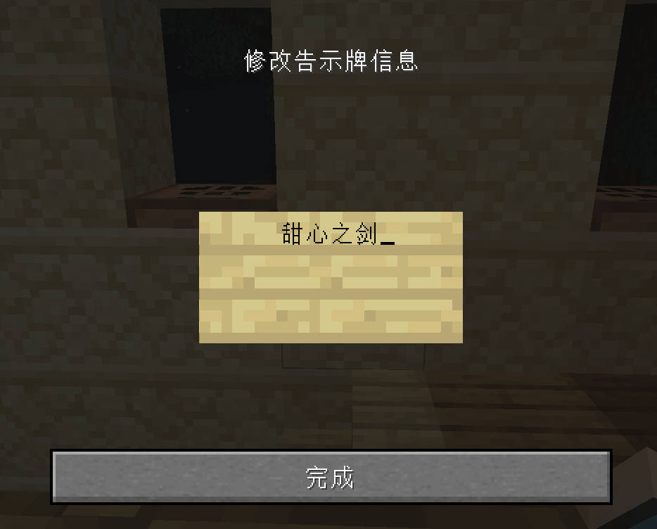
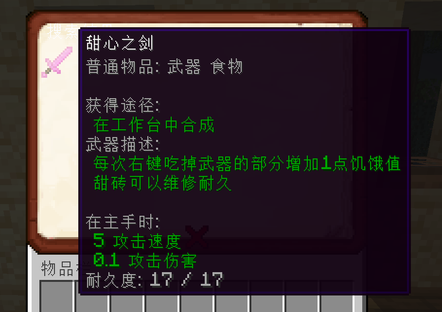
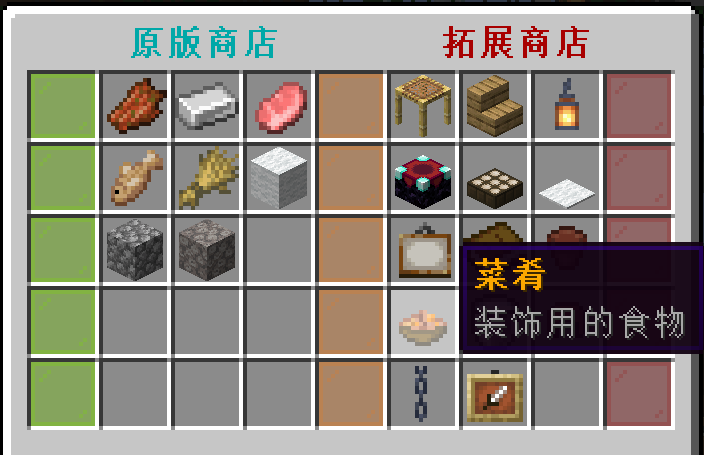
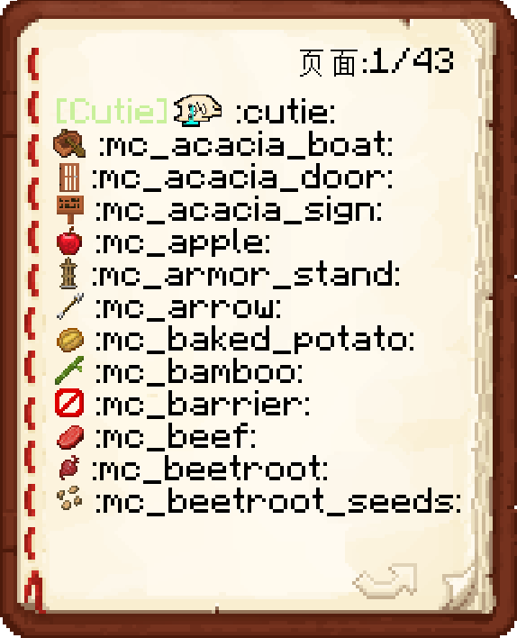
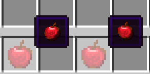

## 拓展物品百科全书

> [!note]
> 拓展物品和原版物品最大的区别就是，拓展物品会有很多行lore（即描述）。

1. **用指令`/ia`打开图鉴收集书**

2. **你可以点击按钮： `放大镜`  来快速搜索物品。在`告示牌`中输入你要查找的物品, 然后点击完成即可搜索。**

3. **你可以在图鉴里随意地翻翻点点，如果看到自己喜欢的拓展物品，可以前往[拓展商店](/systemshop?id=拓展商店)买下它！**

## emoji表情

1. **打开emoji表情的书** `/iaemoji`

2. **你可以在聊天和称号中使用emoji表情。比如在聊天框里输入 `:cat_bye:` 来打出猫猫挥手告别的表情：**

> [!tip]
> 你还可以在聊天框里输入指令`/e`+空格，利用上下方向键来选择要发送的表情包！**现在服务器支持的表情包来源包括[EverydayOneCat](https://zh.moegirl.org.cn/EverydayOneCat)、贴吧、Twitter以及[猫猫虫](https://giphy.com/BugCat_CAPOO/)等，后续还会支持更多来源！**

>[!attention]
>注意，要想在服务器内使用表情包，必须[安装服务器指定材质包](/joinproblem?id=材质包资源包怎么安装)，并且在`选项...`-`语言...`中**关闭**“强制使用Unicode字体”，否则可能只会看到字符方块。

3. **你还可以在铁砧用表情包给你的物品命名，比如命名为 `&f:mc_apple:` ，物品的名字就会变成一个苹果（如果不加&f，就会是一个斜着的苹果）：**

4. **[称号](/tags?id=佩戴自定义称号)也支持使用表情包：**

