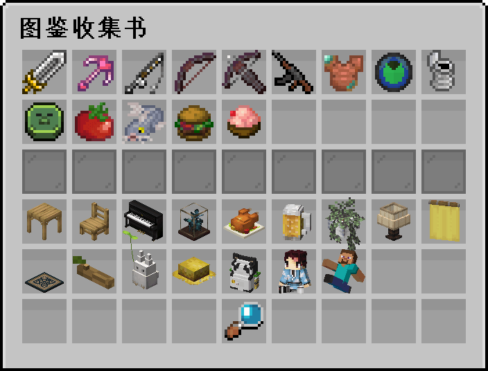
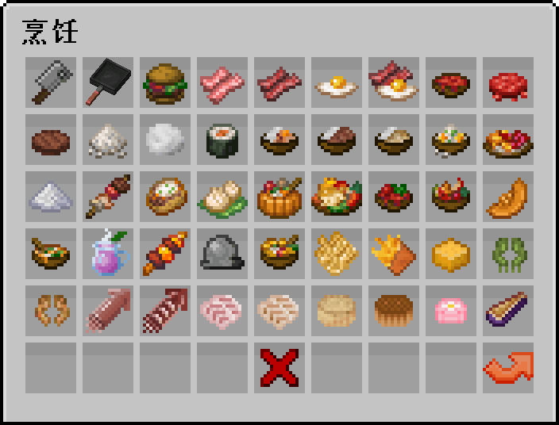
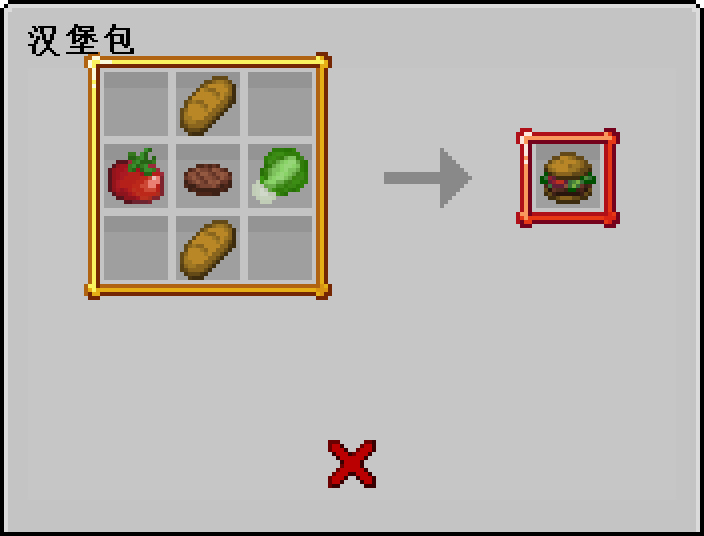
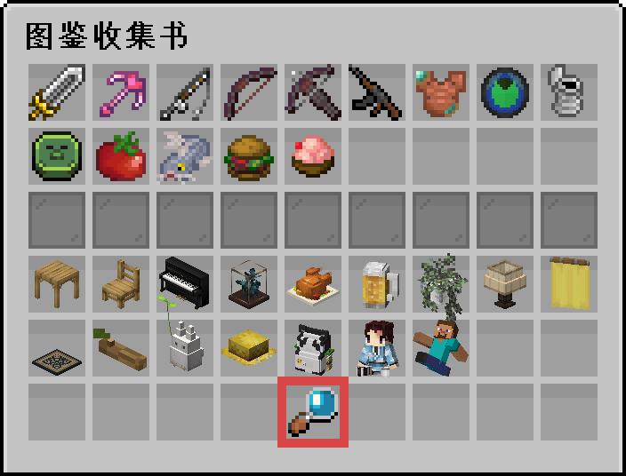
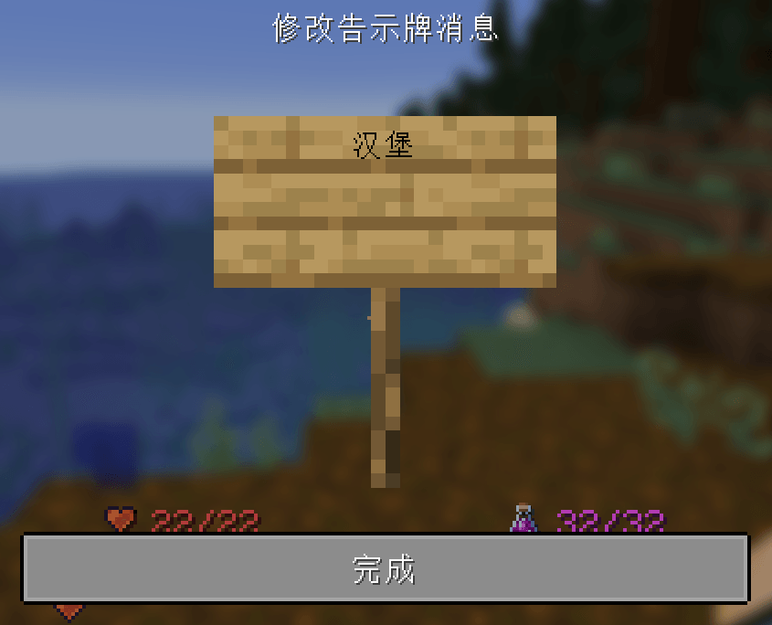
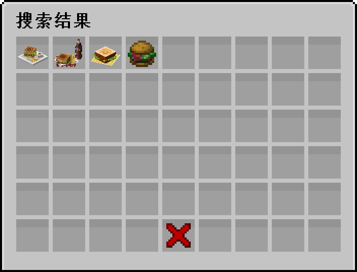

> [!note]
> 拓展物品是指利用插件制作的新物品,通常你需要安装服务器资源包才能看见它的材质
## 📖 物品图鉴

### 输入指令: `/ia` 打开图鉴

+ 第一页是物品的**类型**，点击这些图标可以跳转到具体的物品

+ 第二页是**具体物品**(下图是烹饪类型的物品)

+ 第三页是**物品配方**(下图是汉堡包的配方)

## 🔎 查找配方

> [!tip]
> 以找到汉堡的合成配方为例

1.点击图鉴书的放大镜图标

2.在告示牌上面输入`汉堡`，并点击完成

3.弹出搜索结果(如果没搜到东西，可以只搜索1个字)

4.点击物品查看配方

