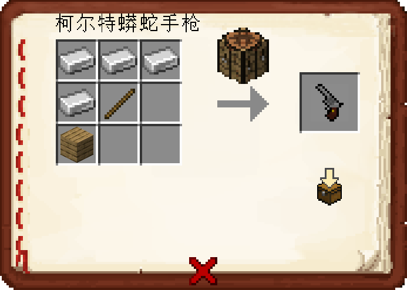

## 拓展物品百科全书
> 拓展物品和原版物品最大的区别就是，拓展物品会有很多行lore(即描述)

1. **打开拓展物品百科全书** `/ia`

## 查找拓展物品的合成表

1. **你可以点击按钮：`放大镜`  来快速搜索物品**

    在`告示牌`中输入你要查找的物品, 然后点击**完成**即可搜索

2. **手持拓展物品输入`/iarecipe`快速获得当前物品的合成表**

3. **在百科全书里面你可以随意的翻翻点点，查看各个物品的合成表**

## emoji表情
1. **打开emoji表情的书** `/iaemoji`

2.**你可以在聊天和称号中使用emoji表情 比如在聊天框里输入 `:mc_apple:` 来打出苹果的表情**

3. **你可以在用铁砧给你的物品命名 `&f:mc_apple:` 让物品的名字变成苹果表情 (如果不加&f,就会是一个斜着的苹果)**

## 为服务器添加物品

1. 服务器内拓展物品一般都是采用**16×16像素**的png图片

2. 制作模型使用**Blockbench**

3. 你可以在QQ群 `286338133` 内的群文件里 `Itemsadder相关的图片` 上传你绘制的**物品.png**或者**模型.json**

4. 如果需要帮忙制作简易人物手办，请上传人物的**皮肤.png**

## 常问的问题

1. **拓展物品里的翅膀能飞吗**

    实际上，他们只是一个羽毛并不是鞘翅，所以并不能装着翅膀飞

    或许今后会给翅膀附加上一些特效与指令？

2. **神秘矿石为什么那么少?真的有吗？**

    确实是有的，只不过神秘矿石需要在1-6层才生成，生成条件似乎是需要有岩浆湖什么的?

    实际上，神秘系列的武器装备也并不是现在的最强了，我并不建议你花费大量时间去肝

3. **服主赠送的玩具是什么意思?**

    标注了获得途径为服主赠送的，指你可以在服主neverlag或者Dell_G3，或者建筑师momo0_0在场时

    你可以跟他们说你很喜欢某个玩具，并让他们赠送你一个

    当然愿不愿意送你不一定(**人都不认识的话为什么会送你?**)