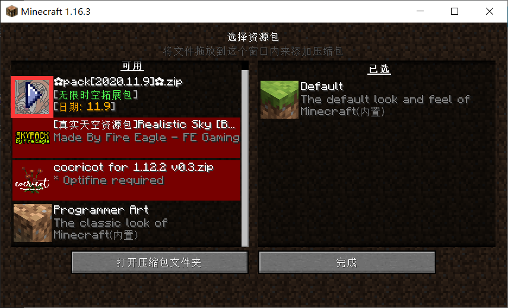
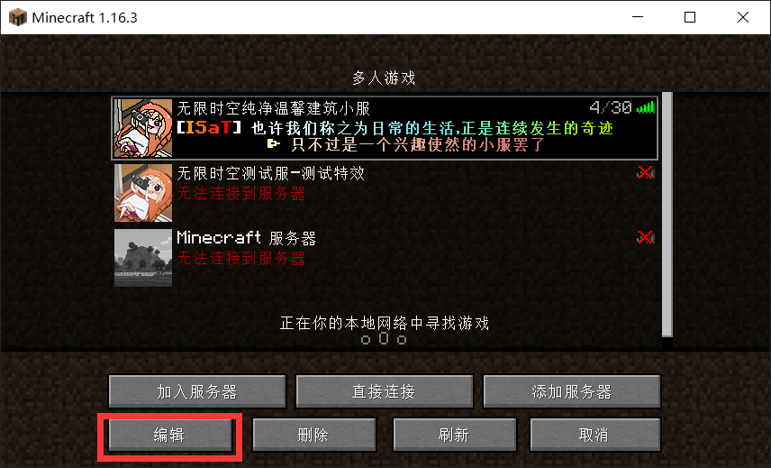
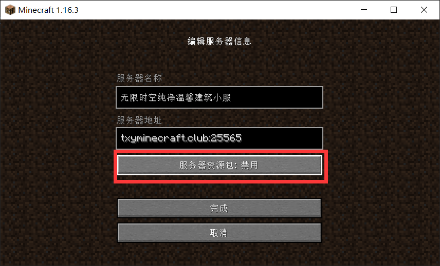

## 有没有整合好的客户端?
有的，请加QQ群 `286338133`  从群文件里的`✿客户端整合包✿`中下载

不过材质包可能不是最新的，你仍然需要自己去更新到最新的材质包

## 材质包下好了，放在哪？
如果你在游戏中，请按ESC进入**选项...** →  **资源包...** → **打开压缩包文件夹**

然后将下载来的材质包直接拖入这个文件夹中(不需要解压)

最后点击红色框框里的箭头，让材质包进入<u>**已选**</u>这一侧(即右侧)，最后点击 **完成** 即可加载材质包

## 每次进服都要加载材质包好麻烦
你可以在 **多人游戏** 这个界面选中我们服务器后，点击 **编辑** 

**点击服务器资源包设置为禁用**

这样你就可以屏蔽掉服务器推送给你的材质包
## 我是正版，为什么没有皮肤？
如果你是正版玩家，可以找到出生点附近的NPC-牛仔右键点击他，打开验证菜单

输入/premium后验证成功，退出服务器重进，你将显示正版皮肤
## 为什么我正版验证后再也登陆不上了？
+ 如果你是非正版玩家，那么下次别再瞎搞了 请加QQ群`286338133` 联系 **管理员neverlag** 替你取消验证

+ 如果你是正版玩家，请检查下是否正版登陆了

+ 偶尔也有网络的问题导致一直验证，请尝试下重启客户端(~~你可能是正版的受害者~~)

## “你不允许再为你的IP在服务器注册更多用户了!”
我们限制了一个IP只能注册一个账号,以避免出现小号刷物品

如果你和你的朋友的IP是一样的

请加QQ群`286338133` 联系 **管理员neverlag** 帮你注册账号

## “你的用户名包含非法字母，用户名里允许的字母...”
请 **不要使用中文** 作为id，java版是不允许用中文的字符的

如果你特别想使用中文id，你可以在加入服务器后设置nickname(昵称)