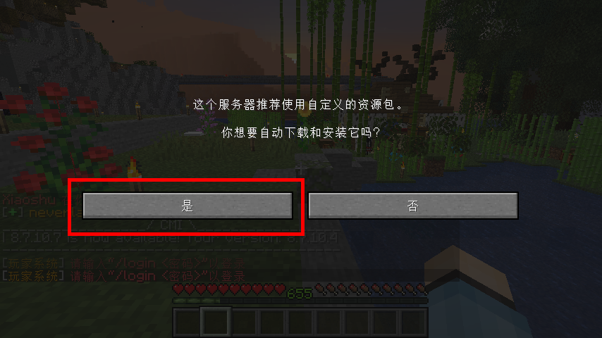
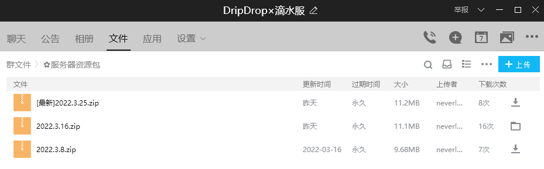
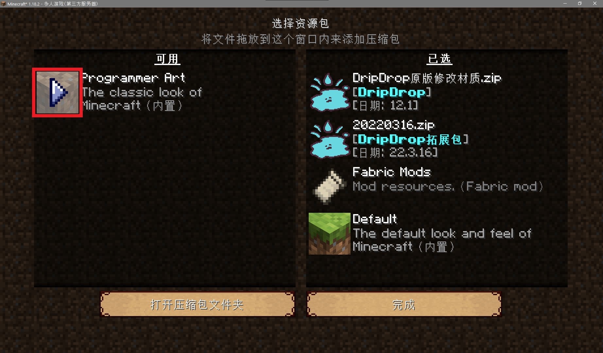

## 游玩本服有什么规定吗？

**本服拒绝以下人（shǎ）员（bī）：** 

+ 烧杀抢掠，以搞破坏为乐的`熊孩子`；
+ 脾气暴躁，随时随地对他人口吐芬芳的`祖安人`；
+ 飞天遁地，透视矿追的`神仙`；
+ 只会复读，到处传播垃圾信息的`大喇叭`；
+ 一无所知，却认为别人应当无条件帮助自己的`爷新`。

**本服明确禁止的行为：**

1. 恶意攻击伤害其他玩家；
2. 恶意破坏其他玩家的建筑；
3. 随意破坏其他玩家领地周边自然环境；
4. 盗取其他玩家的财产；
5. 利用BUG大量刷物品；
6. 恶意卡服影响其他玩家游戏；
7. 公开宣传和推荐使用外挂；
8. 其他严重妨害服务器正常运营的行为。

**不受欢迎的行为：**

1. 宣传其他服务器；
2. 与其他玩家发生争吵；
3. 发表具有争议性的不当言论；
4. 其他容易引起争议的行为。

**不适合以下玩家：**

+ 搞大型红石（指规模巨大且长期无节制运作，严重消耗服务器资源和降低其他玩家的游戏体验）的玩家；
+ 重度RPG和游戏数值鉴赏玩家；
+ 重度PVP狂热爱好者；
+ 热衷短时间内爆肝/爆刷，并以此为唯一游戏目标和乐趣的玩家。

>[!warning]
>古语有云：“以人为镜，可以明得失。”赛博空间有赛博空间的规矩，对于违反规矩的人，当然是挂人一时爽，一直挂人一直爽。

|   玩家    |                       封禁事由                       |
| :---------: | :----------------------------------------------: |
|    nmsl     | 恶意拆毁其他玩家没有圈领地的家，还创小号进来骂人 |
|   whx233    |         不仅拆别人家，还把别人的箱子锁了         |
| FuFusuperBa |          明目张胆在服主面前开启飞天外挂          |
|  SirCakeX   |     开小号偷东西搞破坏，大号转移物资试图洗白     |
|   _Hzxlzz   |      大量购买火药制作TNT炸别人家还试图隐瞒       |
|   Gaveme    |       偷老玩家的纪念物品，恶意点火破坏建筑       |
|   ian3451   |  通过发表不当涉政言论的方式，妨害服务器正常运营  |
|Diving7|蓄意破坏其他玩家领地周围地理环境，拒绝道歉和恢复|
|Lanse_Fox|盗窃其他玩家财产|
|Your_Promise|使用矿透；使用TNT炸毁玩家建筑|

## 材质包/资源包怎么安装？

服务器专用材质包可以从群文件目录`材质包（resourcePack）`里下载“DripDrop原版修改材质”，如下图所示。

服务器拓展物品资源包可以从群文件目录`✿服务器资源包`里下载最新日期发布的资源包，下图为示例。

如果你在游戏中，请按`ESC`进入**选项... → 资源包... → 打开压缩包文件夹**。

然后将下载来的材质包直接拖入这个文件夹中（不需要解压）。

最后点击红色框框里的箭头，让材质包进入右侧的 <u>**已选**</u> 当中，最后点击 **完成** 即可加载材质包。

## 我搜索不到服务器怎么办？

> [!note]
> 这里的搜索不到服务器是指没有加载出服务器图标和服务器的Motd，并提示“无法连接到服务器”的情况

服务器无法连接通常可能由于以下一种或若干种原因：

+ **玩家自己的网络问题**
    
    可以通过尝试浏览网页等方式进行排查，若这些方式有异常，则证明网络存在问题；
    
    若连接其他服务器异常，则可能是玩家自己电脑的防火墙拦截了客户端的网络连接，具体解决方案建议寻求搜索引擎帮助。

+ **服务器处在维护、重启等未开放的状态**
    
    这种情况通常会有通知，注意群里的聊天信息和公告等。待维护、重启等工作结束后，服务器就会恢复正常连接。
    
    在某些情况下，服务器域名指向的服务器地址会发生变更（比如更换服务器主机需要迁移数据），由于各地网络服务提供商的DNS记录更新时间存在差异，因此部分玩家被解析到的地址可能仍为旧地址，需要继续等待一段时间，待当地DNS记录完成更新后再尝试重新连接。

+ **部分版本的第三方启动器无法正常解析服务器域名**
    
    就目前已知的情况来看，类似问题主要集中发生在**PCL2**的特定版本上，如果玩家使用的PCL2无法正常搜索和连接大部分**基于面板服**运营的服务器，就表明启动器存在该问题，建议更换PCL2版本，或使用HMCL或者官方启动器。

+ **其他不可抗力导致**    

## 我的启动器为什么会崩溃？

+ **如果是使用服务器材质包引起崩溃**

    请暂时停用材质包，然后将问题反馈给服主`neverlag`以便及时处理。

+ **如果未进入服务器前就崩溃**

    通常引起这种崩溃的原因有Java环境异常（比如版本不匹配）、mod缺失、冲突或版本不兼容等，请根据崩溃日志通过搜索引擎自行排查，或在群内寻找帮助。

## 我进不了游戏怎么办？

如果不是客户端崩溃导致玩家无法进入游戏，常见的问题有以下几种：

* 第一种是提示“Out Of Memory”（内存溢出），这种情况通常是玩家没有给游戏分配足够的内存（在64位电脑，你为启动器分配的最大内存应该至少达到2 GB 或 2048 MB）。

* 第二种是提示连接有异常，这种情况通常是网络连接有问题，建议玩家先排查自己的网络是否异常。

* 第三种是提示“身份验证失败”、“身份验证服务器宕机”或“身份验证服务器维护中”，表示玩家/本服主机与 *Mojang* 的验证服务器连接有异常，原因主要包括玩家/本服主机网络波动、*Mojang*验证服务器故障或中国国家防火墙干扰。建议玩家等待一两分钟后尝试多登录几次，或是等官方修复问题后再重新进入，又或是使用加速器等科学上网工具。

* 第四种是提示“Unknown Host”（未知主机），如果排除玩家自己的网络问题，则建议玩家检查输入的服务器地址是否存在、正确，有没有使用不该使用的**全角字符**（比如中文冒号`：`，类似`ＡＢＣ１２３`这类间距特别大的字母和数字）输入，然后尝试再登录几次。

其他情形建议玩家截图或上传错误信息到群里，管理员和其他可能遇到并解决过类似问题的小伙伴将尝试在线解决。

## 服务器支持基岩版玩家登入吗？

截至2022年6月，本服务器仅支持 *Java* 版玩家登入。虽然现在市面上有[Geyser（间歇泉）](https://geysermc.org/)这样的互通插件，但是开发者自己也承认互通插件本质上就是进行了协议转换，而基岩版与Java版之间的差异远远不止于此（**尤其是一些数据结构**）。所以就目前来看，除非基岩版和Java版能够做到“唯一的差异就是开发语言”，否则互通插件使用起来有很多限制。强行互通带来的收益不见得会多于运营单一类型的服务器。由于存在这些目前还不能解决的差异问题，两种版本的玩家同处一个服务器时，将不得不相互妥协，因此很有可能无法完整享受到各自版本带来的全部体验。

> [!note]
> Geyser插件的开发者在其[项目Wiki](https://wiki.geysermc.org/geyser/current-limitations/)中有如下说明：
>
>"With Geyser being a protocol translator between two different games with two different codebases, 
>there are a handful of limitations that Geyser is unfortunately unable to handle. 
>Despite Minecraft Bedrock and Java being quite close in comparison, there are some vast differences in many areas."
>
>“Geyser作为一个基于两种不同代码所开发的**两种不同游戏**之间的协议转换器，还有许多限制没法解决。尽管基岩版和Java版相比有很多相近之处，但是在别的地方也同样存在着一些巨大的差异。”
>
> 从上面的描述可以看出，互通插件的开发者认为基岩版和Java版之间的差异已经大到足以认定为两种游戏，光靠通信协议转换并不能从根本上解决问题，更不可能完全满足两边玩家的需求。

## 服务器的经济体系是怎样的？

DripDrop的游戏货币名字为 `硬币` ，用于圈地、玩家之间交易，以及购买系统物品等。在正常情况下，**硬币只能通过商品交易、红包/个人转账这两种方式获得**，向服务器捐赠赞助真实货币并不能为玩家兑换来任何硬币。

本服目前的经济体系运作方式为**基于商品/劳动力的硬币兑换**。玩家通过[系统商店](/systemshop)、[全球市场](/globalmarket)、[箱子商店](/quickshop)以及玩家间交♂易的方式，实现商品/劳动力与硬币的兑换流通。当然，偶尔也会有土豪向全服玩家发红包，但是要注意这并不是主流的获取硬币的方式。

## 服务器会不会删档?

通常，Minecraft每更新一个大版本，或是当前周目已经没有玩家继续上线探索时就会换一个周目。删档与否取决于是否出现以下情况：

+  大版本更新后的体验测试阶段，日活跃玩家和游戏内容数量未达标，基本不考虑保留该阶段的服务器存档；

+  发生重大事故，服务器数据完全损坏且无法采取任何可接受的方式恢复（例如物理主机遭遇核爆，或是服务商跑路删数据）；

+  依据有关法律、法院裁决或行政命令，个人被禁止在中国大陆境内公开建立运营Minecraft游戏服务器，以及提供相关服务；

+  长期没有任何一个玩家玩这个服务器（彻底凉了，不止删档，可能再也不开了）。

## 能不能加个XX插件？

> 如果你非要玩某个插件不可，而本服又并不打算使用该插件，建议玩家自己开个服或者换个服。

一般来说，我**拒绝**，除非你推荐的插件真的很不错。以下为**直接拒绝**的插件：

+   MCMMO插件等一直提供即时反馈的插件；

+   宝石镶嵌，武器强化，装备鉴定等的RPG浓度很高的插件；

+   Mypet宠物插件（这个插件的AI实在是蠢）；

+   地皮插件（我觉得在一块一块的地皮上造家很蠢）；

+   粘液插件（我们服用Itemsadder就够了）。

## 我忘记了账号登录密码怎么办？

>[!warning]
>切勿轻信和使用任何由未知第三方提供的账号密码找回服务！

我们无法提供任何与此相关的技术支持，**请正版玩家务必使用官方提供的正式渠道**找回账号密码。