> [!warning]
> 特效插件为Procosmetics，虽然有很多内置的特效，但完全无法自定义，所以没法增加或修改特效。
> 该插件有许多Bug，而且插件作者的态度极其敷衍和随便，腐竹只能把有Bug的特效暂时删除了。

## 特效菜单

输入指令 `/cos` 打开特效菜单：

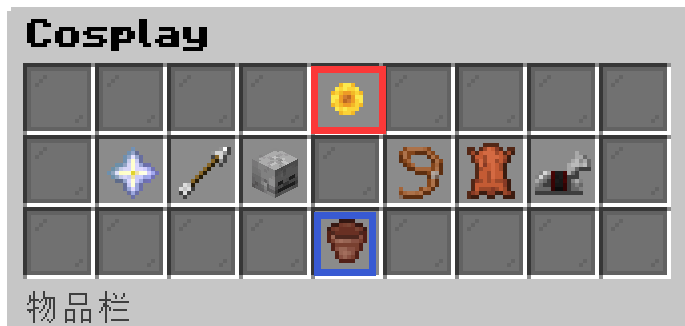
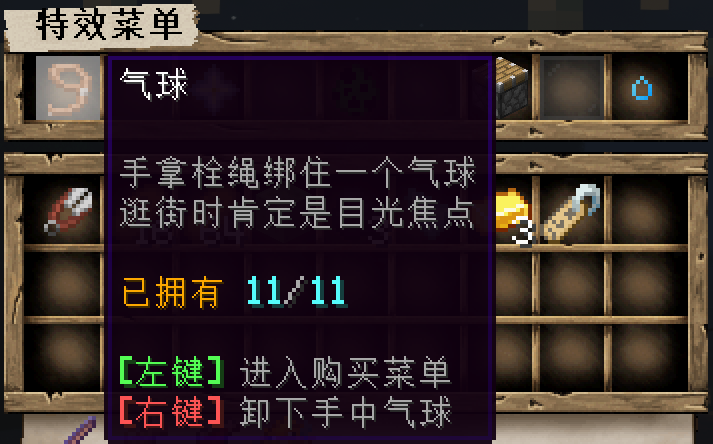
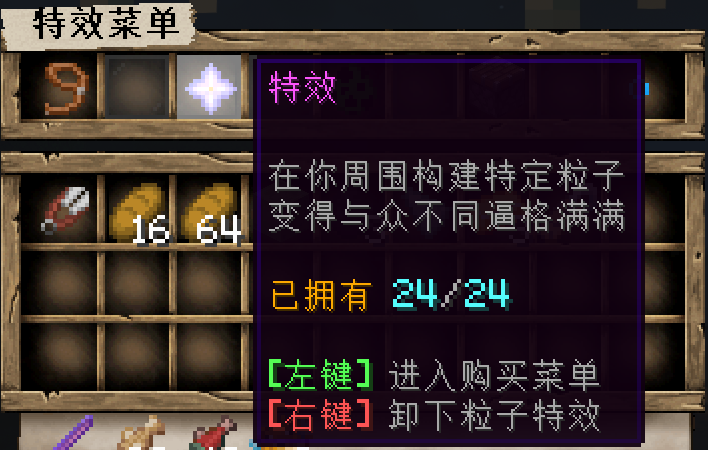
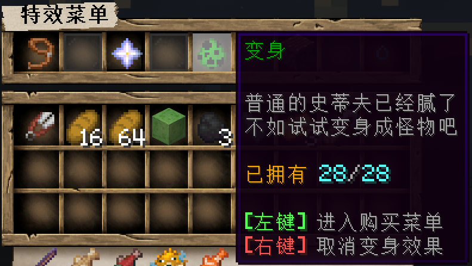
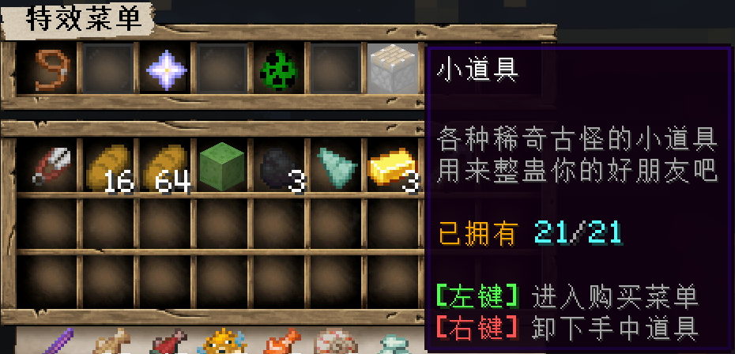

>[!note]
>注意，当服务器TPS下降到17以内时，插件会自动取消部分特效的装备以减少服务器资源消耗。

## 气球

气球可以通过打开菜单进行查看，将鼠标移到气球图标上还会显示更多信息：

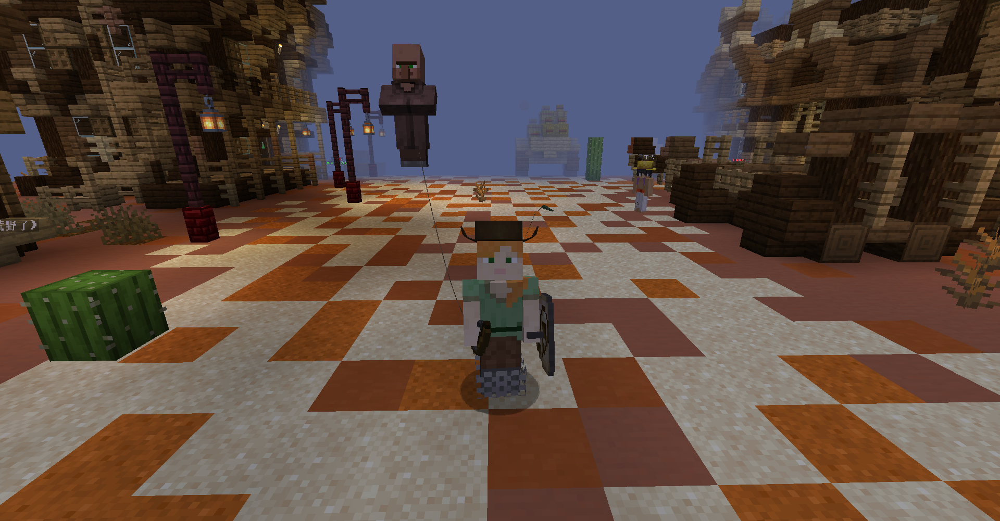
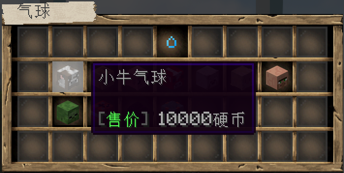

**左键**点击气球图标即可装备在右手上。如果要收回气球，就需要再进到气球菜单里，**右键**点击对应的气球图标。

>[!note]
>注意，虽然气球是装备在右手上，但并不影响玩家用右手持有其他物品。

## 特效

特效的查看、装备还有取消与气球类似：

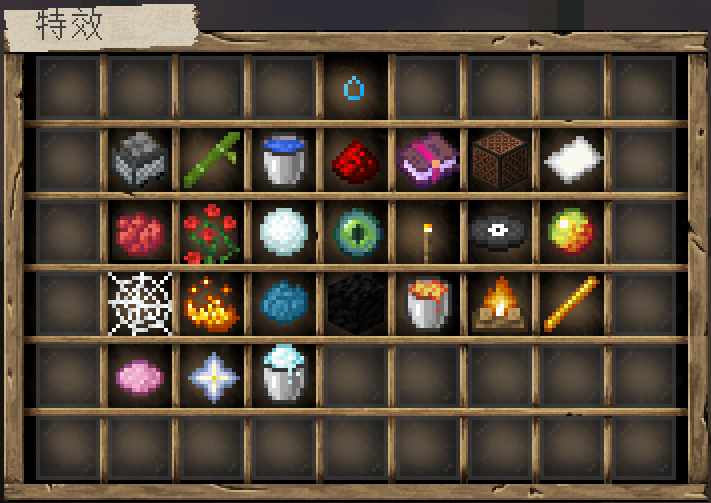
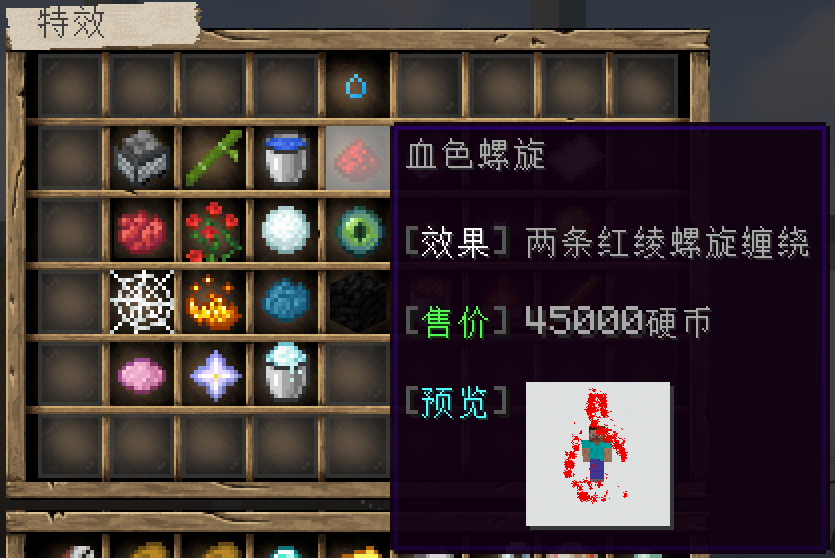

装备后的效果：

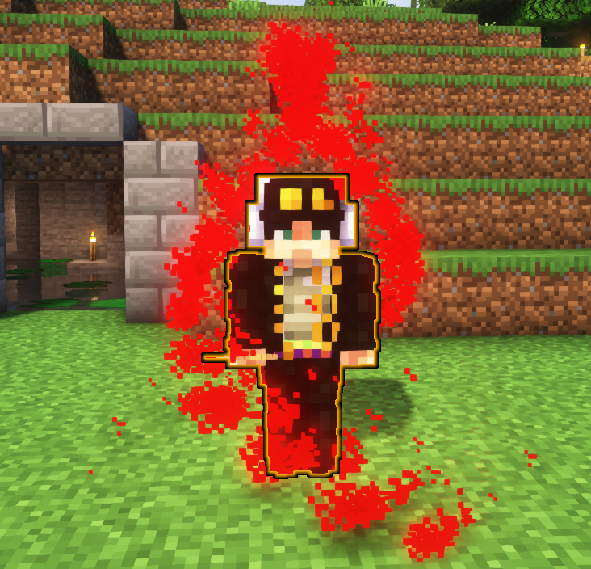

## 变身

变身的查看、装备以及取消和上面的一样：

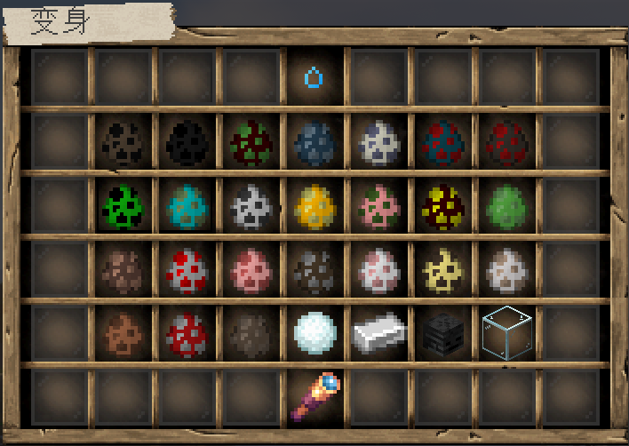
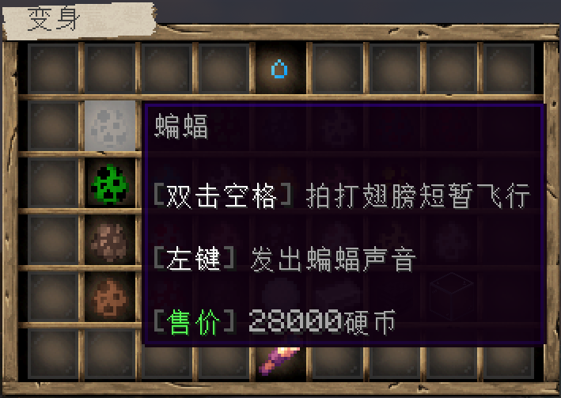

装备效果类似于下图：

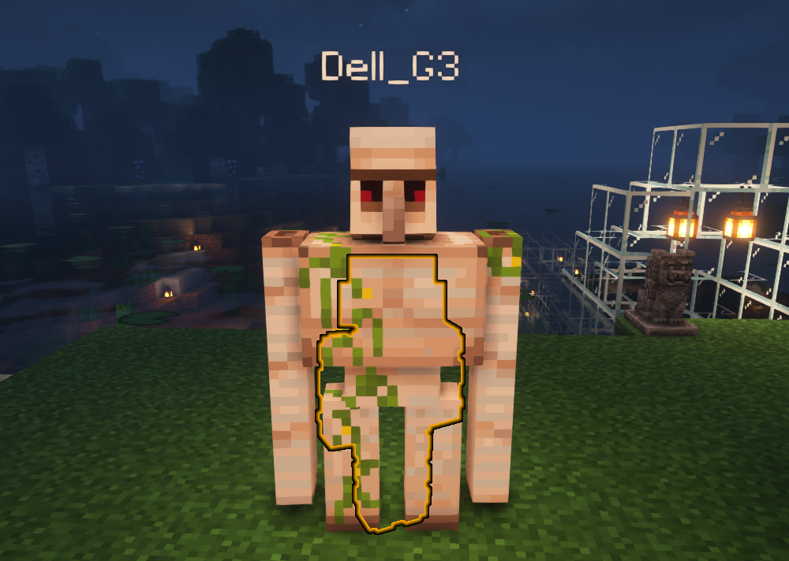

>[!note]
>变身的原理是让玩家隐形（穿的盔甲并不隐形），在玩家的位置生成一个实体，模拟变身的效果。上图中显示的人物轮廓，是因为同时启用了后面要介绍的发光特效。玩家可以按`F5`切换观察视角来查看变身效果。

## 道具

小道具的查看和上面三种都一样，但是购买和装备的流程有所差异：

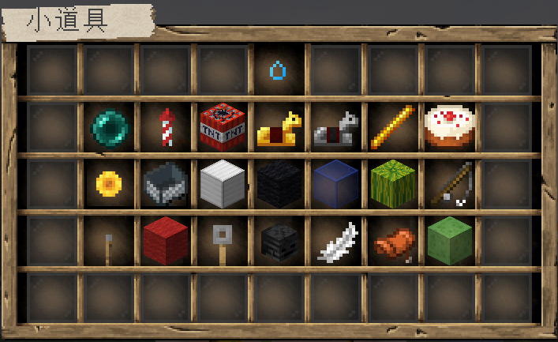

如果是第一次购买某个小道具，**左键**点击该小道具的图标之后，就会右手持有该物品，此时再点击左键使用该道具，就会进入下图所示的购买界面：

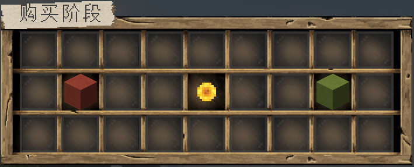

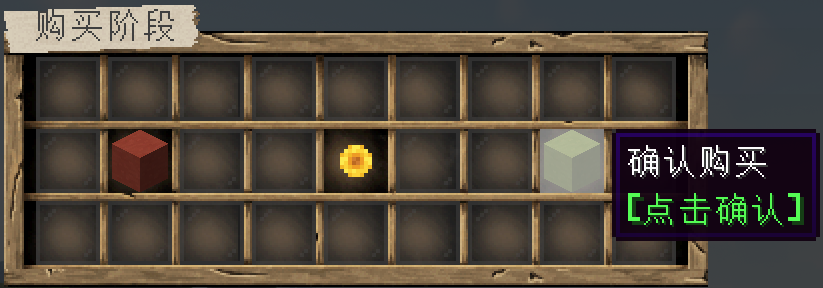

只有选择购买之后，小道具才算真正被装备到玩家身上。小道具的使用和一般的物品不太一样，需要**长按右键**才能被使用。

>[!note]
>注意，小道具只要购买过一次就能进入小道具菜单里直接装备使用，在数量用完之前不用再重复购买。

## 发光

发光特效并不是位于特效菜单里，而是位于服务菜单当中：

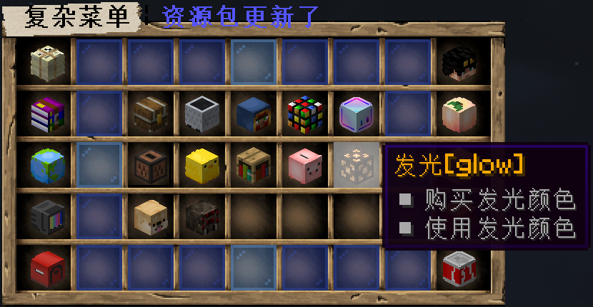
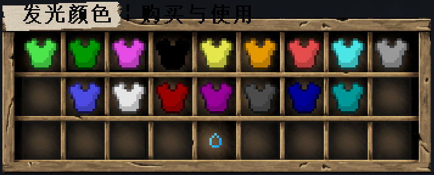

选择自己喜欢的颜色，**左键**点击即可购买装备，点击下面的水滴图标就能取消装备：

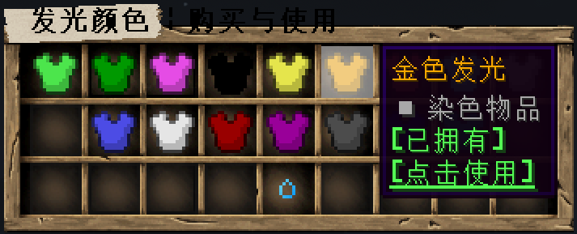
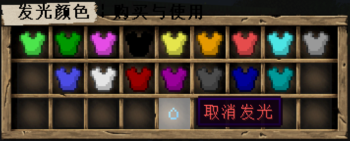

装备发光特效之后，玩家名字会变成相应的颜色：

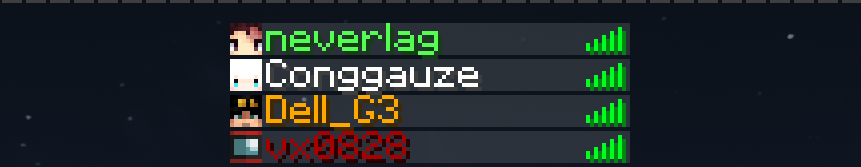

人物轮廓也会以同样颜色显现，在其他玩家视野范围内，即便有非透明物品遮挡也能看到玩家的人物轮廓，**配合移动光源插件使用时**，就可以取代手持光源，起到一定程度的照明作用：

>启用发光特效时

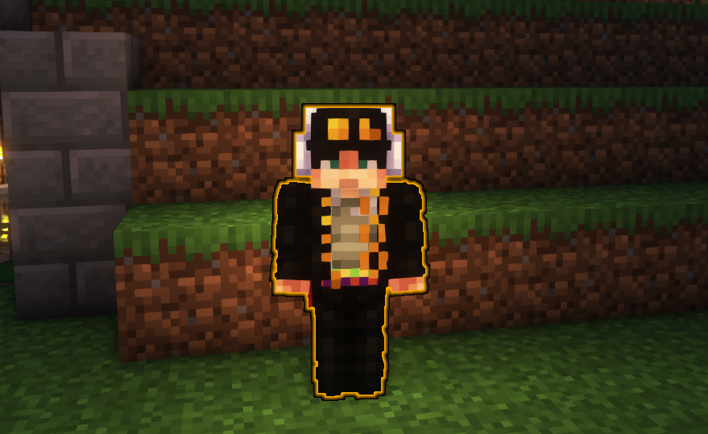

>未启用发光特效

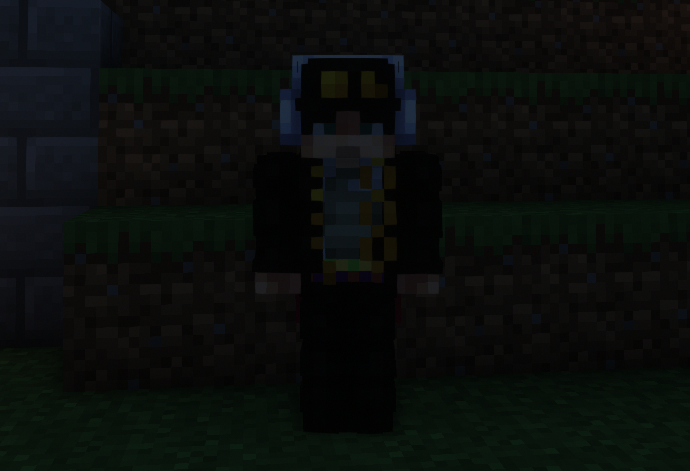