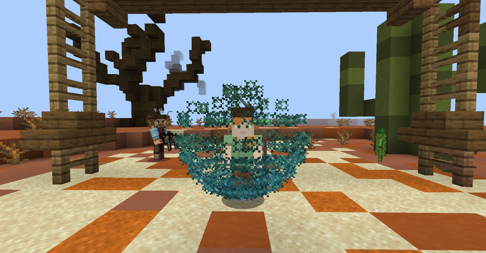
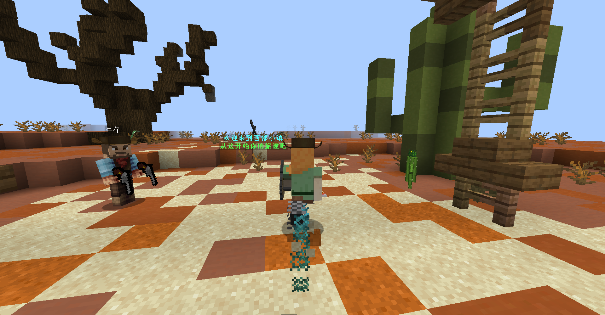
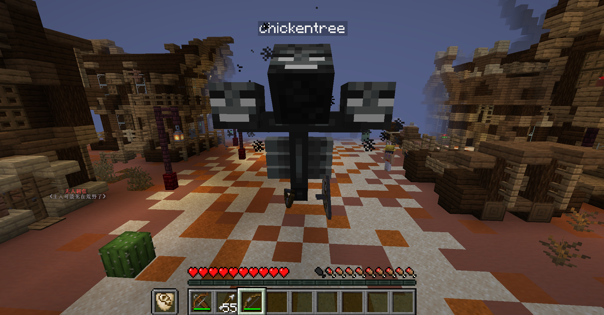
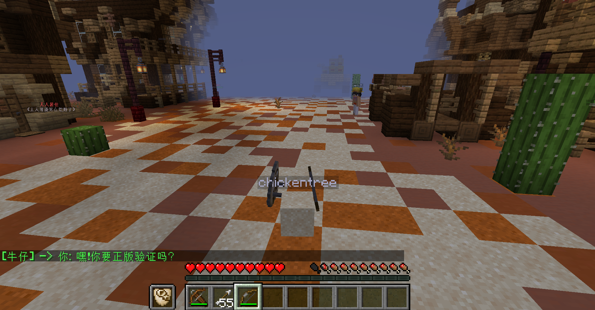
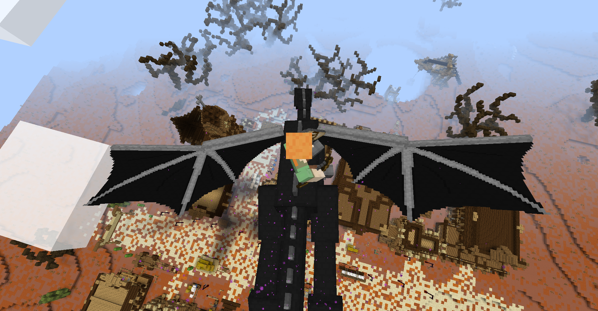
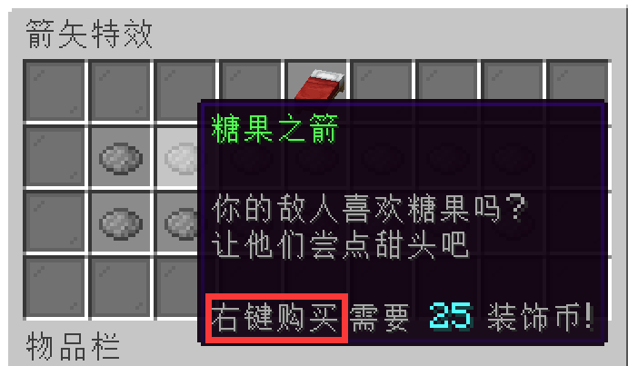
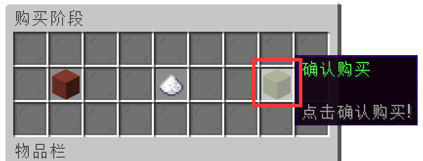
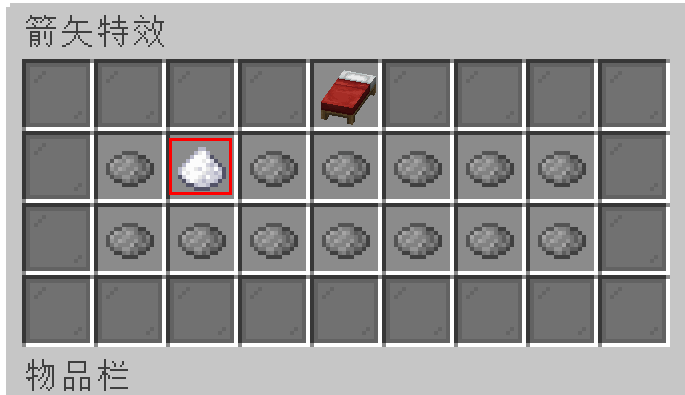
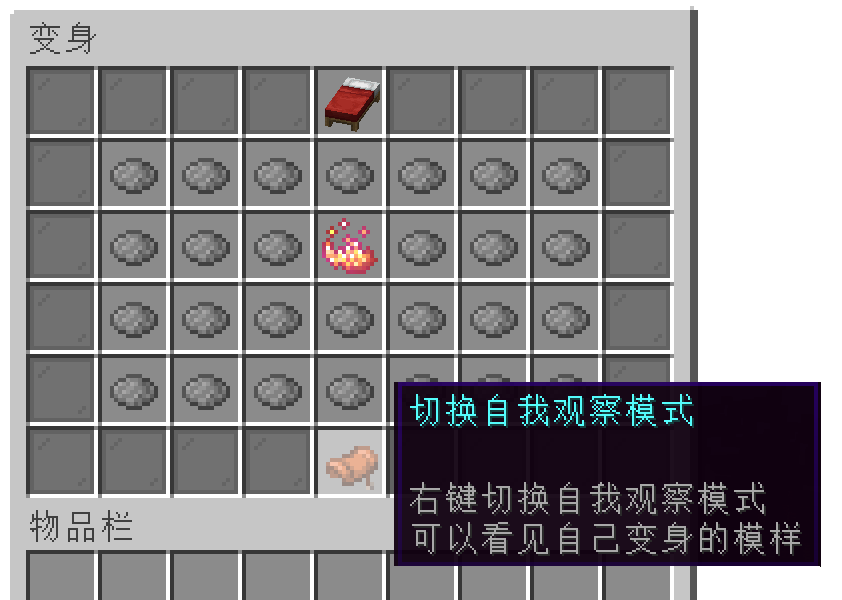

> 特效插件为Procosmetics，虽然有很多内置的特效，但完全无法自定义，所以没法增加，没法修改特效

> 💩 该插件有许多Bug，而且插件作者的态度极其敷衍和随便，我只能把有Bug的特效暂时删除了

## 特效菜单
输入指令 `/cos` 打开特效菜单

+ 将鼠标放在  `向日葵` 上可以查看你的 **装饰币** 数量 

+ 点击  `花盆` 可以**卸下**所有的装饰特效

## 粒子特效 
> 粒子特效是时刻触发的，静止时往往是构成粒子图案，立体形状，运动时会在身后留下一道粒子轨迹的特效

例如 `保护盾` 在玩家**静止**时，会有一个蓝色的粒子形成盾的效果

而在**移动的时候**，会在屁股后面留下一道蓝色的轨迹

## 弓箭特效
> 弓箭特效是在用弓或者弩射出箭时，给箭附加的特效，箭移动中有轨迹特效，击中触发击中特效

## 死亡特效
> 死亡特效是在玩家死亡时触发的特效，但本人几乎观察不到，不推荐购买

## 气球特效
> 气球特效是让玩家右手牵着一个气球，当然你实际上还是可以用右手拿东西

## 变身特效
> 变身特效是让玩家变成一个怪物或者方块，有的怪物还具有特别的技能

> 变身的原理是让玩家隐形(穿的盔甲并不隐形)，在玩家的位置生成一个实体，模拟变身的效果

例如变成 `凋零` 就可以像创造模式一样**飞行**

变成 `方块` 可以右键点击沙子变成沙子，点击泥土变成泥土而**任意的转变**

## 坐骑特效
> 坐骑特效是召唤一个坐骑，除了 `死灵战马` 现有坐骑都可以**飞天**

> `火蛇` 又出了Bug，`末影龙` 有的玩家乘坐时会非常卡顿

你甚至可以召唤 `末影龙` 用鼠标的视线来操纵末影龙飞行的方向

## 装饰币
> 装饰币是用来购买特效的货币，独立于木锄币，玩家之间无法交易

1. **每日签到领取2枚装饰币(购买了 `用爱发电机` 的玩家在 `发电`期间可以双倍领取 )**

2. **你可以通过氪金用RMB购买装饰币，比例为1:5**

3. **你可以通过顶帖每次获得5枚装饰币**

4. **你可以参加服务器举办的活动(不定期)获得装饰币**

## 购买特效

+ 你需要 **右键点击(注意是右键，很傻逼的设计)** 想要购买的特效

    

+ 然后 **左键点击** `绿色方块` 来确认购买

    

+ 购买成功后 **不会有任何提示(也是很傻逼的设计)**  但将该特效会显示解锁的样子了

    

## 常见问题
1. **我购买前能不能先预览一下特效？**

    暂时不能，我们的特效测试服已经租期到了关闭了

    请找有该特效的其他玩家看看效果

    如果服主`neverlag`或`Dell_G3`在线，可以找他们预览效果

2. **变身特效为什么我看不见变身？**

    在变身特效的菜单里面，点击 `切换自我观察模式` ，即可看见变身的样子

    