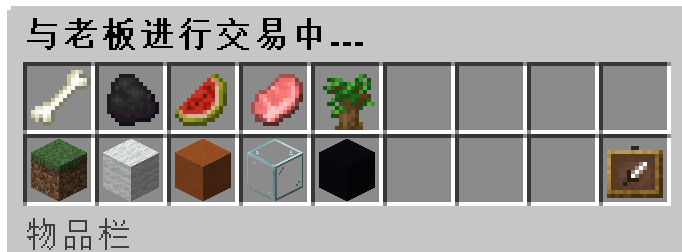
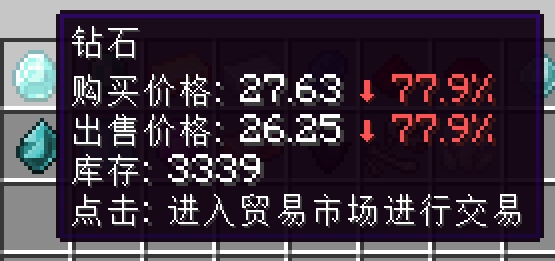
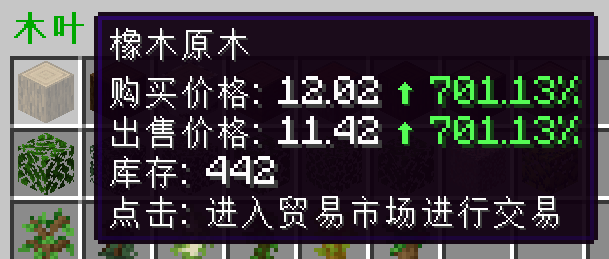

## 怎么赚钱，去哪赚钱？
> 💰 无限时空的游戏货币名字为 `木锄币` ，用于圈地，玩家之间交易，购买系统物品

1. **一般玩家是前往 `矿区` 挖矿，卖矿石**

    先输入指令 `/ore` 前往矿区（由于该指令收费，需要二次输入确认）。

    然后输入指令 `/rt` 随机传送，找个地方开始挖矿。

    最后输入指令 `/deal` 打开系统交易菜单，进行交易。

    

2. **自己开箱子商店和玩家之间进行交易**

    开箱子商店的教程请具体查看[箱子商店](quickshop.md)。

3. **补充一点，物品物价是根据供需关系自动调整的**

> 💎 按照现在的供求关系，总有一天木头会比钻石还贵

大量的玩家挖矿卖矿，而几乎没有人购买矿石，会导致 **矿石的价格一直在跌**。

而很多人购买木头作为建材，却没什么人去砍树卖木头，会导致 **木头的价格一直在涨**。

    

## 这个服务器怎么玩？

> 我不知道问出这个问题的人是希望我回答什么，这就是一个普通的生存服，加了一些拓展物品罢了。

1. **如果你是一个喜欢自行摸索的玩家**

    你可以和在其他服一样四处逛逛，然后收集，然后造家，就和普通的生存服一样没有任何差别。
    
    只不过偶尔你会在钓鱼的时候会钓上来一只`青蛙`，一只`水母`，甚至一个 `鲨鱼帽`；

    偶尔你会在打草的时候掉落了 `水稻种子`，`四叶草`，在杀僵尸的时候掉了一个 `僵尸手办`；

    这个时候你可以看看物品的描述，输入 `/iarecipe` 看看它的配方，然后放到仓库里面收藏起来。

    或者看见邻居家里造了一个 `木椅子`或者 `风铃`，你也想造，于是输入 `/ia` 在`拓展物品百科全书`里找到配方自己也造一个。

2. **如果你是一个喜欢读Wiki的玩家**

    我觉得你可以大体看看有什么新玩意，然后还是该干嘛干嘛；

    你大概会一页一页地翻自己能合成的物品，然后把它们造出来放在家里，这样就已经是很出色的玩家了；
    
    当然，你可能认真地读了Wiki，知道了各种指令、Boss的位置与打法等等，最后变成了我们服的大佬。

## 为什么服务器人那么少？

> 人少并不代表服务器质量不好，实际上会问这个问题的玩家都认为我们服务器质量还行，我很感谢能问这个问题的玩家。

1. **服务器太多了**

    截止到我写Wiki的时候，已经通过MCBBS审核的服务器有1806个，不通过MCBBS宣传的服务器还会更多。

    有太多对服务器不了解的人，在淘宝上买个面板服（通常还是垃圾配置）采用一键方式草草开服。

    这样的结果就是服务器数量太多，导致玩家都被分散开了，平均下来每个服可能也没有多少人。

2. **很多玩家并不知道服务器的好坏**

    有的服务器哪怕光看宣传贴就无法感受到诚意，两三张随意的截图，配上稀稀拉拉的文字。

    甚至服务器可能是用服务端整合包里直接开起来的，连主城地图都不换。

    就只是因为是刚开荒，就有许多玩家过去玩。

    还有那么多的快餐骗钱服，也能吸引许许多多的玩家去充值。

    我自己个人很喜欢的几个服务器（`Sotap`、`极东域`以及`奔兔`等）人都很少。

    但这几个服的质量和游戏深度都是挺好的，或许玩家也没有耐心去玩。
    
    不得不承认的是，**有什么样的玩家就会塑造什么样的游戏环境和市场**。
    
    只要有愿意吃💩的玩家存在，自然就会有提供💩的游戏运营者，而且主动吃/喂💩尤为可悲。

3. **我们服务器自身原因**

    我们服仍然没有很合理完善的氪金体系，游戏里的经济体系也处于可有可无的状态。

    服务器宣传也完全不够，一天或许只顶一次贴，根本没什么人知道我们服务器。

    而且那些升级和肝的插件（比如MCMMO和通行证）我也拒绝加入，玩家如果自己没有目标很容易无所事事。

    > 我很反对那些，给予玩家大量即时反馈的插件，让玩家过几分钟就获得升级，获得提升，获得满足。

    > 这是出于对人的性格塑造考虑的，还在读书的玩家也不应该为了这个服务器里的一些数值提升而浪费宝贵的时间。

4. **恶性循环**

    人少的服务器会让不了解的玩家觉得这个服务器很差，从而不愿意玩，进而人数越发地少。有些东西我们愿意做出改变，但是有些东西我们确实无力改变。

## 这个服是几周目，会不会删档?

准确说这是2.5周目，从二周目开始就不会再进行删档，以下为可能会删档的因素：

+   存档完全损坏而且备份也损坏了；

+   有关部门禁止个人在中国大陆境内公开建立Minecraft游戏服务器；

+   长期没有任何一个玩家玩这个服务器（不止删档，可能再也不开了）。

## 能不能加个XX插件？

> 如果你非要玩某个插件，我的建议是自己开个服或者换个服。

一般来说，我**拒绝**，除非你推荐的插件真的很不错，以下为**直接拒绝**的插件：

+   MCMMO插件等一直提供即时反馈的插件；

+   宝石镶嵌，武器强化，装备鉴定等的RPG浓度很高的插件；

+   Mypet宠物插件（这个插件的AI实在是蠢）；

+   地皮插件（我觉得在一块一块的地皮上造家很蠢）；

+   粘液插件（我们服用Itemsadder就够了）。

## 被炼金术师变成牛了怎么办？

退出重进，下次记住不要点他了。

## 用什么圈领地啊？

 `木锄头`