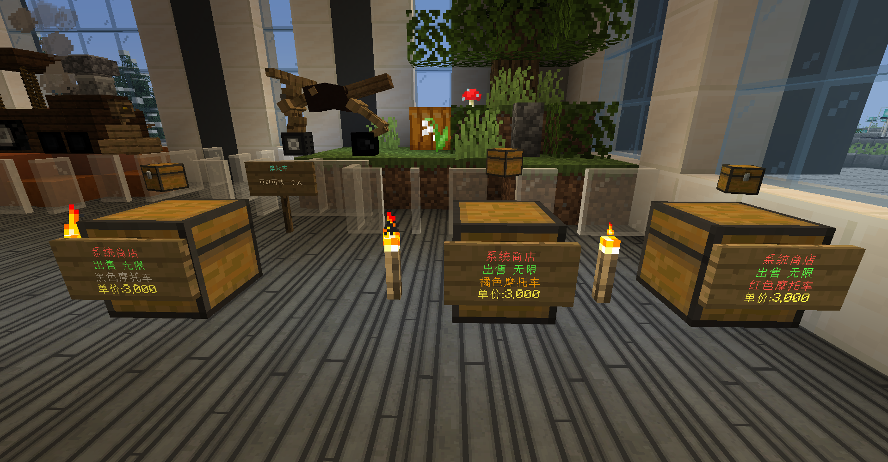
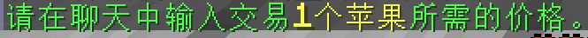
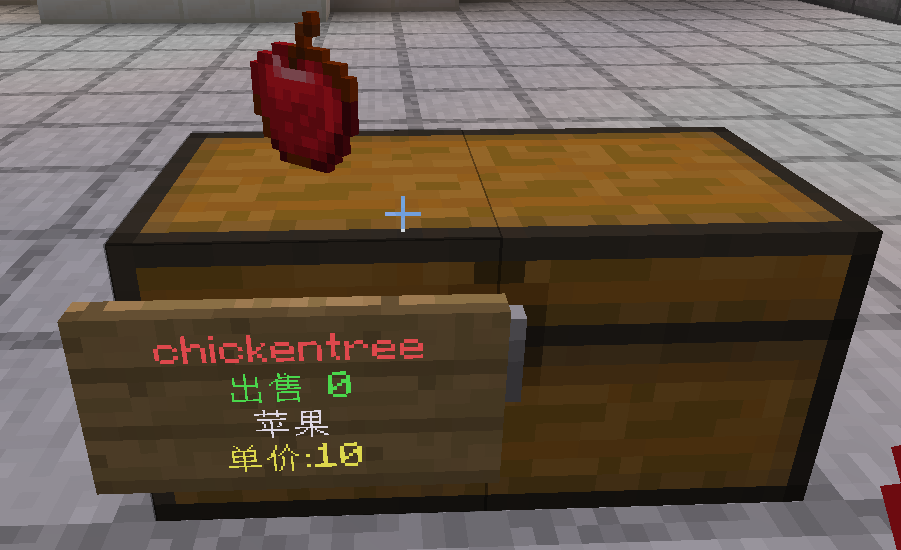
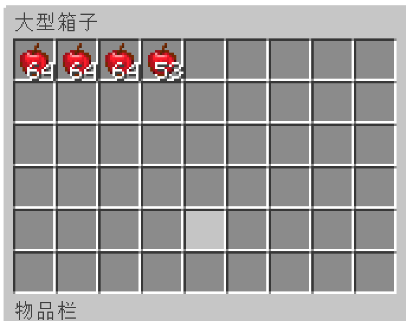
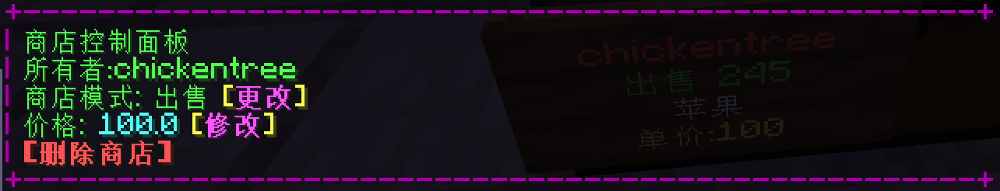
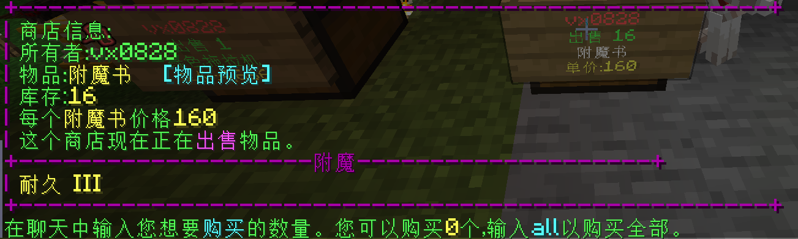

> [!note]
> 箱子商店是用箱子加一块显示信息的木牌制作的，可以进行收购和出售物品的游戏商店（只卖虚拟物品）。

## 了解箱子商店

箱子商店大概长图里的样子，一个 `箱子` 和一个 `木牌`，`木牌`上面有自动生成的信息。

## 创建箱子商店的教程

> [!note]
> **出售型**商店是指玩家可以购买这个商店里的物品，**收购型**商店是指玩家可以卖东西给这个商店。

以创建出售型商店为例，其创建步骤如下：

步骤一：假设你要卖 `苹果` ，那么手里拿着 `苹果` ，点一下箱子（大小箱子都可以），聊天框会弹出下图所示的信息。

步骤二：输入你想定的 `苹果` 单价（注意是**单价**）。比如输入 `10` ，此时箱子上会**自动生成**一个木牌。

+ 第1行标注了 商店的主人游戏ID

+ 第2行标注了 出售/销售 以及 库存

+ 第3行标注了 物品

+ 第4行标注了 单价

步骤三：你将想卖的 `苹果` 放入箱子中，就变成了库存，商店到这一步就创建成功了。

步骤四：**右键点击** 箱子商店上的木牌，然后点击 **[修改]** ，就可以删除该商店或更改其模式。要删除商店，就点击 **[删除商店]** ，要切换商店模式，就点击 **[更改]** （比如下图可以从出售模式切换为收购模式）

步骤五：如果你想和你的朋友一起经营商店，输入指令 `/qs staff add <玩家名>` ，这样该玩家也可以打开箱子替你管理库存。

## 用箱子商店买东西

**左键点击** 一个 **出售型** 的商店的木牌，然后会弹出一个信息：

你可以点击 **[物品预览]** 看出售的物品是否是真的，比如商品有可能只是改了一个`龙蛋`名字的`鸡蛋`。

确认后，在聊天框里输入你想要购买的数量，即可完成购买。
