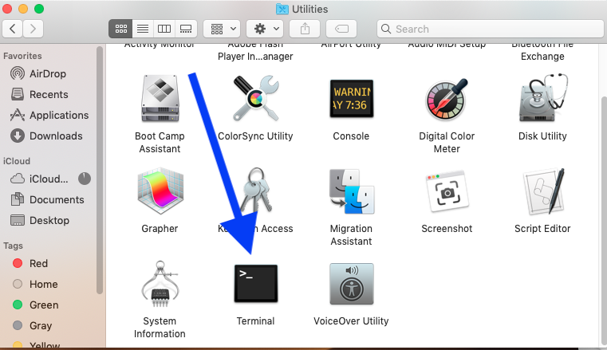

## 从哪里下载第三方启动器

对于许多第三方启动器来说，Mac OS以及Linux平台的玩家似乎并不是什么重要的群体（因为Windows的市场占有率高得吓人），于是网上下载到的第三方启动器通常都是`.exe`格式的可执行文件。而问题在于，Mac OS和Linux是无法直接运行这种文件的。

比较好的方法是，要么从MCBBS论坛的[启动器发布版块](https://www.mcbbs.net/forum.php?mod=forumdisplay&fid=43&filter=typeid&typeid=908)里找到`.jar`格式的第三方启动器，要么就从[HMCL发布网站](https://ci.huangyuhui.net/job/HMCL/)里下载`.jar`格式的启动器文件。

## 怎么使用第三方启动器

如果Mac OS以及Linux平台玩家坚持要使用`.exe`格式的启动器，那么有两种选择：

* 安装Windows虚拟机，在虚拟机里运行`.exe`文件，就是性能上可能不太令人满意；
* 为自己的电脑安装Windows，只要切换系统就能玩游戏，但是可能要重启才能切换。

至于如何安装Windows虚拟机或是给自己的电脑装上另外一个系统，玩家可以自行向搜索引擎求教，这里不做展开。

还有一种选择就是使用之前提到的`.jar`文件，我们在这里默认Linux用户是知道如何执行这种文件的，因此只需要告诉Mac用户怎么做就行了。

在Mac OS的启动台里，找到名为“终端”（Terminal，如下图所示）的命令行工具，



打开它，然后输入`java -jar /启动器所在的路径/启动器文件名.jar`，回车运行即可。例如一个放在桌面上，名为“HMCL”的`.jar`格式启动器，要使用它，就需要输入并回车执行以下指令：

```
java -jar ./Desktop/HMCL.jar
```

> 一般而言，能够提供`.jar`格式文件的第三方启动器，在使用操作上跟Windows用户不会有什么区别，因此可以参照Windows用户的方式，去使用这些第三方启动器。