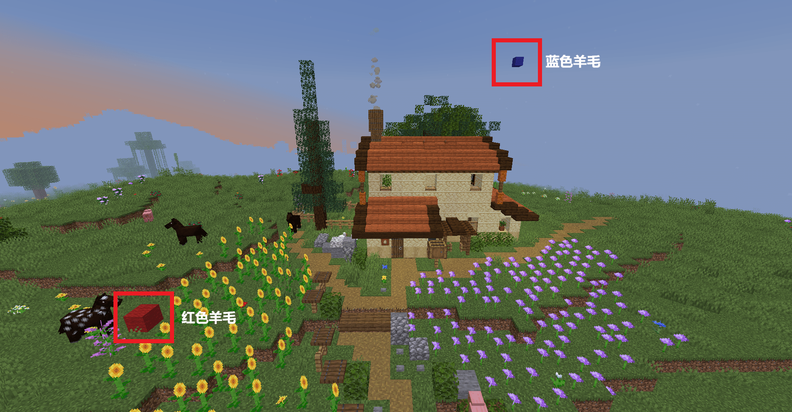

> [!note]
> + 领地插件是用来保护房屋建筑的插件，选择空间的对角两个点，将这个空间占为己有并加以保护。
>
> + 空间中的XYZ三个轴，每个1×1×1的方块需要0.05硬币(游戏币)，删除领地后会退还所有费用
>
> + 本服的圈地工具为  `木锄头` 。
>
> + 如果你想详细了解领地插件的指令/权限，请访问[Residence官方Wiki](https://www.zrips.net/residence/)
 
## ⭕ 创建领地

1. 合成一个  `木锄头` ，在你想要圈起来的空间，比如图片中的小房子：

    用木锄头 **左键** 点击第一个点（下图红色羊毛）；

    用木锄头 **右键** 点击第二个点（下图蓝色羊毛）。

2. 选择的时候可以注意看聊天框里是否有提示信息，选择完毕后会告诉你圈领地需要花费多少钱：

3. 输入指令 `/res create <领地名>` 比如`/res create myhome`，就创建了一个叫做myhome的领地。

4. 如果你想让你的朋友也能在领地里开箱子，造建筑，请输入指令给他增加权限 `/res padd <领地名> <玩家名>`。

## 📕 指令大全

| 操作                       | 指令                   | 示例或说明           |
| :------------------------- | :--------------------- | :------------------- |
| **领地插件帮助指令**       | `/res`                 |
| **创建领地**               | `/res create <领地名>` | `/res create myhome` |
| **传送到领地**             | `/res tp <领地名>`     | `/res tp myhome`     |
| **设置领地的属性**         | `/res set`             |                      |
| **给某个玩家增加领地权限** | `/res padd <玩家名>`   |                      |
| **去除某个玩家的领地权限** | `/res pdel <玩家名>`   |
| **列出自己的所有领地**     | `/res list`            |                      |  |
| **删除领地**               | `/res remove <领地名>` |删除领地会退钱到玩家账户|

##  ❓ 常见问题

### 没有权限创建领地

+ 你处在副本地图或资源世界，这些地方无法创建领地
+ 你只能在主世界里创建领地

