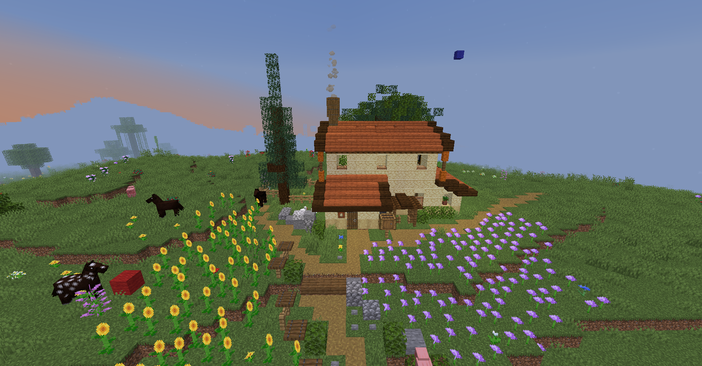
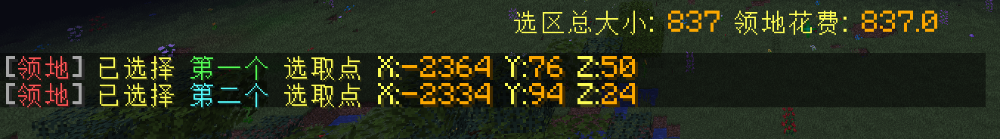

> 领地插件是用来保护房屋建筑的插件，选择空间的对角两个点，将这个空间占为己有并加以保护

> 空间中的XYZ三个轴，服务器对Y轴(高度)不进行收费，也就是说按照占地面积收费，1个方块的面积需要1木锄币

> 本服的圈地工具为  `木锄头` 
## 领地的指令
1. **领地插件帮助指令** `/res`

2. **创建领地** `/res create <领地名>` 例子: `/res create myhome`

3. **传送到领地** `/res tp <领地名>` 例子: `/res tp myhome`

4. **设置领地的属性** `/res set`

5. **给某个玩家增加领地权限** `/res padd <玩家名>`

6. **去除某个玩家的领地权限** `/res pdel <玩家名>`

7. **列出自己的所有领地** `/res list`

8. **删除领地** `/res remove <领地名>`

## 创建领地的简单教程

1. 合成一个 `木锄头` ,在你想要圈起来的空间，比如图片中的小房子

    用木锄头**左键点击**第一个点 **(红色羊毛)**

    用木锄头**右键点击**第二个点 **(蓝色羊毛)**

2. 选择的时候可以注意看聊天框里是否有提示信息，选择完毕后会告诉你圈领地需要的钱

3. 输入指令 `/res create <领地名>` 比如`/res create myhome`，这样你就创建了一个叫做myhome的领地

4. 如果你想让你的朋友也能在领地里开箱子，造建筑，请输入指令给他增加权限 `/res padd <领地名> <玩家名>`

## 领地有关的小问题

1. “你没有执行此操作的权限”

    在矿区内无法创建领地