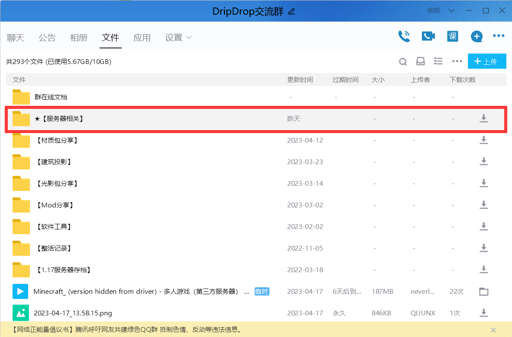
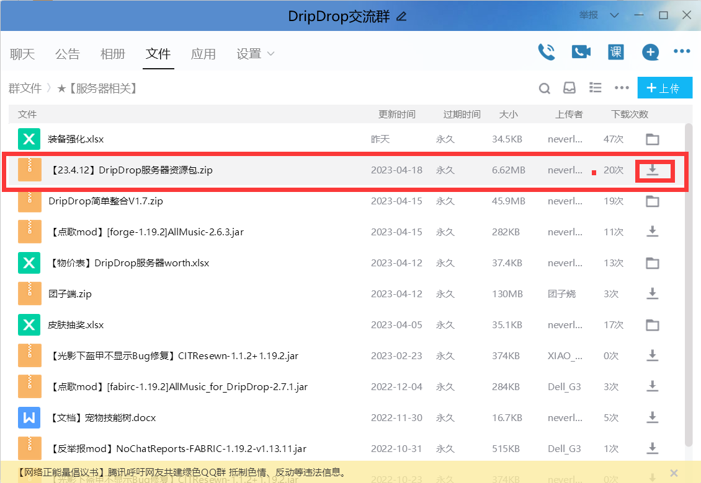
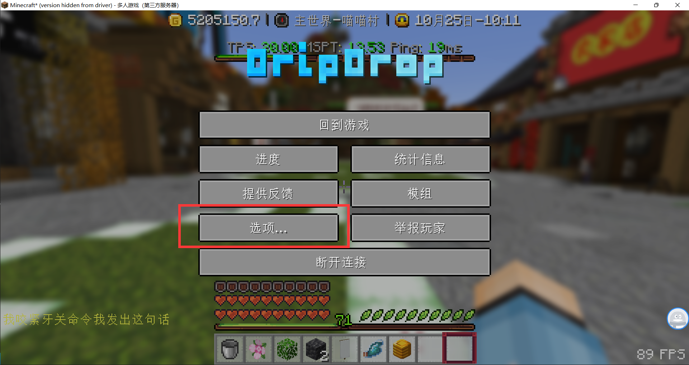
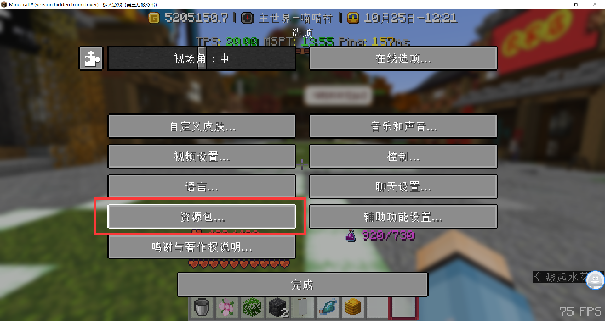
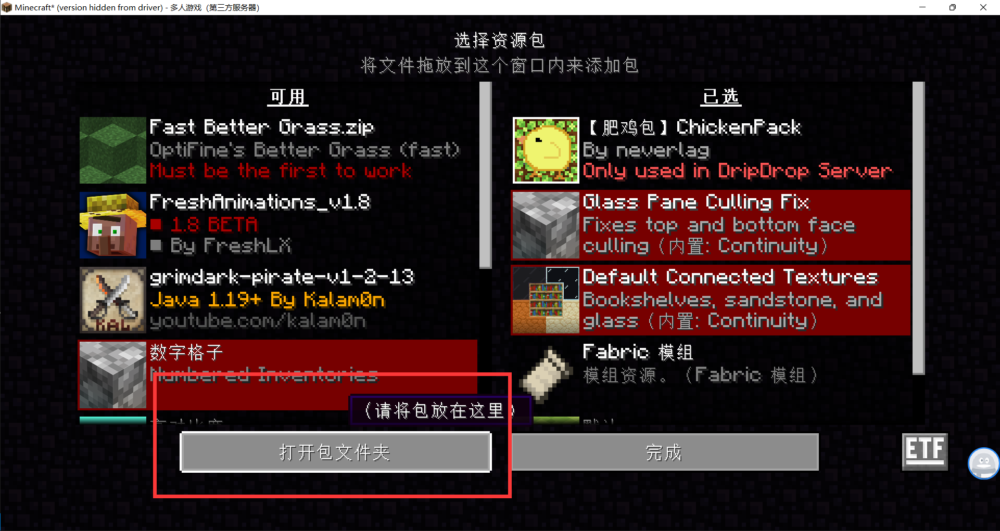
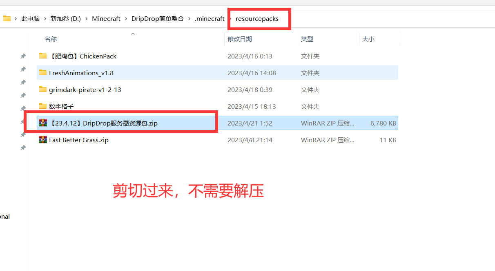
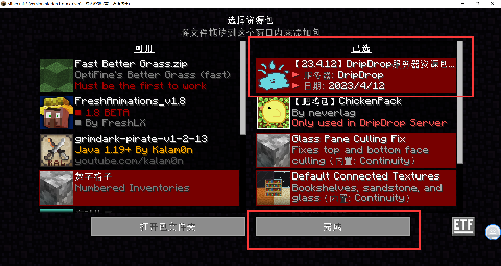

> [!tip]
> 你可以先跳过这步，这并不影响你正常游玩。但是如果想获得更多游戏体验，请参照下面步骤加载使用服务器资源包。

## 📥 在线加载

> [!warning]
> 在线加载的优点是方便快捷，缺点是每次加入退出服务器都需要一次加载。

**1. 打开聊天栏后点击服务器资源包即可自动下载**

 

**2. 输入指令`/pack`在线加载**

## 👌 手动安装(推荐)

> [!warning]
> 手动安装的优点是无需每次都要加载，缺点是需要自己下载最新版本。

**1. 打开[QQ群聊](https://jq.qq.com/?_wv=1027&k=VoMxW5eI)(286338133)，点击“文件”**

**2. 打开`★【服务器相关】`文件夹**

**3. 下载服务器资源包**

**4. 在游戏内按`ESC`打开设置页面，按`选项...`，再点`资源包...`**

**5. 点击`打开包文件夹`，并将下载的资源包文件剪切过来**

**6. 点击右箭头使服务器资源包到右侧已选,最后点击完成**

