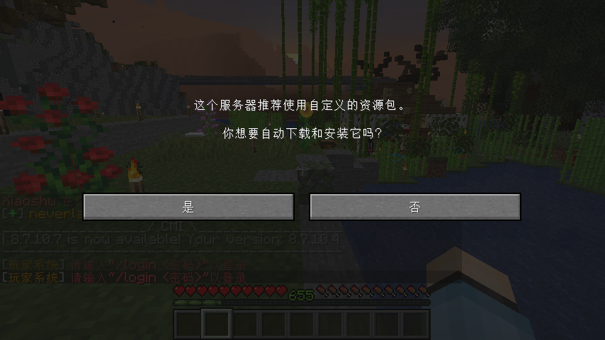
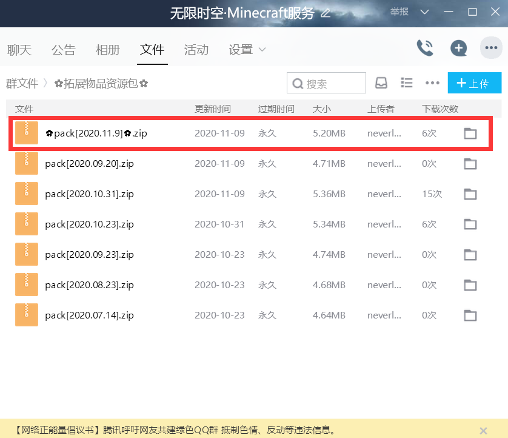

## 不欢迎与不适合
**不欢迎**以下玩家
+ 恶意杀人，破坏，盗取他人财产的玩家(熊孩子)
+ 飞天，透视等等作弊的外挂使用者
+ 脾气很差张口就骂的玩家
+ 什么都不懂，却认为别人理所应当需要帮助你的玩家

**不适合**以下玩家
+ 搞大型红石的玩家
+ 重度RPG玩家
+ 喜欢肝，喜欢刷的玩家

## 进入服务器
我们没有正版验证和白名单的门槛，你可以直接用IP连入我们服务器

我们服务器的IP地址为 `txyminecraft.club:25565`

你可以通过 **1.16** 的任意一个版本加入我们的服务器 (推荐用 **1.16.4**)

## 安装材质包
> 你可以暂时跳过此步，因为这并不是必须的

> 但是不安装材质包，你可能会在服务器里见到`一个房子里摆了一堆的橡木`，`头戴羽毛还以为自己很帅的玩家`，`箱子里一堆的名字不一样的苹果`

请知悉，服务器里面的拓展物品需要安装材质包，你可以通过以下两种方式下载

+ 进入服务器后，选择 **是**

+ 加入QQ群`286338133` 从群文件里的 `✿拓展物品资源包✿` **下载最新的** 材质包

## 注册与登录
如果你是第一次加入我们服务器，请先通过指令注册，按T打开聊天框后输入

`/register a123456 a123456` (当然我并不建议你使用a123456这种密码)

今后再次登陆我们服务器需要输入指令

`/login a123456`

## 正版验证
如果你是正版玩家，可以找到出生点附近的NPC-牛仔右键点击他，打开验证菜单

输入/premium后验证成功，退出服务器再进入，你将显示正版皮肤，而且登陆不再需要密码

