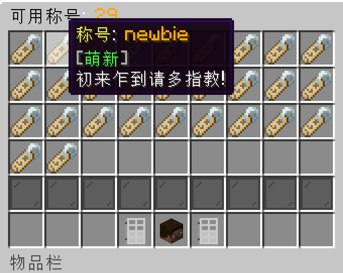

## 称号获取
1. 输入指令 `/tag` 打开称号获取界面

2. 你可以将鼠标移到 **称号图标** 上查看是否满足称号的条件

3. 在满足条件后，**左键点击** 图标即可获取称号

## 佩戴称号

1. 输入指令 `/tags` 打开可用称号的菜单

2. **左键点击** 你喜欢的称号即可佩戴

3. 在聊天框里说话时会显示你的称号

## 自定义称号
> 在购买 `用爱发电机` 后，你可以找服主 `neverlag` 定制你的自定义称号

1. 自定义称号支持**16进制的颜色**，你也可以输入 `/color` 来查看10页的RGB颜色

RGB颜色可以实现很多酷炫的效果，比如渐变的称号
无敌大佬

2. 自定义称号支持emoji表情，表情可以输入指令 `/iaemoji` 查看

3. 自定义称号支持旧版颜色代码

