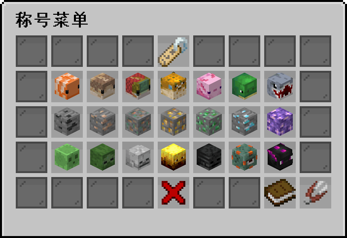
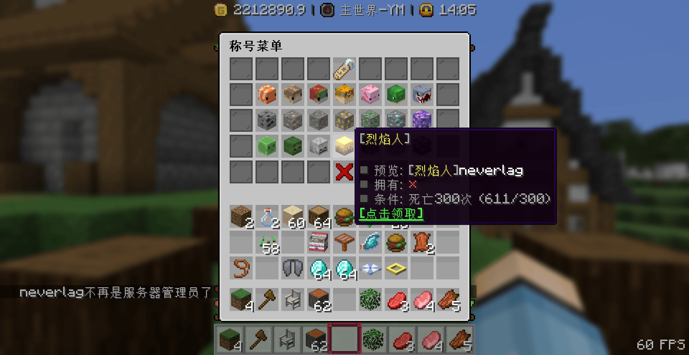
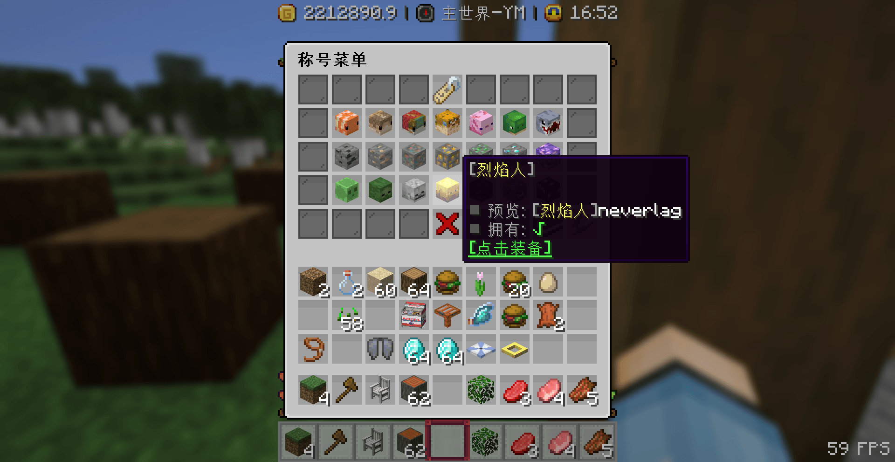
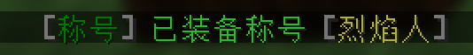
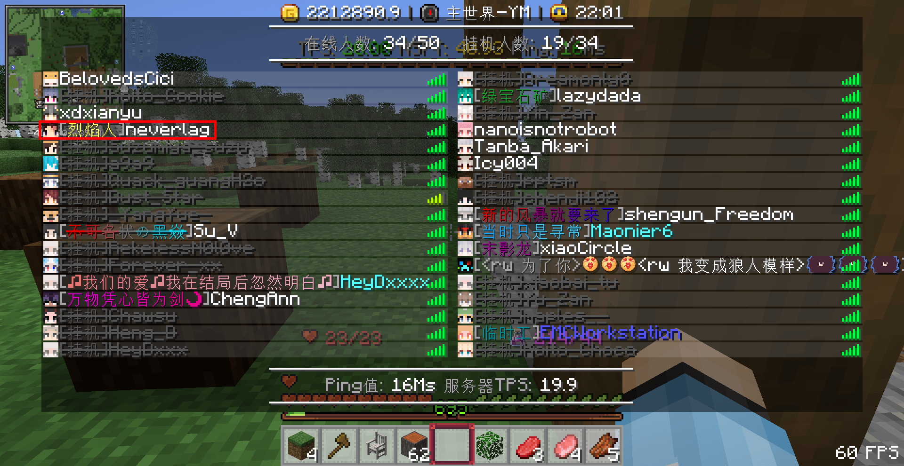
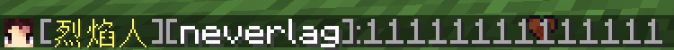
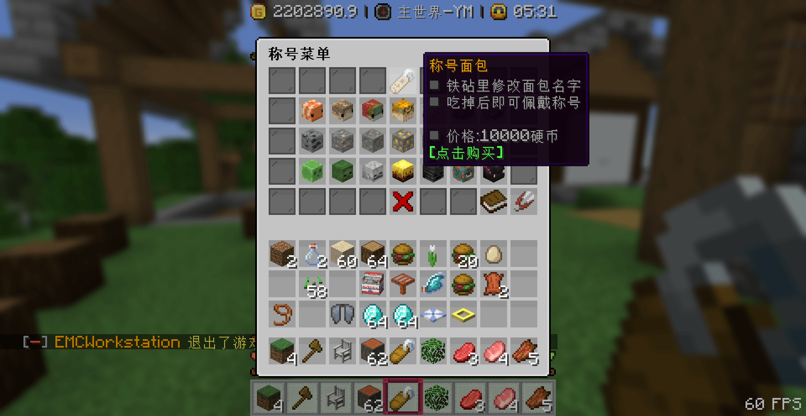
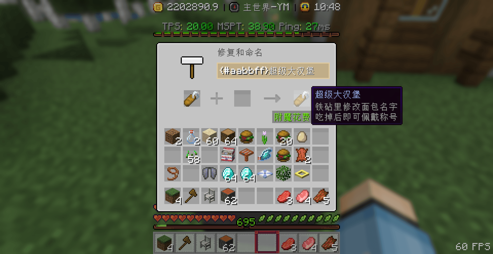
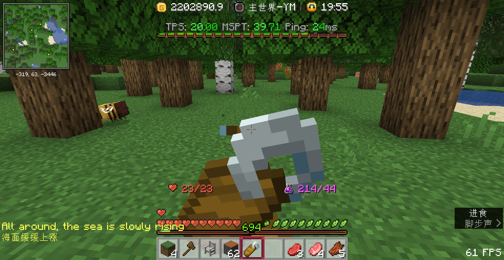
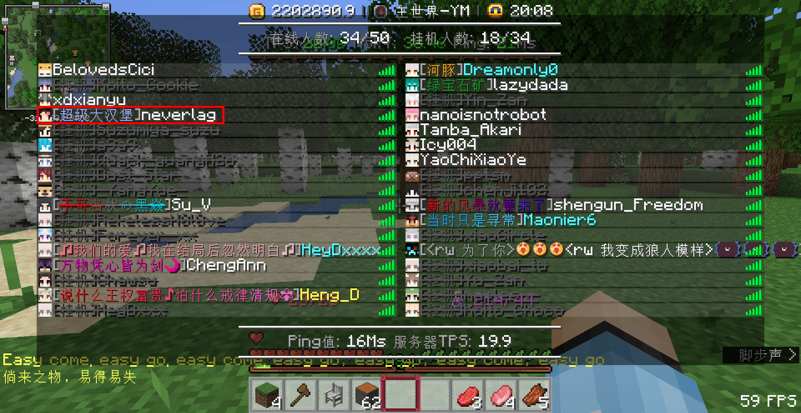

## 📜 获取称号

1. 输入指令`/tag`打开称号菜单

2. 查看称号获取条件，发现已经满足条件可以领取

>[!note]
>目前条件只有钓鱼个数、挖掘方块数、死亡次数三个条件

3. 左键点击领取后，再次输入`/tag`打开称号菜单

4. 显示`[点击装备]`说明已经领取成功

## 📌 佩戴称号

1. 左键点击可以装备的称号，系统提示装备成功

2. 按`Tab`查看玩家列表，发现自己已经拥有称号前缀

3. 在聊天里打字，发现也有称号显示

## 🍞 自定义称号

1. 购买 **称号面包** ,点击即可购买

2. 将购买到的 **称号面包** 放到铁砧中改名

> [!tip]
> 铁砧支持传统颜色代码，RGB颜色代码，聊天表情，彩虹字

3. 将 **称号面包** 放在主手吃掉

> [!warning]
> 目前 **称号面包** 只能读取主手物品的命名

吃完面包后按`Tab`显示称号已经改为超级大汉堡

## ❓ 常见问题

### 为什么吃不了称号面包？

因为你饥饿值是满的，通俗来讲就是你不饿，没法吃东西