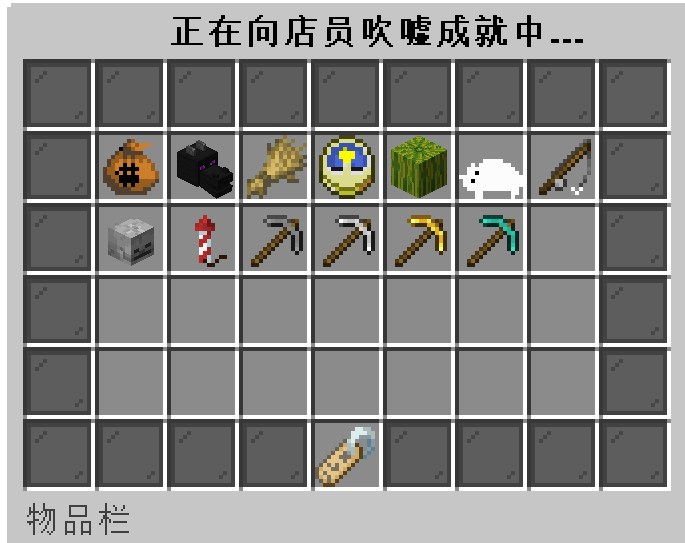
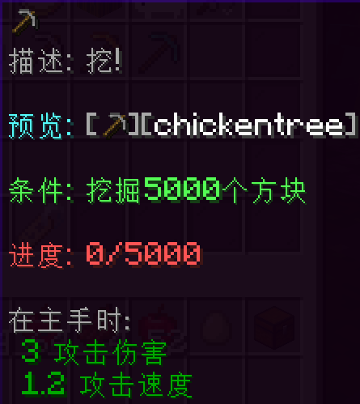
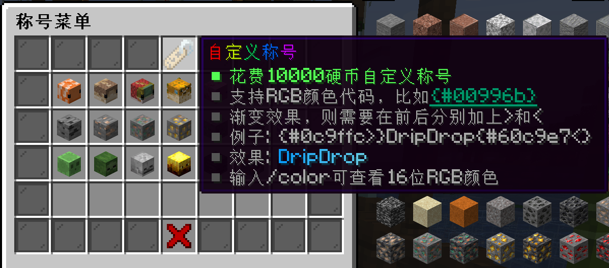
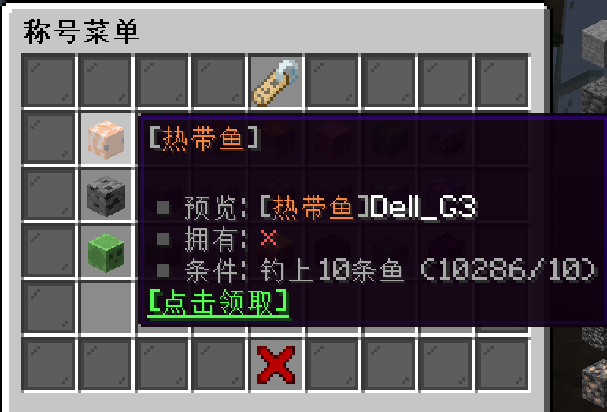
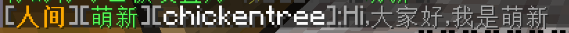
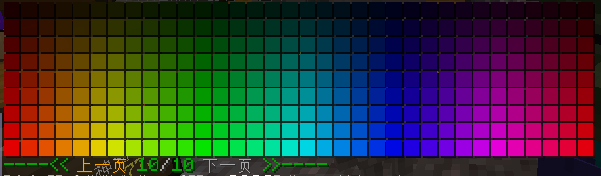
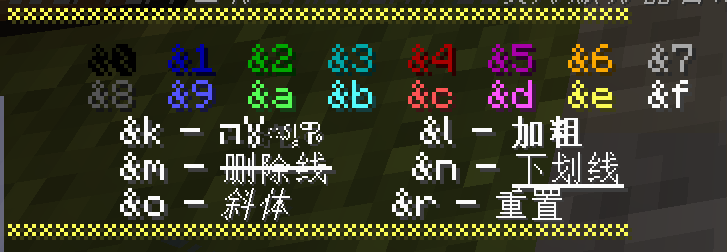

## 进入称号菜单

输入指令 `/tag` 或通过系统菜单对应的图标入口，即可打开称号配置界面：

玩家称号有两种，一种是消耗硬币获取的**自定义称号**，另一种则是在游戏中达成某种条件后即可自动获得的**条件称号**：

>自定义称号

>条件称号

## 佩戴条件称号

进入称号菜单，找到对应的称号，**左键**点击即可佩戴：

佩戴之后，在聊天框里说话时会显示玩家的称号

## 佩戴自定义称号

1. 自定义称号支持**16进制的颜色**，你也可以输入 `/color` 来查看10页的RGB颜色

RGB颜色可以实现很多酷炫的效果，比如渐变的称号
无敌大佬

2. 自定义称号支持emoji表情，表情可以输入指令 `/iaemoji` 查看

3. 自定义称号支持旧版颜色代码

>[!attention]
>注意，称号名称尽量不要超过10个字符，否则会影响聊天栏的视觉效果。对于包含有妨害服务器正常运营内容的称号，管理员随时有权力采取一切合理措施进行处置。