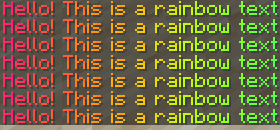
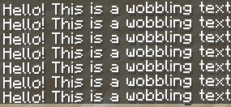
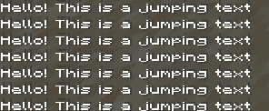
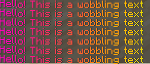
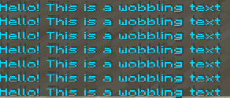
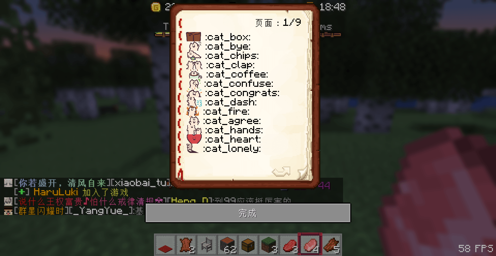
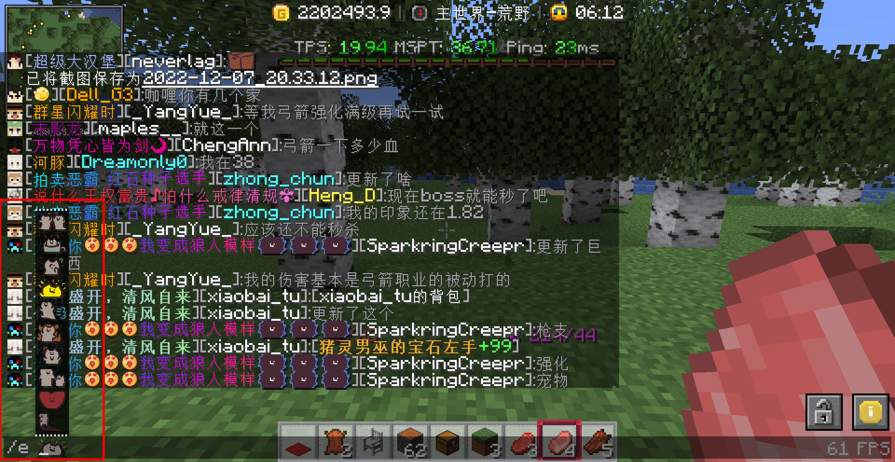

> [!tip]
> 以下特殊文本基本可以用在任何地方，包括聊天、告示牌、铁砧改名、称号等等(除了有些插件的宠物命名不支持16进制颜色)

## 🖌️ 颜色代码

+ 输入`/colors`查看传统颜色代码
+ 例子: `&9&m测试文本`将显示为 ~测试文本~

## 🎨 十六进制颜色

+ 输入`/color` 查看Hex Color(16进制颜色)
+ 例子: `{#964b00}测试文本`将显示为 测试文本

## 🖍️ 渐变颜色

1. **简单渐变**

+ 在文本的前后分别使用两种不同的十六进制颜色，并在前面的`{}`中的最后加上`>`；后面的`{}`中的最后加入`<`即可
+ 例子: `{#0c9ffc>}这是一段会颜色渐变的文字{#60c9e7<}`

> [!warning]
> 注意例子中大于号`>`和小于号`<`的位置

2. **多次渐变**

+ 多次渐变颜色在最前面的颜色中加入`>`，中间的颜色加入`<>`，最后的颜色加入`<`
+ 例子: `{#ff0000>}这是一段会渐{#ff00d8<>}变3次的很长{#7e00ff<>}很长的文字{#0030ff<}`

## 🌟 文字特效

> [!warning]
> 文字特效需要安装服务器资源包后才能看见

1. **彩虹字体(rainbow)**

+ 例子: `<r Hello!This is a rainbow text>`

2. **抖动字体(wobble)**

+ 例子: `<w Hello!This is a wobbling text>`

3. **跳跃字体(jump)**

+ 例子: `<j Hello!This is a jumping text>`

4. **彩虹+抖动(rainbow + wobble)**

+ 例子: `<rw Hello!This is a wobbling text>`

5. **彩虹+跳跃(rainbow + jump)**

+ 例子: `<rj Hello!This is a wobbling text>`

## 😃 emoji表情

> [!warning]
> emoji表情需要安装服务器资源包后才能看见  
> 而且需要在ESC设置中选择`选项...`-`语言...`-`强制使用Unicode字体 : 关`

### 表情书

1. 输入`/emoji`打开emoji表情书

2. 在聊天栏里发送 `:cat_box:` 即可发送一个箱子的表情包

3. 直接在聊天栏里使用`/e` 然后按一下`空格键`，你可以用鼠标滚轮在上面滚动选择表情包

4. 表情包实际上也是一种字体，可以在它前面使用颜色代码

