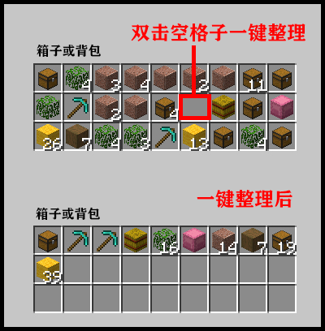
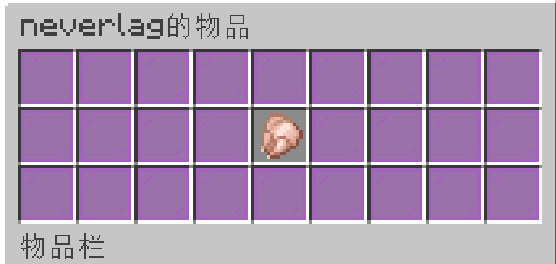
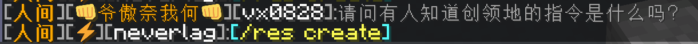
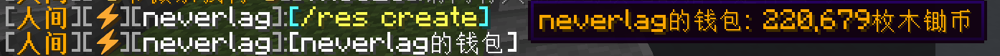
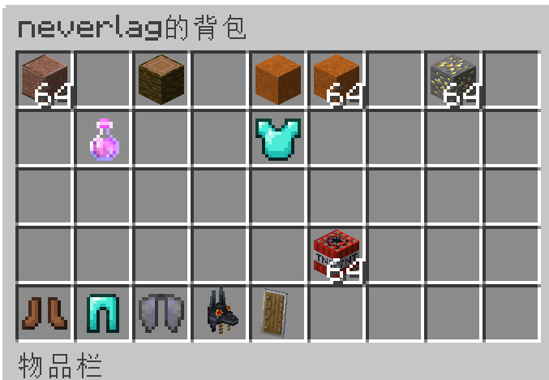
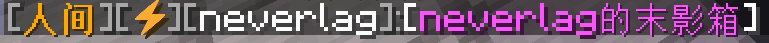
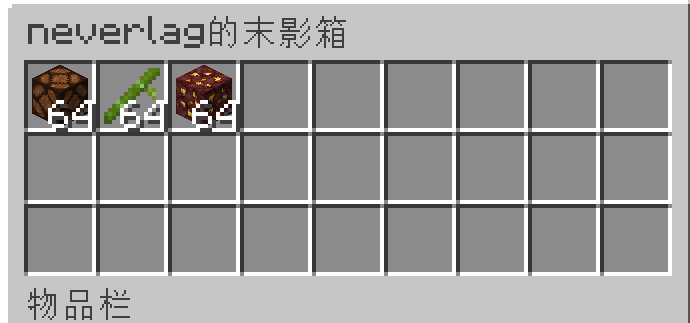
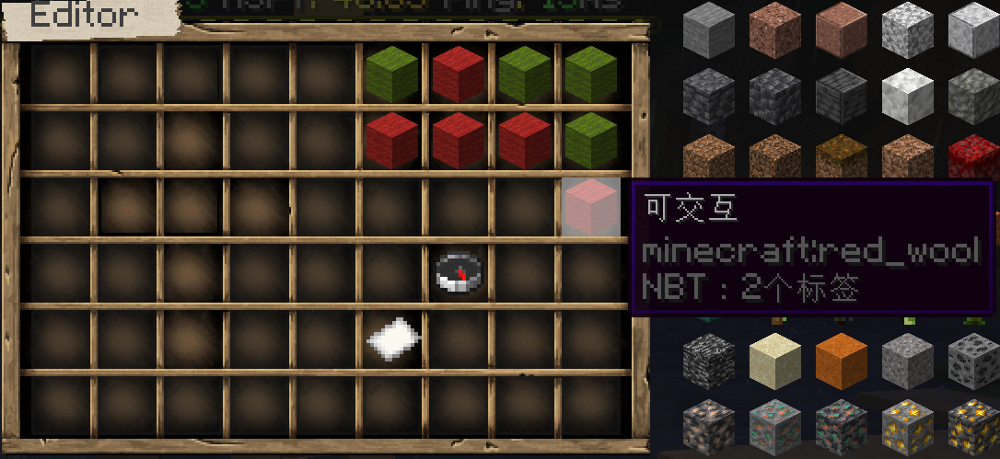
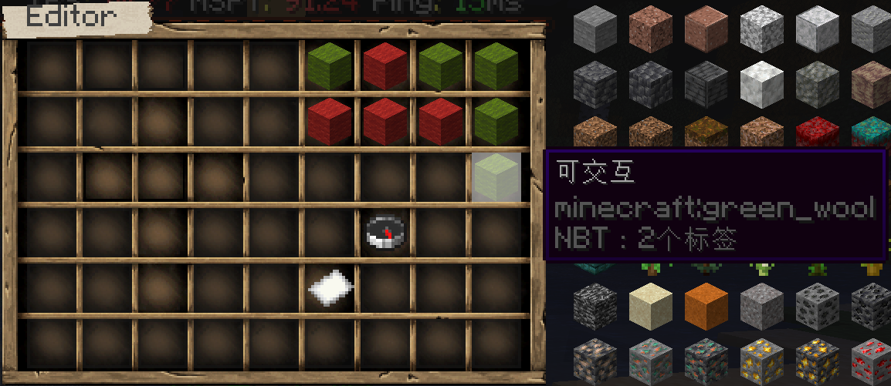

>[!Note]
>更多游玩技巧，可以在游戏聊天栏中输入执行`/tips`指令进行查看！

## 一键整理

你可以在箱子或者背包里用鼠标左键双击 `空格子` 进行一键整理。

## 聊天展示

1. **你可以输入 `[item]` 将你手持物品展示到聊天框里**

    

    同时你可以在聊天框里点击在这个 `[生鸡肉 ×1]` 打开页面查看详情。

    

2. **你可以输入 `[/<指令>]` 来告诉其他玩家指令**

    比如你可以输入`[/res create]` 来告诉其他玩家领地的创建指令。

    同时你可以在聊天框里点击这个指令 来直接输入指令。

    

3. **你可以输入 `[money]` 来告诉其他玩家你的钱包**

    同时你可以在聊天框里将鼠标放在钱包上就能查看有多少钱。

    

    你可以在聊天框里点击这个 `[neverlag的钱包]` 则会自动输入转账给该玩家的指令 `/cmi pay neverlag`。

4. **你可以输入 `[inv]` 来展示你的背包**

    

    同时你可以在聊天框里点击在这个 `[neverlag的背包]` 打开页面进行更具体的查看。

    

5. **你可以输入 `[ender]` 来展示你的末影箱**

    

    同时你可以在聊天框里点击在这个 `[neverlag的背包]` 打开页面进行更具体的查看。

    

## 不可交互的盔甲架

服务器安装有CMI插件，因此部分玩家可能会在不经意间通过`shift + 鼠标右键`的方式点击到盔甲架，然后打开类似下图的配置页面：

注意上图当中的弹出描述的配置项，**默认情况下是红色的，代表盔甲架可以交互，比如放上盔甲或是破坏掉。**点击之后，该选项就变成了绿色，表示**不可交互**，如下图所示：

一旦盔甲架被设置为不可交互，任何玩家（包括OP）都不能破坏掉该盔甲架，或是放上、取下任意盔甲，也不能再次通过`shift + 鼠标右键`的方式打开盔甲架的配置选项！如果玩家对这些盔甲架的设置选项不是非常熟悉，强烈建议不要随意修改，以免发生不可逆转恢复的问题。

如果确实不小心将盔甲架设置成不可交互，也不用太担心，只要面对盔甲架输入`/cmi armorstand near`，即可再次打开盔甲架的配置选项，然后重新让盔甲架恢复可交互状态就行了。

## 退不出的副本

如果有玩家进入副本游玩后尚未通关，但又因为某些原因想退出副本，会发现菜单里并没有退出副本的选项（刀剑神域警告？😂），即使强行关闭客户端再次进入游戏，也会发生自己依然处于副本任务的状态之中。这种时候不要慌，输入指令`/dungeon quit`一般就能离开副本了。

