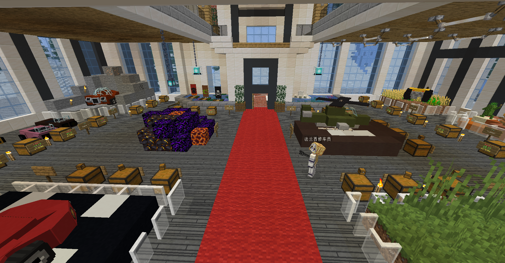
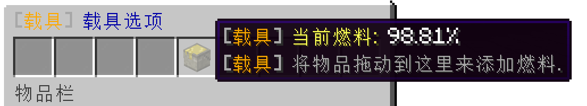
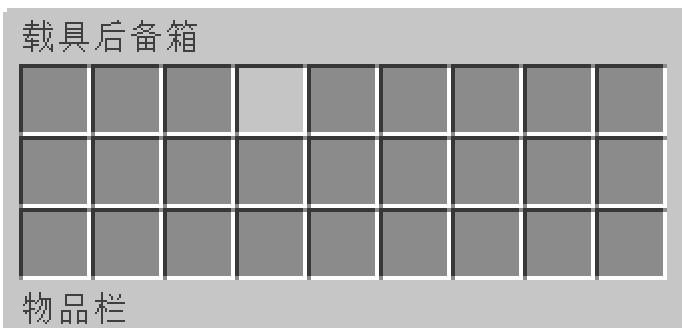

## 载具类型

目前出售的载具的种类目前有:

| 载具     | 功能描述                                 |
| :------- | :--------------------------------------- |
| 拖拉机   | 开在耕地里可以自动收割和自动终止         |
| 钻头车   | 一直顶着可以将前面3×3的方块破坏          |
| 赛车     | 单纯的装饰，就是好看                     |
| 摩托车   | 可以载另外一个玩家                       |
| 飞天扫帚 | 可以不消耗燃料飞上天                     |
| 火车     | 可以在铁轨上行驶                         |
| 木筏     | 可以在水面上行驶                         |
| 坦克     | 手持`火焰弹`坐在坦克里，右键可以发射炮弹 |
| 降落伞   | 在空中打开可以缓缓降落                   |
| 直升飞机 | 可以飞                                   |
| 潜水艇   | 在水下行驶，还自带夜视功能               |

## 购买载具

你可以输入 `/car` 来到载具商店，用 `木锄币` 购买载具。

购买方式即箱子商店的购买方式。

买来的载具是打包在一个箱子里的。

## 载具放置

一般载具用买来的 `载具盒子` 点击地面即可放置。

+ `降落伞`则需要在空中打开。

+ `木筏` 需要在水面上放置。

+ `潜水艇` 需要在水中放置。

## 载具回收

你需要对着载具按 `Shift键(潜行键)+鼠标右键` 来回收载具。

## 载具燃料

你需要对着载具按 `Shift键(潜行键)+鼠标左键` 来打开载具的燃料面板。

然后将燃料拖到中间的那个桶里面即可加油。

可用的燃料有

+ 煤炭   +8点能量

+ 木炭   +8点能量

+ 煤炭块 +80点能量

+ 岩浆桶 +100点能量

## 载具后备箱

坐在载具上时，低头(对着载具) 按 `右键` 打开载具后备箱，你可以在后备箱里面放东西。

## 载具维修

载具是有血量的，你可以在载具商店找 `NPC法兰西修车员` 购买  `扳手`。

然后坐在载具上，拿着 `扳手` 左键点击一下，车子就维修完成了。

